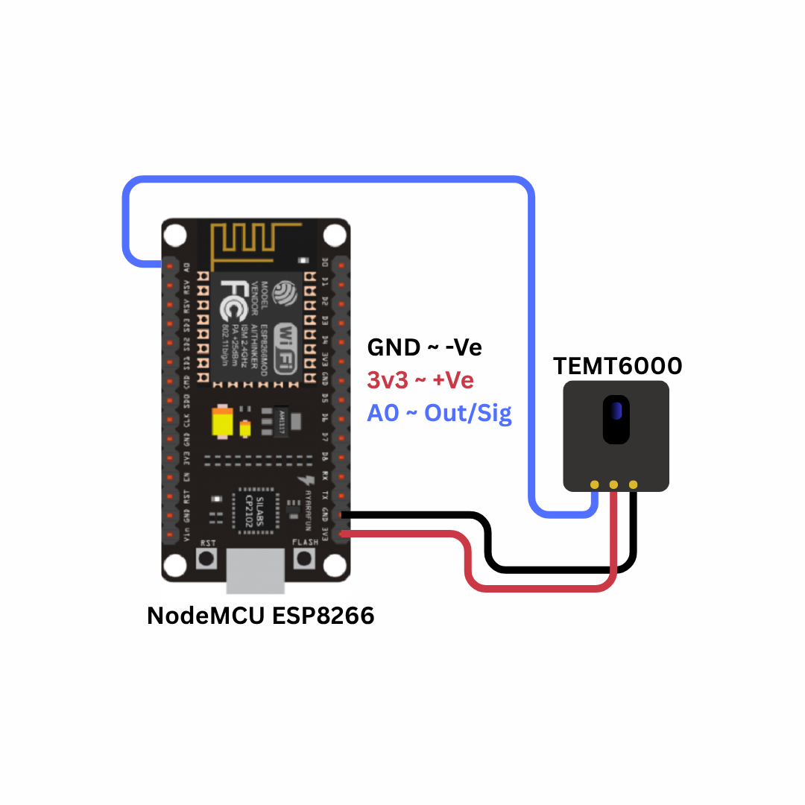
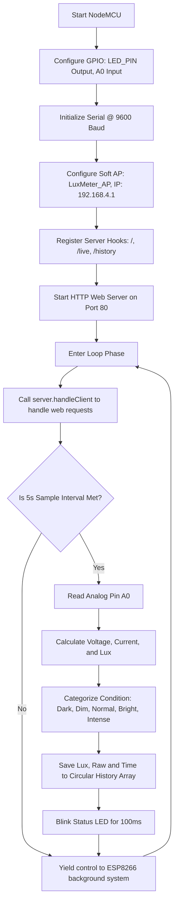

# IoT-Based Ambient Light Intensity Analyzer using NodeMCU

---

## 1. Problem Statement

Light is one of the most critical environmental variables influencing human activity, agricultural productivity, ecological balance, and industrial operations. Understanding and measuring ambient light intensity (illuminance) is fundamental in several domains:

1. **Circadian Biology and Ergonomics**: Improper indoor lighting in workspaces, school classrooms, and hospitals can cause eye strain, headaches, and disrupt human circadian rhythms, leading to sleep disorders and reduced cognitive productivity.
2. **Precision Agriculture and Greenhouse Management**: Different plant species require specific daily light integrals (DLI) to optimize photosynthesis. Insufficient light stunts growth, while excessive solar radiation can scorch leaves and dry out soil rapidly.
3. **Solar Energy Harvest System Optimization**: Designing solar panels and tracking installations requires detailed historical profiles of local solar irradiance to determine efficiency and predict daily power outputs.
4. **Smart Building Automation and Energy Conservation**: Standard buildings consume significant amounts of electrical energy on constant artificial lighting, regardless of whether natural sunlight is entering through windows.
5. **Limitations of Traditional Instruments**: Commercial lux meters are specialized, expensive devices that operate in isolation. They lack the capacity to log historical trends locally or stream real-time data wirelessly to multiple stakeholders without complex data acquisition hardware.

### Proposed Solution
To resolve these challenges, we need a low-cost, compact, and wireless IoT edge device. The solution should continuously measure ambient light intensity, convert raw sensor readings into scientific units (Lux), categorize the environmental condition (e.g., Dark, Dim, Normal, Bright, Intense), and expose this data via a local web interface. The device must broadcast its own WiFi network so that users can view real-time data on their phones or computers without requiring external internet connections, cloud accounts, or proprietary apps.

---

## 2. Our Solution

The **IoT-Based Ambient Light Intensity Analyzer** is a standalone, micro-embedded system designed around the ESP8266 NodeMCU platform and the TEMT6000 silicon NPN phototransistor. This device acts as an autonomous sensor node that captures, filters, scales, logs, and visualizes ambient light data.

### Key Features
- **Human-Eye Spectrum Matching**: Utilizes the TEMT6000 sensor, which has a spectral sensitivity curve matching the human eye's photopic response, avoiding infrared and ultraviolet skew.
- **Accurate Mathematical Scaling**: Converts analog output voltage to current, and maps it directly to Illuminance in Lux based on manufacturer specifications.
- **Standalone Access Point Mode**: Broadcasts a secure, localized WiFi network (`SSID: LuxMeter_AP`), running an onboard web server serving an interactive dashboard at `http://192.168.4.1`.
- **Dynamic SVG Sun Visualization**: The browser dashboard renders an animated SVG sun whose size, color, ray thickness, glow intensity, and rotation speed adapt dynamically in real-time to the current Lux level.
- **Micro-Condition Classifier**: Evaluates illuminance levels and categorizes them into five discrete states: *Dark*, *Dim*, *Normal*, *Bright*, and *Intense*.
- **Local History Buffer**: Retains a rolling history of the last 100 measurements in RAM, providing data logging over time without writing to flash memory, which prevents flash memory wear.
- **Visual Feedback Indicator**: Flashes the onboard NodeMCU LED for 100 milliseconds every time a sensor reading is processed, verifying system health.
- **Non-Blocking Execution**: Implements time-sliced multitasking using cooperative scheduling (via `millis()`) to handle high-frequency sensor queries while maintaining responsive web requests.

---

## 3. Brief of Solution

The analyzer combines sensor signal acquisition, mathematical conversion, state logging, and network services on a single chip.

### System Data Flow Architecture
```
+------------------+       Analog Voltage      +-------------------+
|   TEMT6000 OUT   | ------------------------> |    NodeMCU A0     |
|   (Photodiode)   |                           |    (10-bit ADC)   |
+------------------+                           +-------------------+
                                                         │
                                             [ADC Sampling (0-1023)]
                                                         │
                                                         ▼
+------------------------------------------------------------------+
|                     ESP8266 Microcontroller                      |
|                                                                  |
|   1. Volts = Raw * (3.3 / 1023.0)                                |
|   2. Amps = Volts / 10000.0 (10k Resistor Load)                  |
|   3. Microamps = Amps * 1,000,000                                |
|   4. Lux = Microamps * 2.0 (TEMT6000 Datasheet Ratio)            |
|   5. Classify Condition (Dark, Dim, Normal, Bright, Intense)     |
+------------------------------------------------------------------+
          │                                              │
  [Save to RAM Buffer]                           [Blink Status LED]
  (Circular Array, size 100)                     (D2 / GPIO2 - 100ms)
          │                                              │
          ▼                                              ▼
+---------------------+       Web Request        +------------------+
| ESP8266 Web Server  | <----------------------- |   User Web App   |
| (JSON REST APIs)    | -----------------------> |  (JS AJAX Fetch) |
+---------------------+      JSON Response       +------------------+
```

1. **Physical Sensing**: The TEMT6000 phototransistor responds to ambient illuminance, driving a proportional analog voltage across an onboard 10k$\Omega$ resistor.
2. **Analog-to-Digital Conversion (ADC)**: The ESP8266 samples the analog pin A0, translating the voltage into a 10-bit integer ($0 - 1023$).
3. **Lux Computation**: The firmware processes the raw ADC code. Using Ohm's Law and the sensor's current-to-lux ratio, it derives the ambient illuminance in Lux.
4. **Status Classification**: The computed Lux is evaluated against thresholds to assign an environmental category (e.g., "Dim" or "Bright").
5. **Data Logging**: The Lux reading and timestamp are pushed into a circular FIFO buffer in the ESP8266's DRAM.
6. **Data Presentation**: When a web client queries the ESP8266 web server, the device serves an HTML page containing CSS transitions and JavaScript. The page polls `/live` and `/history` endpoints to refresh the dynamic SVG sun and logs table.

---

## 4. What We Are Going to Use

### Hardware Requirements
1. **NodeMCU ESP8266 Development Board (ESP-12E Module)**
   - Core: Xtensa 32-bit LX106 CPU running at 80 MHz.
   - Operating Voltage: 3.3V VCC. Onboard AMS1117 regulator converts 5V USB power to 3.3V.
   - Built-in WiFi: 2.4 GHz 802.11 b/g/n radio.
2. **TEMT6000 Ambient Light Sensor Breakout**
   - Transducer Type: Silicon NPN Phototransistor.
   - Spectral Bandwidth: 360 nm to 970 nm (Peak response at 570 nm, matching human eye photopic vision).
   - Angle of Half Sensitivity: $\pm 60^\circ$.
   - Load Resistor: 10 k$\Omega$ surface-mount resistor forming a voltage divider configuration.
3. **LED (Light Emitting Diode)**
   - Color: Standard Red/Green indicator.
   - Forward Voltage: ~1.8V to 2.2V.
4. **Current-Limiting Resistor**
   - Value: 220 $\Omega$ (1/4 W).
   - Purpose: Prevents excessive current from damaging the GPIO pin and the LED.
5. **Breadboard & Jumper Wires**
6. **Micro-USB Cable**: For power and code flashing.

### Software Requirements
1. **Arduino IDE 2.x**: Open-source IDE used for programming the ESP8266.
2. **ESP8266 Arduino Core**: Provides libraries and definitions to compile C++ code for the Xtensa processor.
3. **Web Browser (Chrome, Firefox, Safari, Edge)**: Used to connect to the offline Access Point and render the animated dashboard.

---

## 5. In-Depth of IoT (Internet of Things)

The Internet of Things (IoT) is a paradigm that extends internet connectivity to physical devices and everyday objects. By embedding electronics, software, and sensors, these devices can interact with their environment, log operational states, and share data over network infrastructures.

### Architecture Layers of IoT
IoT devices are structured into hierarchical functional layers:

```
+-----------------------------------------------------------------+
| 1. Application Layer (Web Dashboard, SVG Animations, UI Table)  |
+-----------------------------------------------------------------+
                               ▲
                               │ HTTP Request/Response (JSON REST)
                               ▼
+-----------------------------------------------------------------+
| 2. Network Layer (ESP8266 SoftAP, IEEE 802.11 b/g/n, TCP/IP)    |
+-----------------------------------------------------------------+
                               ▲
                               │ Hardware Registers (ADC / Bus)
                               ▼
+-----------------------------------------------------------------+
| 3. Perception Layer (TEMT6000 Phototransistor, GPIO Pin State)  |
+-----------------------------------------------------------------+
```

1. **Perception Layer**: The physical interface of the system. In this project, the perception layer consists of the TEMT6000 sensor (which transforms light photons into electrical current) and the ESP8266's ADC peripheral (which digitizes the voltage).
2. **Network Layer**: Handles data transport. The ESP8266 acts as a local router by running in Access Point (AP) mode. It establishes a wireless local area network (WLAN) under the 802.11 b/g/n standard. It handles TCP/IP handshakes, routes IP packets, and executes an HTTP web server on port 80.
3. **Application Layer**: Renders data for users. This layer consists of the dynamic web interface served from the ESP8266's internal flash memory. It uses HTML for layout, CSS for styling and rotation transitions, and JavaScript for AJAX fetching and DOM updates.

### WiFi Operation: Access Point (AP) Mode
In this project, the ESP8266 is configured to run in **Access Point (AP) Mode** rather than Station (STA) Mode.
- **Station (STA) Mode**: The device acts as a client that connects to an external WiFi router. While this allows connection to the wider internet, it makes the device dependent on external network infrastructure.
- **Access Point (AP) Mode**: The ESP8266 generates its own local WiFi network. It acts as the DHCP server, allocating IP addresses (in the `192.168.4.x` range) to any connecting device (e.g., smart phones or laptops). The default IP address of the ESP8266 is set to `192.168.4.1`. This allows the analyzer to operate as a standalone instrument in remote areas, agricultural fields, or industrial sites without relying on internet access or external routers.

### Communication Protocol: HTTP and JSON REST
To display data without reloading the webpage, the system uses AJAX (Asynchronous JavaScript and XML) requests over HTTP:
1. **TCP Connection**: The client browser opens a TCP socket connection to port 80 of IP address `192.168.4.1`.
2. **HTTP GET Requests**: The client JavaScript engine issues two periodic HTTP GET requests:
   - `GET /live`: Requests the latest measurements.
   - `GET /history`: Requests the rolling historical array.
3. **REST JSON Responses**: The ESP8266 processes the request and responds with a standard HTTP header followed by a JSON (JavaScript Object Notation) payload. For example:
   ```json
   {
     "lux": 154.23,
     "raw": 239,
     "cond": "Normal",
     "uptime": 45
   }
   ```
4. **Client-Side Parsing**: The client browser parses the JSON values, scales the SVG elements, updates the gauges, and appends rows to the history table.

---

## 6. In-Depth about Microcontrollers, Sensors, Actuators

Embedded electronic systems are built around three major components: microcontrollers, sensors, and actuators.

```
       +------------+
       |   SENSOR   | (TEMT6000: Translates light intensity to Analog Volt)
       +------------+
             │
             ▼ [A0 Analog Pin: 0 - 3.3V]
       +------------+
       | MICROCON-  |
       |  TROLLER   | (ESP8266 NodeMCU: Computes Lux, runs Web Server)
       +------------+
             │
             ▼ [GPIO Pin Output: PWM / Logic High/Low]
       +------------+
       |  ACTUATOR  | (Status LED / Web Dashboard SVG Animation)
       +------------+
```

### Microcontrollers
A microcontroller is a single integrated circuit containing a processor core, memory, and programmable input/output peripherals. Unlike desktop microprocessors, microcontrollers are optimized for real-time control, low power consumption, and direct hardware interfacing.
- **CPU**: Runs compile C++ code instructions sequentially.
- **RAM**: Stores runtime variables, array buffers (like our history log), and the web server stack.
- **Flash Memory**: Stores the compiled binary firmware program.
- **ADC (Analog-to-Digital Converter)**: Converts continuous voltage variations into discrete digital values.

### Sensors (Transducers)
Sensors are transducers that detect a physical parameter (such as temperature, light, or pressure) and convert it into an electrical signal.
- **Analog Sensors**: Output a continuous voltage level proportional to the measured parameter. The TEMT6000 is an analog light sensor. Its output voltage varies smoothly from 0V in total darkness to 3.3V in bright conditions.
- **Digital Sensors**: Use digital protocols (e.g., I2C, SPI, UART) to send structured binary data packets to the microcontroller.

### Actuators
Actuators convert electrical signals from the microcontroller back into physical action.
- **Physical Actuators**: LEDs, buzzers, relays, and motors. In this system, the status LED on D2 acts as a physical actuator that blinks to indicate sensor readings.
- **Virtual Actuators**: The web-based SVG dashboard serves as a virtual actuator, turning digital state variables into visual animations like a rotating sun or scaling light cone.

---

## 7. In-Depth about ESP8266 NodeMCU

The NodeMCU development board is a widely used platform for IoT applications, featuring the ESP8266EX microcontroller.


### Processor Architecture
- **CPU**: Tensilica Xtensa single-core 32-bit L106 RISC processor.
- **Clock Speed**: Runs at 80 MHz, allowing it to process web requests and sensor readings quickly.
- **Floating-Point Unit**: The CPU does not contain a hardware floating-point unit (FPU). Floating-point math is computed via software emulation, which takes more CPU cycles but is sufficient for our calculations.
- **Memory Map**:
  - **SRAM**: 80 KB of DRAM for variables and the call stack, plus 32 KB of IRAM for instruction caching.
  - **SPI Flash**: Typically 4 MB on standard NodeMCU boards, accessed via a Quad-SPI interface to store the program code.

### Power Management
The ESP8266 operates strictly at 3.3V logic levels. Connecting a 5V power source directly to its pins can damage the chip.
- The NodeMCU board includes an **AMS1117-3.3V LDO linear regulator**. This regulator steps down the 5V power from the micro-USB port to a stable 3.3V to run the processor and the TEMT6000 sensor.

### Pinout Mapping
The table below maps the NodeMCU board pins to the ESP8266's internal GPIO pin designations:

| Board Pin | GPIO Pin | Function in This Project | Electrical Characteristics |
|-----------|----------|--------------------------|----------------------------|
| **A0**    | ADC0     | Analog Sensor Input (TEMT6000) | 10-bit resolution ($0 - 1023$). Input range: $0 - 3.3\text{V}$ (due to internal voltage divider on NodeMCU). |
| **D2**    | GPIO4    | Status LED Output | 3.3V digital output. Used to blink the status indicator. |
| **3V3**   | 3.3V VCC | Sensor Power Supply | Stable 3.3V DC power rail from regulator. |
| **GND**   | Ground   | Common System Ground | Common ground reference. |

### Technical Capabilities of ESP8266
* **Processor Core**: Tensilica Xtensa 32-bit LX106 RISC CPU, operating at 80 MHz (can be overclocked to 160 MHz). It delivers up to 645 DMIPS of processing power.
* **Memory Subsystem**: 80 KB of Instruction/Data SRAM, plus support for up to 16 MB of external SPI flash memory (typically 4 MB on NodeMCU boards) to store firmware, assets, and file systems.
* **Integrated Wi-Fi Stack**: Built-in 802.11 b/g/n Wi-Fi transceiver running at 2.4 GHz. It supports WEP, WPA/WPA2 Personal/Enterprise security protocols. It includes an integrated TR switch, balun, LNA, power amplifier, and matching network.
* **Low-Power Modes**: Supports three sleep configurations to conserve power in battery-operated nodes:
  - **Modem Sleep** (~15 mA): CPU remains active, Wi-Fi radio is powered down between beacon intervals.
  - **Light Sleep** (~0.9 mA): CPU clock is gated, Wi-Fi radio is off. The chip wakes up on external interrupts.
  - **Deep Sleep** (~20 µA): Only the internal Real-Time Clock (RTC) remains active. The chip resets on wake-up (GPIO16/D0 connected to RST).
* **Hardware Peripherals**: Features 17 GPIO pins, hardware PWM (Pulse-Width Modulation), SPI, I2C, I2S, UART interfaces, and a 10-bit analog-to-digital converter (ADC).

### Real-World Applications
1. **Smart Home Automation**: Wireless control of smart plugs, lighting fixtures, appliances, and automated blinds.
2. **Environmental Tracking**: Standalone weather stations, air quality monitors, and greenhouse climate controls.
3. **Wearable Health Monitors**: Portable pulse, step, and temperature trackers that transmit telemetry to local displays or remote apps.
4. **Precision Agriculture**: Remote soil moisture, ambient light, and irrigation control systems for farm management.

### Industrial Usecases
1. **Predictive Maintenance**: Monitoring vibration and temperature of machinery, logging telemetry, and reporting anomalies before failure occurs.
2. **Industrial IoT Gateways**: Bridging legacy serial protocol devices (RS-232/RS-485) to local Wi-Fi networks or MQTT brokers.
3. **Asset Tracking & Logistics**: Monitoring temperature, humidity, and location of sensitive shipments inside warehouses and transport containers.
4. **Remote Telemetry & SCADA**: Wireless transmission of tank levels, pressure values, and power consumption statistics to industrial SCADA systems.

---

## 8. In-Depth about the Project-Specific Sensor: TEMT6000

The TEMT6000 is a high-sensitivity silicon NPN phototransistor designed to detect visible ambient light.

```
       Light Photons (hν)
            │  │  │
            ▼  ▼  ▼
       +--------------+
       |   TEMT6000   |
       |  Base Region | (Light creates electron-hole pairs)
       +--------------+
         Collector (C) ─── connected to 3.3V VCC
         Emitter (E)   ─── connected to OUT / Analog A0 
                           and to Ground via 10kΩ Resistor
```

### Physical Principles of Operation
A phototransistor is a solid-state semiconductor device that behaves like a standard bipolar junction transistor (BJT), but its base-collector junction is exposed to light.
1. **Photoelectric Absorption**: When light photons ($h\nu$) strike the depletion region of the reverse-biased collector-base junction, they transfer energy to valence electrons.
2. **Electron-Hole Generation**: If the photon energy exceeds the bandgap energy of silicon (1.11 eV), it frees an electron, creating a free electron and a positive hole (charge carriers).
3. **Current Amplification**: The electric field at the junction sweeps these carriers across the base, generating a small photocurrent ($I_{\lambda}$). The transistor's NPN structure amplifies this base photocurrent by its current gain ($h_{FE}$), resulting in a larger collector-emitter current ($I_C$):
   $$I_C = h_{FE} \times I_{\lambda}$$
4. **Spectral Sensitivity**: The TEMT6000 is filtered to match the human eye's response, peaking at 570 nm. This helps it ignore infrared light (unlike standard photodiodes), making its measurements more representative of how bright a space feels to a human.

### Mathematical Derivation of Lux
To calculate the light level in Lux, the firmware processes the raw ADC reading through several steps:

1. **Convert ADC Value to Voltage ($V_{\text{out}}$)**:
   The ESP8266 ADC converts the input voltage to a 10-bit integer ($0 - 1023$). The NodeMCU board has an onboard voltage divider ($220\text{ k}\Omega$ and $100\text{ k}\Omega$) that scales a $0 - 3.3\text{V}$ input down to the $0 - 1\text{V}$ range of the ESP8266 ADC.
   $$V_{\text{out}} = \text{Raw ADC} \times \left( \frac{3.3\text{ V}}{1023} \right)$$

2. **Calculate Emitter Current ($I_{\text{out}}$)**:
   The TEMT6000 module connects the emitter to ground through a $10\text{ k}\Omega$ resistor ($R_L$). The output voltage is measured across this resistor. By Ohm's Law:
   $$I_{\text{out}} = \frac{V_{\text{out}}}{R_L} = \frac{V_{\text{out}}}{10,000\ \Omega}$$

3. **Convert Current to Microamps ($I_{\mu\text{A}}$)**:
   $$I_{\mu\text{A}} = I_{\text{out}} \times 1,000,000$$

4. **Calculate Lux**:
   According to the TEMT6000 datasheet, the sensor outputs $50\ \mu\text{A}$ of current when exposed to $100\text{ Lux}$ of light:
   $$\text{Ratio} = \frac{100\text{ Lux}}{50\ \mu\text{A}} = 2.0\text{ Lux per }\mu\text{A}$$
   
   Using this ratio, we calculate the light level:
   $$\text{Lux} = I_{\mu\text{A}} \times 2.0$$

#### Example Calculation:
If the raw ADC reading is **150**:
1. $V_{\text{out}} = 150 \times \left( \frac{3.3}{1023} \right) = 0.48387\text{ V}$
2. $I_{\text{out}} = \frac{0.48387\text{ V}}{10,000\ \Omega} = 0.000048387\text{ A}$
3. $I_{\mu\text{A}} = 0.000048387 \times 1,000,000 = 48.387\ \mu\text{A}$
4. $\text{Lux} = 48.387 \times 2.0 = 96.77\text{ Lux}$

---

## 9. In-Depth about Arduino IDE, Compilation, and Flashing

The Arduino IDE manages a compilation toolchain and serial flashing utilities to build and upload code.

### Compilation Process
When you upload a sketch, the IDE processes the code through these steps:
1. **Sketch Preprocessing**: Joins the sketch files, adds `#include <Arduino.h>`, and generates function prototypes.
2. **Compilation**: The cross-compiler (`xtensa-lx106-elf-g++` for C++) translates the source files into object files (`.o`) containing machine code for the Xtensa processor.
3. **Linking**: The linker (`xtensa-lx106-elf-ld`) combines these object files with pre-compiled system libraries, WiFi frameworks, and the core runtime library to create an Executable and Linkable Format (`.elf`) file.
4. **Binary Creation**: The `elf2bin` tool extracts the executable sections from the `.elf` file to create a single `.bin` file that can be flashed onto the ESP8266.

### SPI Flash Memory Map
The compiled `.bin` file is written to the external SPI flash memory. It contains several segments:
- **`.text`**: The compiled program instructions, which run directly from flash.
- **`.rodata`**: Read-only constants, string literals, and the static HTML page stored in flash using `PROGMEM`.
- **`.data`**: Initialized global and static variables, which are copied to RAM when the system boots.
- **`.bss`**: Uninitialized variables, which are allocated and set to zero in RAM during boot.

### Flashing and Reset Circuit
The IDE uploads the binary file using `esptool.py` over a serial connection:
- **Serial Connection**: The onboard USB-to-UART chip (e.g., CP2102) acts as a bridge between the computer's USB port and the ESP8266's serial pins (TXD0 and RXD0).
- **Auto-Reset Circuit**: The programmer uses the serial DTR (Data Terminal Ready) and RTS (Request To Send) signals to control the ESP8266's reset (`RST`) and boot mode (`GPIO0`) pins:
  1. Pulls `GPIO0` Low while pulsing `RST` Low to reset the processor.
  2. Because `GPIO0` is Low during startup, the processor boots into its ROM-based bootloader rather than the user program.
  3. The `esptool.py` utility writes the binary file block-by-block to the SPI flash.
  4. Once flashing is complete, the circuit pulls `GPIO0` High and pulses `RST` to start the new program.

---

## 10. Implementation with Circuit Diagram

### Wiring Connections Table
The table below lists the electrical connections between the TEMT6000 sensor, LED, and the NodeMCU board:

| Component | Pin Label | NodeMCU Connection Pin | Wire Function | Notes |
|-----------|-----------|------------------------|---------------|-------|
| **TEMT6000** | VCC | 3V3 (3.3V) | Sensor Power Supply | Power supply from the board. |
| **TEMT6000** | GND | GND | System Ground | Common ground reference. |
| **TEMT6000** | OUT / SIG | A0 | Analog Signal Output | Outputs voltage from $0\text{ to }3.3\text{V}$. |
| **LED** | Anode (+) | D2 (GPIO4) via 220$\Omega$ resistor | Digital Control Output | High turns the LED on; Low turns it off. |
| **LED** | Cathode (-) | GND | Ground Reference | Connection to ground. |

### Circuit Design Notes
- **TEMT6000 breakout board**: The sensor is pre-soldered with a 10 k$\Omega$ resistor in series with the phototransistor's emitter to ground, forming a voltage divider. The signal is measured at the emitter pin.
- **Current-Limiting Resistor**: A 220 $\Omega$ resistor is connected in series with the LED to limit the current drawn from the GPIO pin to a safe level of about $6\text{ mA}$:
  $$I = \frac{V_{\text{pin}} - V_{\text{LED}}}{R} = \frac{3.3\text{ V} - 2.0\text{ V}}{220\ \Omega} \approx 5.9\text{ mA}$$

### Circuit Diagram
The wiring and component layout are shown below:



---

## 11. Code Explanation

This section explains the structure and logic of the firmware in `Ambient_Light_Intensity_Analyzer.ino`.

### Pin and Variable Definitions
The firmware defines the sensor and LED pins, sets the WiFi Access Point parameters, and creates a web server instance on port 80:

```cpp
#define SENSOR_PIN    A0         // Analog input for TEMT6000
#define LED_PIN       2          // GPIO2 (maps to built-in LED)

const char* AP_SSID     = "LuxMeter_AP";
const char* AP_PASSWORD = "12345678";
const IPAddress AP_IP(192, 168, 4, 1);
const IPAddress AP_SUBNET(255, 255, 255, 0);

ESP8266WebServer server(80);
```

### Historical Data Buffer
The measurements are stored in a circular queue in RAM. Using a circular queue ensures the system only uses a fixed amount of memory:

```cpp
struct Record {
  float    lux;
  int      raw;
  uint32_t ts;   // seconds since boot
};

Record   history[HISTORY_SIZE];
uint16_t histHead  = 0;   
uint16_t histCount = 0;   

void addRecord(float l, int r) {
  uint16_t idx = (histHead + histCount) % HISTORY_SIZE;
  history[idx].lux = l;
  history[idx].raw = r;
  history[idx].ts  = millis() / 1000;

  if (histCount < HISTORY_SIZE) {
    histCount++;
  } else {
    histHead = (histHead + 1) % HISTORY_SIZE; // Overwrite the oldest record
  }
}
```

### The Non-Blocking Control Loop
The main loop processes web requests and queries the sensor at a set interval. Using a non-blocking approach ensures the web server remains responsive:

```cpp
void loop() {
  server.handleClient(); // Process incoming HTTP requests immediately

  uint32_t now = millis();
  if (now - lastSample >= SAMPLE_INTERVAL) {
    lastSample = now;

    // 1. Read the analog pin
    currentRaw = analogRead(SENSOR_PIN);
    
    // 2. Convert raw value to Lux (assuming 10k load resistor module)
    float volts = currentRaw * (3.3 / 1023.0);
    float amps = volts / 10000.0;           
    float microamps = amps * 1000000.0;
    currentLux = microamps * 2.0;           // 2 Lux per microamp ratio

    // 3. Categorize the light level
    if (currentLux < 10)       currentCondition = "Dark";
    else if (currentLux < 50)  currentCondition = "Dim";
    else if (currentLux < 300) currentCondition = "Normal";
    else if (currentLux < 800) currentCondition = "Bright";
    else                       currentCondition = "Intense";

    // 4. Save the measurement and flash the indicator LED
    addRecord(currentLux, currentRaw);
    
    digitalWrite(LED_PIN, HIGH); // Turn LED on
    delay(100);                  // Short blink
    digitalWrite(LED_PIN, LOW);  // Turn LED off
  }
  yield(); // Allow background WiFi tasks to run
}
```

### Program Flow Diagram
The flowchart below shows the logic of the firmware program:



---

## 12. Working

When the Ambient Light Intensity Analyzer is powered on, it runs through the following operational steps:

```
[ Power On ]
     │
     ▼
[ Setup() Initialization ]
     ├── Set PinModes: SENSOR_PIN (Input), LED_PIN (Output)
     ├── Initialize Serial port @ 9600 Baud
     ├── Configure Soft AP: SSID "LuxMeter_AP", IP 192.168.4.1
     └── Register API endpoints & start HTTP Server
     │
     ▼
[ Loop() Main Execution ]
     ├── Handle incoming web requests (server.handleClient())
     └── Every 5 seconds:
             ├── Read analog value from A0
             ├── Calculate current Lux & determine condition
             ├── Write reading to history buffer
             └── Flash the indicator LED (100ms)
     │
     ▼
[ User Interface Loop ]
     ├── Client connects to "LuxMeter_AP" and opens http://192.168.4.1
     ├── Web page loads HTML, CSS, and JS from flash
     └── JavaScript polls `/live` and `/history` every 5 seconds:
             ├── Updates raw and computed values
             ├── Adjusts SVG sun radius, rays, and rotation speed
             └── Appends new rows to the history table
```

1. **Startup**: The CPU runs the `setup()` function to initialize the serial port, set pin directions, set up the WiFi Access Point with the specified IP address, and register the web server routes.
2. **Measurement**: Every 5 seconds, the system reads the voltage on pin A0, calculates the Lux value, categorizes the light level, adds the record to history, and blinks the LED.
3. **Web Server**: The web server waits for incoming connections. When a client requests the root URL (`/`), the server sends the HTML page stored in flash memory.
4. **Dashboard Updates**: The JavaScript in the webpage polls the `/live` and `/history` JSON endpoints every 5 seconds. It updates the values on the page and adjusts the appearance of the SVG sun based on the Lux reading:
   - **Dark (< 10 Lux)**: Grey sun, thin rays, very slow rotation (60s).
   - **Dim (10 - 50 Lux)**: Orange sun, thin rays, slow rotation (40s).
   - **Normal (50 - 300 Lux)**: Yellow sun, medium rays, medium rotation (30s).
   - **Bright (300 - 800 Lux)**: Yellow-white sun, thick rays, fast rotation (20s).
   - **Intense (>= 800 Lux)**: White sun, thick glowing rays, fastest rotation (10s).

---

## 13. Conclusion

### Project Evaluation
The Ambient Light Intensity Analyzer provides an affordable, standalone solution for measuring and logging light levels. The phototransistor's spectral response matches human vision, making it suitable for applications like workplace assessments, energy-saving systems, and greenhouse monitoring. The web dashboard provides clear, real-time visual feedback without requiring internet connectivity.

### Future Improvements
1. **Calibration**: Add a calibration setting in the web interface to allow users to adjust readings against a reference light meter.
2. **Data Export**: Add a button on the dashboard to export the historical data as a CSV file for analysis in external software.
3. **Battery Operation**: Implement low-power deep sleep modes to run the device off batteries for long-term measurements in agricultural fields.
