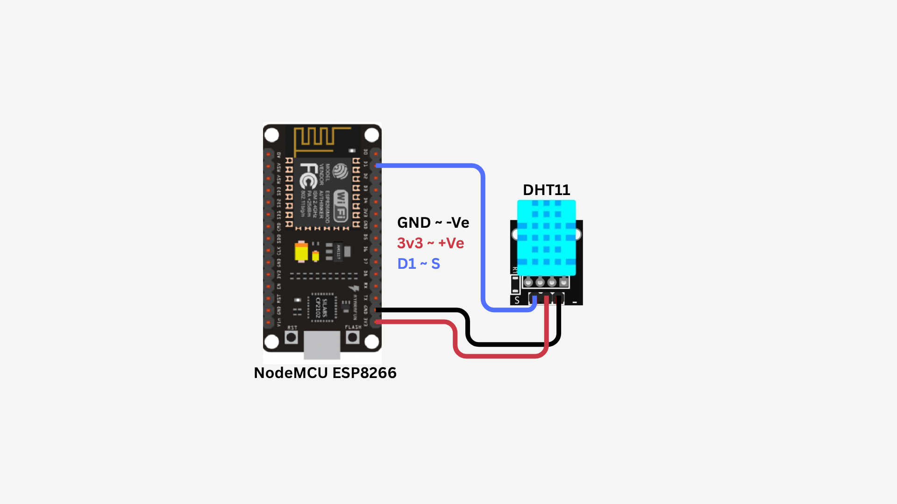
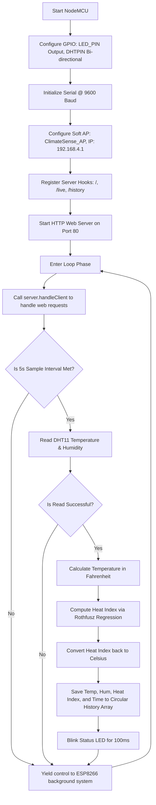

# ClimateSense: IoT Temperature & Humidity Monitoring using DHT11

---

## 1. Problem Statement

Microclimate monitoring is a key factor in civil planning, indoor HVAC control, environmental science, and modern agriculture. Ambient temperature and relative humidity directly influence human health, industrial output, and agricultural productivity:

1. **Human Thermal Comfort and Health**: The human body regulates temperature through evaporative cooling (sweating). Under high humidity, sweat cannot evaporate efficiently, causing the perceived temperature to feel much higher. High relative humidity and temperature can lead to heat exhaustion and heatstroke.
2. **Industrial Warehousing and Electronics Protection**: High humidity promotes mold growth, rust, and oxidation, which can damage stored goods, paper archives, and sensitive electronics. Conversely, low humidity increases the risk of electrostatic discharge (ESD) in electronic manufacturing plants.
3. **Agricultural Greenhouse Management**: Crop health depends on maintaining a specific Vapor Pressure Deficit (VPD). When humidity is too high, transpirational flow drops, causing nutrient deficiencies. When it is too low, plants wilt and drop leaves.
4. **Energy Consumption in Buildings**: Standard HVAC systems operate on static timers rather than real-time indoor air conditions, leading to inefficient heating and cooling.
5. **Limitations of Standard Thermometers**: Traditional analog thermometers and digital hydrometers do not support data logging or remote monitoring. Users must physically read the display, preventing integration into automated systems.

### Proposed Solution
To resolve these challenges, we need an affordable IoT sensor node that measures real-time temperature and relative humidity, calculates the feels-like Heat Index using the Rothfusz regression equation, logs historical trends, and hosts a localized wireless dashboard. This system must broadcast its own WiFi network, allowing any nearby smartphone or computer to connect and view live data and historical logs without requiring external internet or app store downloads.

---

## 2. Our Solution

**ClimateSense** is a standalone, micro-embedded IoT weather station built on the ESP8266 NodeMCU microcontroller and the DHT11 digital temperature/humidity sensor. This device acts as an autonomous sensor node that captures, filters, logs, and visualizes microclimate data.

### Key Features
- **Integrated Digital Sensing**: Uses the DHT11 sensor to capture ambient temperature and relative humidity using a single-wire digital interface.
- **Accurate Heat Index Calculation**: Evaluates the combined effects of air temperature and relative humidity to compute the feels-like temperature using the Rothfusz regression model.
- **Offline Wireless Access Point**: Broadcasts its own localized WiFi network (`SSID: ClimateSense_AP`), running an onboard web server serving the dashboard at `http://192.168.4.1`.
- **Responsive Circular SVG Gauges**: The dashboard displays live temperature and humidity readings using animated circular SVG gauges that scale dynamically.
- **Micro-Condition Indicators**: Displays dynamic weather status indicators based on real-time climate conditions.
- **Status Feedback LED**: Flashes the onboard NodeMCU LED for 100 milliseconds on every successful sensor read.
- **Circular RAM Buffer**: Retains the last 100 measurements in a rolling FIFO array in DRAM, preventing flash memory wear.
- **Non-Blocking Control Loop**: Implements time-sliced multitasking using cooperative scheduling (via `millis()`) to handle high-frequency sensor queries while maintaining responsive web requests.

---

## 3. Brief of Solution

The ClimateSense node combines digital sensor reading, mathematical calculations, data logging, and web services on a single chip.

### System Data Flow Architecture
```
+------------------+     Single-Wire Protocol     +-------------------+
|   DHT11 Sensor   | ---------------------------> |    NodeMCU D1     |
| (Temp/Hum Probe) |                              |    (GPIO Pin 5)   |
+------------------+                              +-------------------+
                                                            │
                                                [40-bit Binary Stream]
                                                            │
                                                            ▼
+---------------------------------------------------------------------+
|                       ESP8266 Microcontroller                       |
|                                                                     |
|   1. Decode 40-bit packet (Checksum verify)                         |
|   2. Extract Temperature (T) and Relative Humidity (RH)             |
|   3. Convert T to Fahrenheit (T_F)                                  |
|   4. Compute Heat Index (HI) via Rothfusz Regression                |
|   5. Convert HI back to Celsius                                     |
+---------------------------------------------------------------------+
          │                                                 │
  [Save to RAM Buffer]                              [Blink Status LED]
  (Circular Array, size 100)                        (D4 / GPIO2 - 100ms)
          │                                                 │
          ▼                                                 ▼
+---------------------+         Web Request         +------------------+
| ESP8266 Web Server  | <-------------------------- |   User Web App   |
| (JSON REST APIs)    | --------------------------> |  (JS AJAX Fetch) |
+---------------------+        JSON Response        +------------------+
```

1. **Digital Sampling**: The DHT11 sensor measures temperature and humidity using internal resistive and thermistor elements.
2. **Data Transmission**: The sensor sends a 40-bit digital data stream to NodeMCU pin D1 (GPIO5) using a proprietary single-wire protocol.
3. **Data Verification**: The firmware verifies the 40-bit stream using the final checksum byte.
4. **Heat Index Computation**: If the data is valid, the firmware converts the temperature to Fahrenheit, calculates the Heat Index using the Rothfusz regression equation, and converts the result back to Celsius.
5. **Data Logging**: The temperature, humidity, and calculated Heat Index are saved to the circular memory buffer, and the status LED flashes.
6. **Dashboard Updates**: The web server handles HTTP requests and serves the dashboard. The client-side JavaScript parses the JSON data to update the circular SVG gauges and append rows to the history table.

---

## 4. What We Are Going to Use

### Hardware Requirements
1. **NodeMCU ESP8266 Development Board (ESP-12E Module)**
   - Core: Xtensa 32-bit LX106 CPU running at 80 MHz.
   - Peripherals: GPIO pins, SPI Flash, WiFi Radio.
   - Operating Voltage: 3.3V. Onboard regulator converts 5V USB power to 3.3V.
2. **DHT11 Temperature & Humidity Sensor**
   - Transducer Type: Resistive humidity sensor and NTC thermistor.
   - Temperature Range: $0^\circ\text{C}$ to $50^\circ\text{C}$ ($\pm 2.0^\circ\text{C}$ accuracy).
   - Humidity Range: 20% to 90% Relative Humidity ($\pm 5.0\%$ accuracy).
   - Sampling Rate: 1 Hz (one reading per second maximum).
3. **LED (Light Emitting Diode)**
   - Color: Standard Red/Blue/Green indicator.
   - Forward Voltage: ~2.0V.
4. **Current-Limiting Resistor**
   - Value: 220 $\Omega$ (1/4 W).
   - Purpose: Protects the GPIO pin and LED from excessive current.
5. **Breadboard & Jumper Wires**
6. **Micro-USB Cable**: For power and code flashing.

### Software Requirements
1. **Arduino IDE 2.x**: Open-source IDE used for programming the ESP8266.
2. **ESP8266 Board Core**: Compiler toolchain and board configuration files.
3. **DHT11 Library**: Library used to decode the DHT11's digital protocol.
4. **Modern Web Browser**: Used to connect to the Access Point and render the dashboard.

---

## 5. In-Depth of IoT (Internet of Things)

The Internet of Things (IoT) is a system of physical devices embedded with electronics, software, and sensors that collect, process, and exchange data over networks.

### Architecture Layers of IoT
This project is structured into three standard IoT layers:

```
+-----------------------------------------------------------------+
| 1. Application Layer (Web Dashboard, Circular SVG Gauges, Table)|
+-----------------------------------------------------------------+
                               ▲
                               │ HTTP Requests (Fetch API)
                               ▼
+-----------------------------------------------------------------+
| 2. Network Layer (ESP8266 SoftAP, IEEE 802.11 b/g/n, TCP/IP)    |
+-----------------------------------------------------------------+
                               ▲
                               │ Single-Wire Digital Bus
                               ▼
+-----------------------------------------------------------------+
| 3. Perception Layer (DHT11 Sensor, NTC Thermistor, GPIO Pins)   |
+-----------------------------------------------------------------+
```

1. **Perception Layer**: Consists of the physical sensors inside the DHT11 housing (NTC thermistor and resistive humidity element) that detect environmental changes and convert them into electrical signals.
2. **Network Layer**: Manages data routing. The ESP8266 generates a localized wireless network under the IEEE 802.11 b/g/n standard. The built-in TCP/IP stack runs a lightweight HTTP server on port 80 to manage incoming client requests.
3. **Application Layer**: Renders the data. The web interface served by the ESP8266 displays raw values, computed percentages, and the animated circular SVG gauges.

### WiFi Operation: Access Point (AP) Mode
In this project, the ESP8266 is configured to run in **Access Point (AP) Mode**:
- **Isolated Operation**: Rather than connecting to an existing router (Station Mode), the ESP8266 generates its own wireless network.
- **Network Credentials**: SSID is set to `ClimateSense_AP` with the password `12345678`.
- **IP Address**: The ESP8266 acts as the DHCP server, assigning IP addresses in the `192.168.4.x` range and hosting the dashboard at `192.168.4.1`.

### Data Exchange: REST API and JSON
The dashboard updates in real-time by polling the web server:
- **Asynchronous AJAX**: The client browser uses the JavaScript Fetch API to request data in the background, preventing page reloads.
- **API Endpoints**:
  - `/live`: Returns the temperature, humidity, calculated Heat Index, sensor status, and system uptime.
  - `/history`: Returns the array of the last 100 logged measurements.
- **JSON Serialization**: Data is formatted as lightweight key-value pairs:
  ```json
  {"ok": true, "temp": 28.5, "hum": 65.0, "heat": 31.2, "uptime": 45}
  ```

---

## 6. In-Depth about Microcontrollers, Sensors, Actuators

Embedded systems use microcontrollers, sensors, and actuators to monitor and interact with the physical world.

```
       +------------+
       |   SENSOR   | (DHT11: Measures temperature and relative humidity)
       +------------+
             │
             ▼ [D1 Digital Pin: Single-Wire 40-bit packet]
       +------------+
       | MICROCON-  |
       |  TROLLER   | (ESP8266 NodeMCU: Decodes bytes, calculates Heat Index)
       +------------+
             │
             ▼ [GPIO Pin: Logic High/Low]
       +------------+
       |  ACTUATOR  | (Status LED / Web Dashboard Circular SVG Gauges)
       +------------+
```

### Microcontrollers
A microcontroller is a single chip that contains a CPU, memory, and input/output peripherals.
- **Processor**: Executes firmware code instructions.
- **RAM**: Stores dynamic variables and the data logs.
- **Flash Memory**: Stores the compiled program and the HTML dashboard page.
- **Peripherals**: Interfaces with digital sensors and controls indicators via GPIO pins.

### Sensors
Sensors are input transducers that convert physical parameters into electrical signals.
- **Digital Sensors**: Use digital communication protocols to transmit pre-digitized data to the microcontroller. The DHT11 is a digital sensor that sends formatted data packets over a single line.

### Actuators
Actuators convert electrical signals back into physical action.
- **Indicator LED**: Connected to D4 (GPIO2) to provide visual feedback.
- **Web Dashboard (Virtual Actuator)**: JavaScript updates the HTML and CSS styles of the circular SVG gauges in response to the sensor data.

---

## 7. In-Depth about ESP8266 NodeMCU

The NodeMCU board breaks out the ESP8266EX chip, making it easy to build connected projects.


### Processor Architecture
- **CPU**: Tensilica Xtensa 32-bit LX106 core.
- **Clock Frequency**: 80 MHz, enabling fast calculations and responsive web hosting.
- **Memory Structure**:
  - **SRAM**: 80 KB DRAM for dynamic data, variables, and networking stacks.
  - **SPI Flash**: 4 MB external flash memory to store the program and web dashboard assets.

### Hardware Interfaces
- **GPIO Pins**: Digital input/output pins. In this project, pin D1 is used to read data from the DHT11, and pin D4 is used to blink the LED.
- **WiFi Radio**: Integrated 2.4 GHz radio supporting WPA/WPA2 security and the TCP/IP stack.

### Pinout Mapping
The table below maps the NodeMCU board pins to the ESP8266's internal GPIO pin designations:

| Board Pin | GPIO Pin | Function in This Project | Electrical Characteristics |
|-----------|----------|--------------------------|----------------------------|
| **D1**    | GPIO5    | DHT11 Sensor Data Input | Bidirectional digital pin. Uses single-wire communication protocol. |
| **D4**    | GPIO2    | Status LED Output | 3.3V digital output. Triggers the status indicator. |
| **3V3**   | 3.3V VCC | Sensor Power Supply | Stable 3.3V output from the onboard regulator. |
| **GND**   | Ground   | Common System Ground | Common ground reference. |

---

## 8. In-Depth about the Project-Specific Sensor: DHT11

The DHT11 is a basic, ultra-low-cost digital temperature and humidity sensor.

```
                    DHT11 Internal Architecture
             ┌──────────────────────────────────────┐
             │   Capacitive Humidity Sensor         │
             │   NTC Thermistor (Temperature)       │
             │   Onboard 8-bit MCU (ADC & Decoder)  │
             └──────────────────┬───────────────────┘
                                │
                                ▼ Bidirectional Single-Wire Bus
```

### Inner Sensing Mechanisms
The DHT11 contains two sensor elements connected to an onboard 8-bit microcontroller:
1. **Resistive Humidity Sensor**: Consists of a moisture-holding substrate between two conductive electrodes. As the relative humidity of the air changes, the substrate absorbs or releases water vapor, altering the electrical resistance between the electrodes. The onboard 8-bit microcontroller measures this resistance and converts it into a relative humidity value.
2. **NTC Thermistor**: A negative temperature coefficient resistor. Its electrical resistance decreases as the temperature rises. The microcontroller measures this resistance to calculate the temperature.
3. **Onboard MCU**: The 8-bit MCU handles the analog readings, converts them into digital values, and packages them into a single-wire data stream.

### Single-Wire Communication Protocol
The DHT11 communicates using a custom single-wire protocol over a single data line:
1. **Start Signal**: The ESP8266 pulls the data line Low for at least 18 milliseconds, then pulls it High and waits for the sensor's response.
2. **Sensor Response**: The DHT11 pulls the data line Low for 80 microseconds, then High for 80 microseconds to indicate it is ready to transmit.
3. **Data Transmission**: The sensor sends 40 bits of data (5 bytes):
   - **Byte 1**: Relative Humidity (integer part)
   - **Byte 2**: Relative Humidity (decimal part, always 0 on DHT11)
   - **Byte 3**: Temperature (integer part)
   - **Byte 4**: Temperature (decimal part, always 0 on DHT11)
   - **Byte 5**: Checksum (the sum of bytes 1, 2, 3, and 4)
4. **Bit Coding**:
   - A logic **0** is sent as a 50 $\mu$s Low pulse followed by a 26-28 $\mu$s High pulse.
   - A logic **1** is sent as a 50 $\mu$s Low pulse followed by a 70 $\mu$s High pulse.

### Heat Index Mathematics
The Heat Index (HI) measures how hot it feels when relative humidity is factored in with the actual air temperature. The National Weather Service uses the **Rothfusz Regression Equation**:

$$HI = -42.379 + 2.04901523 \times T_F + 10.14333127 \times RH - 0.22475541 \times T_F \times RH - 0.00683783 \times T_F^2 - 0.05481717 \times RH^2 + 0.00122874 \times T_F^2 \times RH + 0.00085282 \times T_F \times RH^2 - 0.00000199 \times T_F^2 \times RH^2$$

Where:
- $T_F$ is the temperature in Fahrenheit.
- $RH$ is the relative humidity in percent.

#### Computation Steps in Firmware:
1. **Convert Celsius to Fahrenheit**:
   $$T_F = \left( T_C \times \frac{9}{5} \right) + 32$$
2. **Compute Heat Index in Fahrenheit ($HI_F$)**:
   The firmware evaluates the polynomial regression using the parameters $T_F$ and $RH$.
3. **Convert Heat Index back to Celsius ($HI_C$)**:
   $$HI_C = (HI_F - 32) \times \frac{5}{9}$$

---

## 9. In-Depth about Arduino IDE, Compilation, and Flashing

The Arduino IDE manages the build and upload process for the microcontroller sketch.

### Compilation Toolchain
1. **Preprocessing**: The IDE joins the `.ino` files, adds standard headers, and generates function prototypes.
2. **Compilation**: The cross-compiler (`xtensa-lx106-elf-g++`) compiles the code into binary object files (`.o`).
3. **Linking**: The linker (`xtensa-lx106-elf-ld`) combines the object files with system and WiFi libraries to create a single `.elf` file.
4. **Binary Generation**: The `elf2bin` utility extracts the executable code from the `.elf` file to create the final `.bin` binary file.

### Memory Layout
- **`.text`**: The program instructions stored in flash memory.
- **`.rodata`**: Read-only constants, string literals, and the static HTML page stored in flash using `PROGMEM`.
- **`.data`**: Initialized variables, which are copied to RAM when the board boots.
- **`.bss`**: Uninitialized variables, which are allocated and set to zero in RAM during boot.

### Flashing and Reset
The IDE uploads the binary file using `esptool.py` over serial:
- **Serial Interface**: The onboard CP2102 USB-to-UART chip bridges the computer's USB port to the ESP8266's serial pins.
- **Reset Sequence**: The tool uses the DTR and RTS lines to control the `RST` and `GPIO0` pins:
  1. Pulls `GPIO0` Low and pulses `RST` Low to restart the chip into bootloader mode.
  2. The bootloader writes the binary file to the external SPI flash.
  3. The tool pulls `GPIO0` High and pulses `RST` to reboot the chip and run the program.

---

## 10. Implementation with Circuit Diagram

### Wiring Connections Table
The table below lists the connections between the DHT11 sensor, LED, and the NodeMCU board:

| Component | Pin Label | NodeMCU Connection Pin | Wire Function | Notes |
|-----------|-----------|------------------------|---------------|-------|
| **DHT11** | VCC | 3V3 (3.3V) | Sensor Power Supply | Power supply from the board. |
| **DHT11** | GND | GND | System Ground | Common ground reference. |
| **DHT11** | DATA | D1 (GPIO5) | Digital Bidirectional Bus | Transmits the digitized 40-bit data packet. |
| **LED** | Anode (+) | D4 (GPIO2) via 220$\Omega$ resistor | Digital Control Output | High turns the LED on; Low turns it off. |
| **LED** | Cathode (-) | GND | Ground Reference | Connection to ground. |

### Circuit Design Notes
- **DHT11 Breakout Module**: Standard breakout boards include a 10 k$\Omega$ pull-up resistor on the DATA line to keep the line high when idle. If using a bare DHT11 sensor, this resistor must be added externally.
- **Current-Limiting Resistor**: A 220 $\Omega$ resistor is connected in series with the LED to limit the current drawn from the GPIO pin to a safe level of about $6\text{ mA}$:
  $$I = \frac{V_{\text{pin}} - V_{\text{LED}}}{R} = \frac{3.3\text{ V} - 2.0\text{ V}}{220\ \Omega} \approx 5.9\text{ mA}$$

### Circuit Diagram
The wiring and component layout are shown below:



---

## 11. Code Explanation

This section explains the structure and logic of the firmware in `ClimateSense.ino`.

### Pin and Variable Definitions
The firmware defines the sensor and LED pins, sets the WiFi Access Point parameters, and creates a web server instance on port 80:

```cpp
#include <DHT11.h>

#define DHTPIN        5          // D1 on NodeMCU
#define LED_PIN       2          // D4 on NodeMCU

const char* AP_SSID     = "ClimateSense_AP";
const char* AP_PASSWORD = "12345678";
const IPAddress AP_IP(192, 168, 4, 1);
const IPAddress AP_SUBNET(255, 255, 255, 0);

DHT11          dht11(DHTPIN);
ESP8266WebServer server(80);
```

### The Non-Blocking Control Loop
The main loop processes web requests and queries the sensor at a set interval. Using a non-blocking approach ensures the web server remains responsive:

```cpp
void loop() {
  server.handleClient(); // Process incoming HTTP requests immediately

  uint32_t now = millis();
  if (now - lastSample >= SAMPLE_INTERVAL) {
    lastSample = now;

    int iTemp = 0, iHum = 0;
    int result = dht11.readTemperatureHumidity(iTemp, iHum);

    if (result != 0) {
      sensorOK = false;
      Serial.println("[DHT11] ERROR: " + String(DHT11::getErrorString(result)));
    } else {
      sensorOK     = true;
      currentTemp  = (float)iTemp;
      currentHum   = (float)iHum;
      
      // Save the measurement and flash the indicator LED
      addRecord(currentTemp, currentHum);
      
      digitalWrite(LED_PIN, HIGH); // Turn LED on
      delay(100);                  // Short blink
      digitalWrite(LED_PIN, LOW);  // Turn LED off
    }
  }
  yield(); // Allow background WiFi tasks to run
}
```

---

## 12. Working

When the ClimateSense Weather Station is powered on, it runs through the following operational steps:

```
[ Power On ]
     │
     ▼
[ Setup() Initialization ]
     ├── Set PinModes: DHT11 DATA (GPIO5/D1), LED_PIN (Output)
     ├── Initialize Serial port @ 9600 Baud
     ├── Configure Soft AP: SSID "ClimateSense_AP", IP 192.168.4.1
     └── Register API endpoints & start HTTP Server
     │
     ▼
[ Loop() Main Execution ]
     ├── Handle incoming web requests (server.handleClient())
     └── Every 5 seconds:
             ├── Trigger DHT11 read (40-bit packet)
             ├── Check checksum & calculate Heat Index
             ├── Write reading to history buffer
             └── Flash the status LED (100ms)
     │
     ▼
[ User Interface Loop ]
     ├── Client connects to "ClimateSense_AP" and opens http://192.168.4.1
     ├── Web page loads HTML, CSS, and JS from flash
     └── JavaScript polls `/live` and `/history` every 5 seconds:
             ├── Updates temperature, humidity, and heat index values
             ├── Animates circular SVG gauges (updating stroke-dashoffset)
             └── Appends new rows to the history table
```

1. **Startup**: The CPU runs the `setup()` function to initialize the serial port, set pin directions, set up the WiFi Access Point with the specified IP address, and register the web server routes.
2. **Measurement**: Every 5 seconds, the system reads the DHT11 data, verifies the checksum, calculates the Heat Index, adds the record to history, and blinks the LED.
3. **Web Server**: The web server waits for incoming connections. When a client requests the root URL (`/`), the server sends the HTML page stored in flash memory.
4. **Dashboard Updates**: The JavaScript in the webpage polls the `/live` and `/history` JSON endpoints every 5 seconds. It updates the values on the page and adjusts the appearance of the circular SVG gauges:
   - **Temperature Gauge**: Translates the Celsius value to a percentage of the gauge range and updates the gauge needle and fill arc.
   - **Humidity Gauge**: Updates the humidity fill arc.
   - **Weather Emoji**: Changes the emoji icon based on climate thresholds (e.g., ☀️ for hot, ❄️ for cold, 🌧️ for high humidity).

---

## 13. Conclusion

### Project Evaluation
The ClimateSense weather station provides an affordable, self-contained solution for microclimate monitoring. The real-time web dashboard displays readings using animated circular SVG gauges, and the Heat Index calculations provide a more realistic measure of indoor thermal comfort.

### Future Improvements
1. **High-Accuracy Sensor**: Upgrade to a DHT22 sensor, which measures a wider temperature range ($-40^\circ\text{C}\text{ to }80^\circ\text{C}$ with $\pm 0.5^\circ\text{C}$ accuracy) and relative humidity with decimal precision.
2. **External Storage**: Add an SD card module to log data locally for long-term climate analysis.
3. **Power Optimization**: Implement sleep modes to conserve battery life in portable setups.

---

## 14. Flow Diagram

The flowchart below shows the logic of the firmware program:


