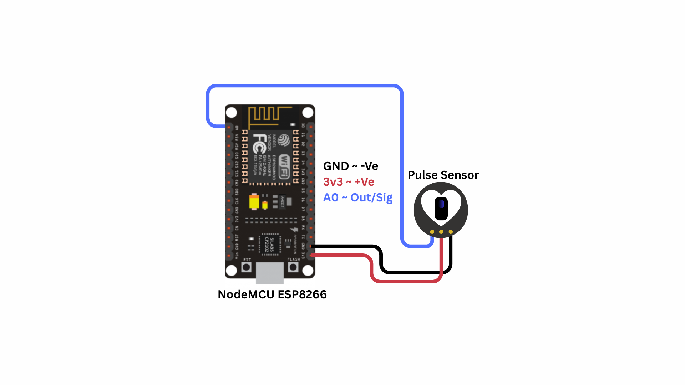
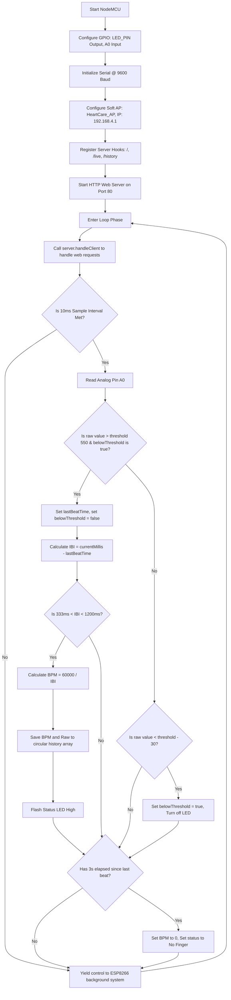

# HeartCare: IoT Heart Beat Monitoring and Visualization System

---

## 1. Problem Statement

Cardiovascular disease is the leading cause of death globally, accounting for an estimated 17.9 million lives lost each year. Early detection of heart rate anomalies (such as tachycardia, bradycardia, or arrhythmia) can prevent severe cardiac events. However, monitoring cardiac health in home and remote settings presents several challenges:

1. **High Cost of Medical Equipment**: Professional electrocardiogram (ECG) and pulse oximeter monitors are expensive and designed primarily for clinical settings, making continuous personal monitoring unaffordable for many.
2. **Data Isolation**: Traditional portable pulse meters show real-time numbers on small LCD displays but lack the ability to log historical trends or share data wirelessly with family members or remote healthcare providers.
3. **Motion and Optical Noise Interference**: Optical pulse readings from the fingertip are highly sensitive to movement and ambient light, requiring software-level filtering to avoid false readings.
4. **App and Internet Dependencies**: Many consumer fitness trackers require active internet connections, bluetooth pairing, and proprietary smartphone apps, which can be difficult for elderly or non-technical users to set up.
5. **Telemedicine Needs in Remote Areas**: In rural clinics, healthcare providers need simple, portable diagnostic tools that operate without internet or external routers.

### Proposed Solution
To address these issues, we need a low-cost, portable, and standalone IoT device that measures heart rate contactlessly from the fingertip. The system must process analog signals at high frequency (100 Hz), implement a robust peak-detection algorithm with noise filtering and hysteresis, log beat history, and host a local web server. By broadcasting its own local WiFi network, the device will allow anyone nearby to view a live, animated ECG dashboard on their phone or computer browser without needing external internet.

---

## 2. Our Solution

**HeartCare** is a standalone, micro-embedded biomedical monitoring system built on the ESP8266 NodeMCU microcontroller and an analog optical pulse sensor. The device operates as a portable heart rate monitor that captures, filters, processes, logs, and visualizes pulse data in real-time.

### Key Features
- **Optical Photoplethysmography (PPG)**: Uses an optical sensor to measure blood volume changes in the fingertip capillaries.
- **Micro-Peak Detection Algorithm**: Implements real-time threshold and hysteresis filtering to identify heartbeats and calculate Beats Per Minute (BPM) based on Inter-Beat Intervals (IBI).
- **Standalone Access Point Mode**: Operates without external routers or internet by generating its own WiFi network (`SSID: HeartCare_AP`), hosting the dashboard at `http://192.168.4.1`.
- **Animated SVG and ECG Web Dashboard**: Serves an HTML page featuring a beating heart SVG that syncs its pump rate directly to the user's pulse, alongside an animated ECG waveform trace.
- **Physical Heartbeat Indicator**: Flashes the NodeMCU GPIO2 (D4) LED in sync with every detected heartbeat.
- **Intelligent Noise Filter**: Automatically rejects false beats outside the human heart rate range of 50 to 180 BPM.
- **Auto-Timeout Disconnection**: Automatically resets the BPM value to zero if no pulse is detected for 3 seconds, indicating the finger has been removed.
- **Rolling RAM Buffer**: Stores the last 100 logged beats in memory, displaying a historical log table on the webpage.
- **Non-Blocking Control Loop**: Uses `millis()` time-slicing to process analog sensor inputs every 10 milliseconds while keeping the web server fully responsive.

---

## 3. Brief of Solution

The system operates as an edge computing node that handles raw signal acquisition, processes physical calculations, logs states, and serves graphical interfaces.

### System Data Flow Architecture
```
+------------------+       Analog Voltage      +-------------------+
|   Pulse Sensor   | ------------------------> |    NodeMCU A0     |
|   (PPG Probe)    |                           |    (10-bit ADC)   |
+------------------+                           +-------------------+
                                                         │
                                             [10ms Analog Sampling]
                                                         │
                                                         ▼
+------------------------------------------------------------------+
|                     ESP8266 Microcontroller                      |
|                                                                  |
|   1. Read raw pulse amplitude (0-1023)                           |
|   2. Check if raw value > threshold (550) & belowThreshold is true |
|   3. Calculate Inter-Beat Interval: IBI = current - lastBeat     |
|   4. Filter noise: Accept only if 333ms < IBI < 1200ms           |
|   5. Compute Beats Per Minute: BPM = 60000 / IBI                 |
|   6. Apply hysteresis: reset belowThreshold when raw < 520       |
+------------------------------------------------------------------+
          │                                              │
  [Save to RAM Buffer]                           [Flash Status LED]
  (Circular Array, size 100)                     (D4 / GPIO2 - High/Low)
          │                                              │
          ▼                                              ▼
+---------------------+       Web Request        +------------------+
| ESP8266 Web Server  | <----------------------- |   User Web App   |
| (JSON REST APIs)    | -----------------------► |  (JS AJAX Fetch) |
+---------------------+      JSON Response       +------------------+
```

1. **Pulse Sensing**: The photoplethysmographic sensor shines green light into the fingertip and measures the reflected light, outputting a fluctuating analog voltage.
2. **ADC Acquisition**: The ESP8266 samples pin A0 every 10 milliseconds, converting the voltage to a 10-bit integer ($0 - 1023$).
3. **Peak Detection**: The firmware checks if the signal exceeds the threshold. When a peak is found, it calculates the Inter-Beat Interval (IBI) in milliseconds.
4. **BPM Computation**: The IBI is converted to Beats Per Minute ($BPM = 60000 / IBI$) and verified against human limits.
5. **Status Control**: The status LED flashes in sync with the heartbeat, and the record is saved to the circular buffer.
6. **Dashboard Updates**: The web server handles browser requests, returning the HTML page and JSON payloads. The client-side JavaScript parses the JSON to update the live BPM display, synchronize the beating heart SVG, and refresh the history table.

---

## 4. What We Are Going to Use

### Hardware Requirements
1. **NodeMCU ESP8266 Development Board (ESP-12E Module)**
   - Core: Xtensa 32-bit LX106 CPU running at 80 MHz.
   - Peripherals: 10-bit ADC, GPIO pins, SPI Flash.
   - WiFi Module: 2.4 GHz 802.11 b/g/n radio.
2. **Analog Pulse Sensor (PPG)**
   - Sensing Method: Green LED (525 nm) and photodetector.
   - Operating Voltage: 3V to 5V.
   - Current Consumption: ~4 mA.
   - Output Signal: Analog voltage.
3. **LED (Light Emitting Diode)**
   - Purpose: Visual heartbeat indicator.
   - Forward Voltage: ~2.0V.
4. **Current-Limiting Resistor**
   - Value: 220 $\Omega$ (1/4 W).
   - Purpose: Limits the output current from the GPIO pin to protect the LED.
5. **Breadboard & Jumper Wires**
6. **Micro-USB Cable & Power Source**: For programming and power.

### Software Requirements
1. **Arduino IDE 2.x**: IDE used to write, compile, and upload the code.
2. **ESP8266 Arduino Board Core**: Compiler toolchain and board libraries.
3. **Modern Web Browser**: Renders the HTML5, CSS3, and JavaScript dashboard.

---

## 5. In-Depth of IoT (Internet of Things)

The Internet of Things (IoT) is a network of physical devices embedded with sensors, software, and communication electronics, enabling them to collect, log, and exchange data over networks.

### Architecture Layers of IoT
This project is structured into three standard IoT layers:

```
+-----------------------------------------------------------------+
| 1. Application Layer (HeartCare Web App, Heart SVG, ECG Trace)  |
+-----------------------------------------------------------------+
                               ▲
                               │ HTTP Requests (Fetch API)
                               ▼
+-----------------------------------------------------------------+
| 2. Network Layer (ESP8266 Access Point, TCP/IP, Web Server)     |
+-----------------------------------------------------------------+
                               ▲
                               │ Hardware Bus (Analog Read / ADC)
                               ▼
+-----------------------------------------------------------------+
| 3. Perception Layer (PPG Optical Sensor, Fingertip Probe)       |
+-----------------------------------------------------------------+
```

1. **Perception Layer**: Consists of the physical sensors inside the pulse sensor housing (green LED and phototransistor) that detect capillary blood volume changes and convert them into electrical signals.
2. **Network Layer**: Manages data routing. The ESP8266 generates a localized wireless network under the IEEE 802.11 b/g/n standard. The built-in TCP/IP stack runs a lightweight HTTP server on port 80 to manage incoming client requests.
3. **Application Layer**: Renders the data. The web interface served by the ESP8266 displays raw values, computed BPM, and the animated ECG waveform dashboard.

### Wireless Access Point Mode
To operate as a portable device, the ESP8266 runs in **Access Point (AP) Mode**:
- **Standalone Local Network**: The device broadcasts `HeartCare_AP` with the password `12345678`, requiring no external router or internet.
- **IP Address**: The ESP8266 hosts the dashboard at `192.168.4.1` and assigns IP addresses to connected devices via DHCP.

### REST API and JSON Exchange
- **Asynchronous AJAX**: The client browser uses the JavaScript Fetch API to request data in the background, preventing page reloads.
- **API Endpoints**:
  - `/live`: Returns the current BPM, raw amplitude, signal status, and system uptime.
  - `/history`: Returns the array of the last 100 logged measurements.
- **JSON Serialization**: Data is formatted as lightweight key-value pairs:
  ```json
  {"bpm": 72, "raw": 580, "cond": "Reading Pulse", "uptime": 120}
  ```

---

## 6. In-Depth about Microcontrollers, Sensors, Actuators

Embedded systems rely on microcontrollers, sensors, and actuators to monitor and interact with the physical world.

```
       +------------+
       |   SENSOR   | (Pulse Sensor: Capillary blood volume changes to Voltage)
       +------------+
             │
             ▼ [A0 Analog Pin: 0 - 3.3V]
       +------------+
       | MICROCON-  |
       |  TROLLER   | (ESP8266 NodeMCU: Runs peak-detection, hosts web server)
       +------------+
             │
             ▼ [GPIO Pin: Logic High/Low]
       +------------+
       |  ACTUATOR  | (Status LED / Web Dashboard Beating Heart SVG)
       +------------+
```

### Microcontrollers
A microcontroller is a single chip that contains a CPU, memory, and input/output peripherals.
- **Processor**: Executes firmware code instructions.
- **RAM**: Stores dynamic variables and the data logs.
- **Flash Memory**: Stores the compiled program and the HTML dashboard page.
- **Peripherals**: Interfaces with digital sensors and controls indicators via GPIO pins.

### Sensors
Sensors are input transducers that convert physical parameters into electrical signals.
- **Optical PPG Sensors**: Measure changes in light absorption. The pulse sensor shines green light into the skin and measures the reflected light, which fluctuates with each heartbeat.

### Actuators
Actuators convert electrical signals back into physical action.
- **Indicator LED**: Connected to D4 (GPIO2) to flash in sync with the heartbeat.
- **Web Dashboard (Virtual Actuator)**: JavaScript updates the HTML and CSS styles of the beating heart SVG in response to the sensor data.

---

## 7. In-Depth about ESP8266 NodeMCU

The NodeMCU board breaks out the ESP8266EX chip, making it easy to build connected projects.


### Processor Architecture
- **CPU**: Tensilica Xtensa 32-bit LX106 core.
- **Clock Frequency**: 80 MHz, enabling fast calculations and responsive web hosting.
- **Memory Structure**:
  - **SRAM**: 80 KB DRAM for dynamic data, variables, and networking stacks.
  - **SPI Flash**: 4 MB external flash memory to store the program and web dashboard assets.

### Hardware Interfaces
- **Analog Input (A0)**: The ESP8266 has a single analog input pin with a 10-bit ADC. On the NodeMCU board, a resistor divider scales the input voltage range from $0 - 3.3\text{V}$ to the safe $0 - 1\text{V}$ range of the chip.
- **WiFi Radio**: Integrated 2.4 GHz radio supporting WPA/WPA2 security and the TCP/IP stack.

### Pinout Mapping
The table below maps the NodeMCU board pins to the ESP8266's internal GPIO pin designations:

| Board Pin | GPIO Pin | Function in This Project | Electrical Characteristics |
|-----------|----------|--------------------------|----------------------------|
| **A0**    | ADC0     | Analog Sensor Input (Pulse Signal) | 10-bit resolution ($0 - 1023$). Input voltage range: $0 - 3.3\text{V}$. |
| **D4**    | GPIO2    | Status LED Output | 3.3V digital output. Flashes in sync with the heartbeat. |
| **3V3**   | 3.3V VCC | Sensor Power Supply | Stable 3.3V output from the onboard regulator. |
| **GND**   | Ground   | Common System Ground | Common ground reference. |

### Technical Capabilities of ESP8266
* **Processor Core**: Tensilica Xtensa 32-bit LX106 RISC CPU, operating at 80 MHz (can be overclocked to 160 MHz). It delivers up to 645 DMIPS of processing power.
* **Memory Subsystem**: 80 KB of Instruction/Data SRAM, plus support for up to 16 MB of external SPI flash memory (typically 4 MB on NodeMCU boards) to store firmware, assets, and file systems.
* **Integrated Wi-Fi Stack**: Built-in 802.11 b/g/n Wi-Fi transceiver running at 2.4 GHz. It supports WEP, WPA/WPA2 Personal/Enterprise security protocols. It includes an integrated TR switch, balun, LNA, power amplifier, and matching network.
* **Low-Power Modes**: Supports three sleep configurations to conserve power in battery-operated nodes:
  - **Modem Sleep** (~15 mA): CPU remains active, Wi-Fi radio is powered down between beacon intervals.
  - **Light Sleep** (~0.9 mA): CPU clock is gated, Wi-Fi radio is off. The chip wakes up on external interrupts.
  - **Deep Sleep** (~20 µA): Only the internal Real-Time Clock (RTC) remains active. The chip resets on wake-up (GPIO16/D0 connected to RST).
* **Hardware Peripherals**: Features 17 GPIO pins, hardware PWM (Pulse-Width Modulation), SPI, I2C, I2S, UART interfaces, and a 10-bit analog-to-digital converter (ADC).

### Real-World Applications
1. **Smart Home Automation**: Wireless control of smart plugs, lighting fixtures, appliances, and automated blinds.
2. **Environmental Tracking**: Standalone weather stations, air quality monitors, and greenhouse climate controls.
3. **Wearable Health Monitors**: Portable pulse, step, and temperature trackers that transmit telemetry to local displays or remote apps.
4. **Precision Agriculture**: Remote soil moisture, ambient light, and irrigation control systems for farm management.

### Industrial Usecases
1. **Predictive Maintenance**: Monitoring vibration and temperature of machinery, logging telemetry, and reporting anomalies before failure occurs.
2. **Industrial IoT Gateways**: Bridging legacy serial protocol devices (RS-232/RS-485) to local Wi-Fi networks or MQTT brokers.
3. **Asset Tracking & Logistics**: Monitoring temperature, humidity, and location of sensitive shipments inside warehouses and transport containers.
4. **Remote Telemetry & SCADA**: Wireless transmission of tank levels, pressure values, and power consumption statistics to industrial SCADA systems.

---

## 8. In-Depth about the Project-Specific Sensor: Optical Pulse Probe

The system uses an optical pulse sensor based on photoplethysmography (PPG) to measure heart rate.

```
                      Fingertip Capillaries
                        ( \ \ \ \ \ \ )
                       ▲               │
             Green Light               │ Reflected Light
             (LED 525nm)               ▼ (Blood Volume Modulated)
                     ┌───┐           ┌───┐
                     │Tx │           │Rx │
                     └───┴───────────┴───┘
                           PPG Sensor
```

### Physical Principles of Operation
Photoplethysmography (PPG) is an optical technique that detects blood volume changes in microvascular tissue:
1. **Light Absorption**: Oxygenated hemoglobin in blood absorbs green light (525 nm wavelength) more than surrounding tissue.
2. **Capillary Expansion (Systole)**: When the heart beats, it pumps blood through the body, causing the capillaries in the fingertip to expand. This temporary increase in blood volume absorbs more green light, reducing the amount of reflected light.
3. **Capillary Contraction (Diastole)**: Between heartbeats, the blood volume in the capillaries drops, absorbing less green light and reflecting more light back to the sensor.
4. **Voltage Output**: The sensor's photodetector measures the reflected light and converts it into a fluctuating analog voltage, which is sent to the ESP8266's analog pin A0.

### Beat Detection and Hysteresis Algorithm
To identify a true heartbeat from the noisy analog signal, the firmware implements a peak-detection algorithm with hysteresis:
1. **High-Frequency Sampling**: The ESP8266 reads pin A0 every 10 milliseconds (100 Hz).
2. **Threshold Comparison**: A peak (heartbeat) is registered when the raw reading exceeds the threshold:
   $$\text{Raw Reading} > \text{threshold } (550)$$
3. **Inter-Beat Interval (IBI)**: When a peak is found, the system calculates the time elapsed since the last beat:
   $$IBI = \text{currentMillis} - \text{lastBeatTime}$$
4. **Human Range Verification**: To filter out noise, the IBI must fall within the range of standard human heart rates (50 to 180 BPM):
   - **Maximum Limit (180 BPM)**: $IBI_{\text{min}} = \frac{60,000}{180} = 333\text{ ms}$
   - **Minimum Limit (50 BPM)**: $IBI_{\text{max}} = \frac{60,000}{50} = 1200\text{ ms}$
   
   If $333\text{ ms} < IBI < 1200\text{ ms}$, the reading is accepted and the BPM is calculated:
   $$BPM = \frac{60,000}{IBI}$$
5. **Hysteresis Reset**: Once a peak is triggered, the system sets `belowThreshold = false` to prevent multiple triggers from the same pulse. The system resets and looks for the next beat only when the signal drops below a lower threshold:
   $$\text{Raw Reading} < \text{threshold} - 30\ (520)$$

---

## 9. In-Depth about Arduino IDE, Compilation, and Flashing

The Arduino IDE manages the build and upload process for the microcontroller sketch.

### Compilation Process
1. **Preprocessing**: The IDE joins the `.ino` files, adds standard headers, and generates function prototypes.
2. **Compilation**: The cross-compiler (`xtensa-lx106-elf-g++`) compiles the code into binary object files (`.o`).
3. **Linking**: The linker (`xtensa-lx106-elf-ld`) combines the object files with system and WiFi libraries to create a single `.elf` file.
4. **Binary Generation**: The `elf2bin` utility extracts the executable code from the `.elf` file to create the final `.bin` binary file.

### Memory Segments
- **`.text`**: The program instructions stored in flash memory.
- **`.rodata`**: Read-only constants, string literals, and the static HTML page stored in flash using `PROGMEM`.
- **`.data`**: Initialized variables, which are copied to RAM when the board boots.
- **`.bss`**: Uninitialized variables, which are allocated and set to zero in RAM during boot.

### Flashing and Reset
The IDE uploads the binary file using `esptool.py` over serial:
- **Serial Interface**: The onboard CP2102 USB-to-UART chip bridges the computer's USB port to the ESP8266's serial pins.
- **Reset Sequence**: The tool uses the DTR and RTS lines to control the `RST` and `GPIO0` pins:
  1. Pulls `GPIO0` Low and pulses `RST` Low to restart the chip into bootloader mode.
  2. The bootloader writes the binary file to the external SPI flash.
  3. The tool pulls `GPIO0` High and pulses `RST` to reboot the chip and run the program.

---

## 10. Implementation with Circuit Diagram

### Wiring Connections Table
The table below lists the connections between the pulse sensor, LED, and the NodeMCU board:

| Component | Pin Label | NodeMCU Connection Pin | Wire Function | Notes |
|-----------|-----------|------------------------|---------------|-------|
| **Pulse Sensor** | Signal (S) | A0 | Analog Signal Output | Outputs voltage representing the pulse waveform. |
| **Pulse Sensor** | VCC (+) | 3V3 (3.3V) | Sensor Power Supply | Power supply from the board. |
| **Pulse Sensor** | GND (-) | GND | System Ground | Common ground reference. |
| **LED** | Anode (+) | D4 (GPIO2) via 220$\Omega$ resistor | Digital Control Output | High turns the LED on; Low turns it off. |
| **LED** | Cathode (-) | GND | Ground Reference | Connection to ground. |

### Circuit Design Notes
- **Pulse Sensor Filtering**: The sensor module includes RC filtering components to clean up the analog signal before it is sent to the microcontroller.
- **Current-Limiting Resistor**: A 220 $\Omega$ resistor is connected in series with the LED to limit the current drawn from the GPIO pin to a safe level of about $6\text{ mA}$:
  $$I = \frac{V_{\text{pin}} - V_{\text{LED}}}{R} = \frac{3.3\text{ V} - 2.0\text{ V}}{220\ \Omega} \approx 5.9\text{ mA}$$

### Circuit Diagram
The wiring and component layout are shown below:



---

## 11. Code Explanation

This section explains the structure and logic of the firmware in `HeartCare.ino`.

### Pin and Variable Definitions
The firmware defines the sensor and LED pins, sets the WiFi Access Point parameters, and creates a web server instance on port 80:

```cpp
#define SENSOR_PIN    A0         // Analog input for Pulse Sensor
#define LED_PIN       2          // GPIO2 (maps to board D4 pin)

const char* AP_SSID     = "HeartCare_AP";
const char* AP_PASSWORD = "12345678";
const IPAddress AP_IP(192, 168, 4, 1);
const IPAddress AP_SUBNET(255, 255, 255, 0);

ESP8266WebServer server(80);
```

### The Pulse Detection Loop
The main loop checks for web requests and samples the analog sensor every 10 milliseconds:

```cpp
void loop() {
  server.handleClient(); // Process incoming HTTP requests immediately

  uint32_t currentMillis = millis();
  
  // Sample the sensor every 10ms (100 Hz)
  if (currentMillis - lastSampleTime >= 10) {
    lastSampleTime = currentMillis;
    currentRaw = analogRead(SENSOR_PIN);
    
    // Peak Detection Algorithm
    if (currentRaw > threshold && belowThreshold) {
      uint32_t beatTime = currentMillis;
      uint32_t ibi = beatTime - lastBeatTime; // Inter-Beat Interval in ms
      
      // Filter out noise: accept only human heart rates (50 to 180 BPM)
      if (ibi > 333 && ibi < 1200) {
        int computedBPM = 60000 / ibi;
        
        if (computedBPM >= 50 && computedBPM <= 180) {
          currentBPM = computedBPM;
          addRecord(currentBPM, currentRaw);
          
          // Flash the heartbeat indicator LED
          digitalWrite(LED_PIN, HIGH);
        }
      }
      
      lastBeatTime = beatTime;
      belowThreshold = false; // Lock out further triggers
      currentStatus = "Reading Pulse";
      
    } else if (currentRaw < threshold - 30) {
      // Hysteresis: reset lock once signal drops below threshold
      belowThreshold = true;
      digitalWrite(LED_PIN, LOW); // Turn LED off
    }
    
    // Reset BPM if no finger is detected for 3 seconds
    if (currentMillis - lastBeatTime > 3000) {
      currentBPM = 0;
      currentStatus = "No Finger / Weak";
    }
  }
  yield(); // Allow background WiFi tasks to run
}
```

### Program Flow Diagram
The flowchart below shows the logic of the firmware program:



---

## 12. Working

When the HeartCare Monitor is powered on, it runs through the following operational steps:

```
[ Power On ]
     │
     ▼
[ Setup() Initialization ]
     ├── Set PinModes: SENSOR_PIN (Input), LED_PIN (Output)
     ├── Initialize Serial port @ 9600 Baud
     ├── Configure Soft AP: SSID "HeartCare_AP", IP 192.168.4.1
     └── Register API endpoints & start HTTP Server
     │
     ▼
[ Loop() Main Execution ]
     ├── Handle incoming web requests (server.handleClient())
     └── Every 10 milliseconds:
             ├── Read analog value from A0
             ├── Run peak-detection & noise filtering
             ├── Calculate BPM & flash LED (if beat found)
             └── Reset status if no pulse found for 3 seconds
     │
     ▼
[ User Interface Loop ]
     ├── Client connects to "HeartCare_AP" and opens http://192.168.4.1
     ├── Web page loads HTML, CSS, and JS from flash
     └── JavaScript polls `/live` and `/history` every 2 seconds:
             ├── Updates BPM, raw amplitude, and status values
             ├── Adjusts heart SVG pump speed based on BPM
             ├── Animates ECG waveform trace in sync with heart rate
             └── Appends new rows to the history table
```

1. **Startup**: The CPU runs the `setup()` function to initialize the serial port, set pin directions, set up the WiFi Access Point with the specified IP address, and register the web server routes.
2. **Measurement**: Every 10 milliseconds, the system samples the analog pin A0, processes the peak-detection algorithm, calculates the BPM, updates the history records, and blinks the LED.
3. **Web Server**: The web server waits for incoming connections. When a client requests the root URL (`/`), the server sends the HTML page stored in flash memory.
4. **Dashboard Updates**: The JavaScript in the webpage polls the `/live` and `/history` JSON endpoints every 2 seconds. It updates the values on the page and adjusts the appearance of the web page:
   - **Heart Pumping**: The SVG heart and pulse rings animate in sync with the detected BPM.
   - **ECG Waveform**: The ECG line animation speed matches the pulse rate.
   - **Finger Status**: Displays warning messages if the sensor loses contact.

---

## 13. Conclusion

### Project Evaluation
The HeartCare system provides an affordable, standalone solution for real-time heart rate monitoring. The optical sensor and peak-detection algorithm calculate heart rate from the fingertip, and the web dashboard displays the readings using animated heart and ECG graphics.

### Future Improvements
1. **Blood Oxygen SpO2**: Upgrade to a MAX30102 sensor module to measure both heart rate and blood oxygen saturation (SpO2) using red and infrared LEDs.
2. **Cloud Integration**: Add Station Mode capability to allow the device to connect to a local router and upload measurements to a secure health database.
3. **Rechargeable Battery**: Mount the system in a custom 3D-printed enclosure with a rechargeable Li-Ion battery for fully portable monitoring.
