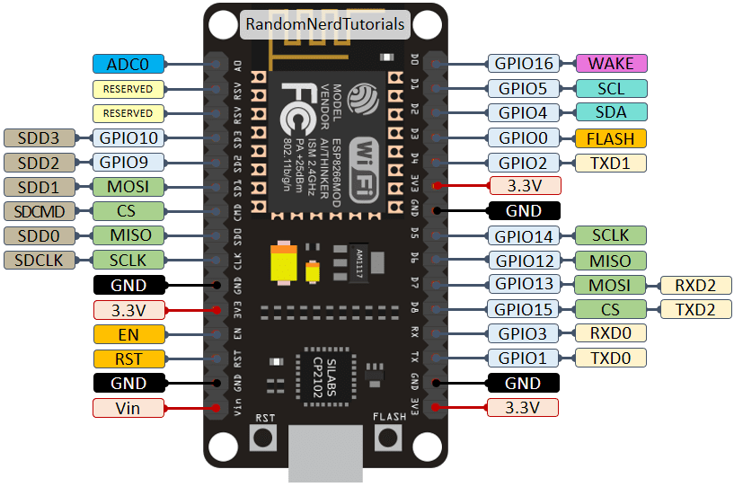
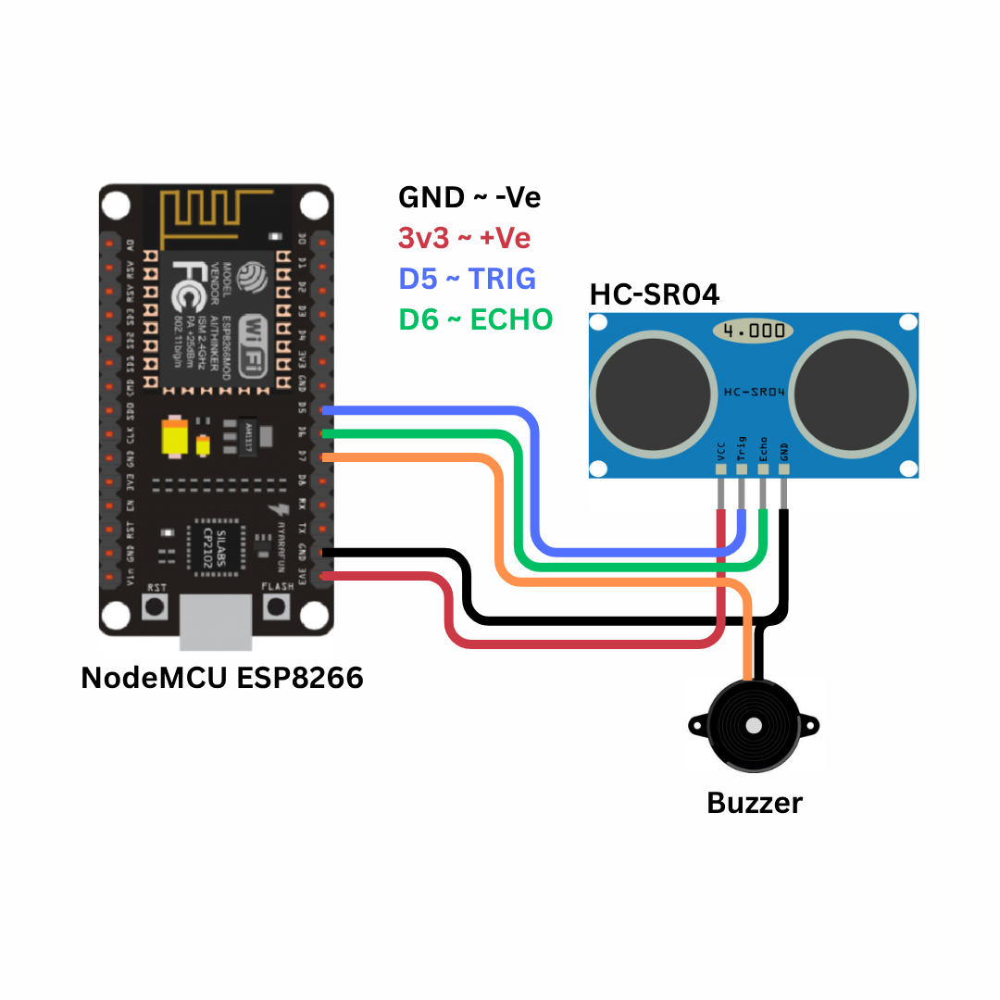
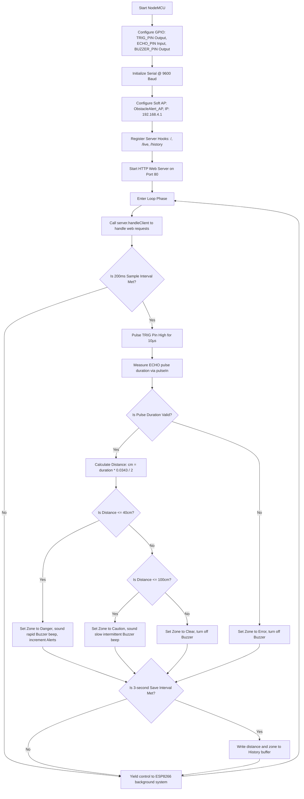

# IoT Obstacle Detection and Alert System using IR Sensor

---

## 1. Problem Statement

Mobility and independent navigation are fundamental challenges for visually impaired and blind individuals. According to the World Health Organization (WHO), over 285 million people worldwide are visually impaired, with 39 million classified as legally blind. Navigating daily environments poses significant hazards:

1. **Limitations of the Traditional White Cane**: The standard white cane is a physical tool that detects obstacles only upon direct contact. It fails to identify hanging obstacles (such as tree branches, open cabinet doors, or signboards) and provides zero advance warning, exposing users to head and chest injuries.
2. **Short Reaction Windows**: Because traditional tools rely on physical contact, the user has very little time to stop or change direction once an obstacle is detected, increasing the risk of falls or collisions.
3. **Environmental Interference**: Close-range detection systems that rely on basic infrared (IR) sensors are highly sensitive to sunlight, ambient light, and the color or material of the obstacle (e.g., black surfaces absorb IR light, causing detection failures).
4. **Caregiver Anxiety and Remote Monitoring**: Family members and caregivers have no way to monitor the user's environment in real-time to assess potential hazards.
5. **High Cost of Commercial Assistive Tech**: High-end electronic canes with built-in sensors and GPS telemetry are expensive, making them inaccessible to low-income populations in developing nations.

### Proposed Solution
To address these issues, we need an affordable, lightweight assistive system that can be mounted on a standard walking stick. The system must measure distances contactlessly, classify proximity zones (e.g., Danger, Caution, Clear), and provide real-time audio alerts via a piezo buzzer. To ensure reliable performance outdoors and under different lighting conditions, the design will use high-precision ultrasonic acoustic ranging. Additionally, the device will host a local web server to broadcast a WiFi network, allowing caregivers to monitor the user's environment and view live alert data on a mobile dashboard without requiring external internet.

---

## 2. Our Solution

The **IoT Obstacle Detection and Alert System** is a standalone, micro-embedded assistive device designed around the ESP8266 NodeMCU microcontroller and the HC-SR04 ultrasonic sensor. Mounted on a walking stick, this device functions as an autonomous ranging node that processes proximity data, drives an audio alarm, and streams visual analytics.

### Key Features
- **Acoustic Time-of-Flight Ranging**: Uses ultrasonic sound waves to measure distances from 2 cm to 400 cm with high reliability under direct sunlight and on diverse surface textures.
- **Graduated Audio Alarm System**: Controls an active piezo buzzer to produce proximity-based warning patterns:
  - **Danger (<= 40 cm)**: Rapid, continuous beeps (80 ms) warning the user to stop immediately.
  - **Caution (40 - 100 cm)**: Intermittent beeps indicating an object is nearby.
  - **Clear (> 100 cm)**: Silent operation.
- **Standalone Caregiver Access Point**: Runs in Access Point (AP) mode, broadcasting a secure WiFi network (`SSID: ObstacleAlert_AP`) and serving a web dashboard at `http://192.168.4.1`.
- **Animated SVG/CSS Caregiver Dashboard**: Renders a live walk-cycle animation showing a figure with a cane emitting sonar waves. An obstacle wall on the screen grows or shrinks in real-time based on the actual sensor distance.
- **Dual Ranging Architecture Analysis**: Combines the theoretical principles of Infrared (IR) reflection and Ultrasonic echo calculation to design a reliable safety instrument.
- **Electrical Signal Attenuation**: Integrates a physical resistor network to reduce the sensor's 5V output to a safe 3.3V level for the ESP8266.
- **Non-Blocking Execution Loop**: Employs cooperative task scheduling using `millis()`, running high-frequency sensor scans (every 200 ms) while maintaining a responsive web server.

---

## 3. Brief of Solution

The system combines acoustic ranging, logic-level shifting, buzzer warning patterns, and web-based caregiver dashboards.

### System Data Flow Architecture
```
+------------------+       Trigger Pulse      +-------------------+
|  NodeMCU GPIO14  | -----------------------> |    HC-SR04 Trig   |
|   (Output D5)    |                          +-------------------+
+------------------+                                    │
                                                [Acoustic Burst]
                                                        │
                                                        ▼
+------------------+        Echo Pulse          +-------------------+
|  NodeMCU GPIO12  | <----------------------- |    HC-SR04 Echo   |
|    (Input D6)    | (Through Voltage Divider)+-------------------+
+------------------+
         │
  [Compute Duration]
         │
         ▼
+------------------------------------------------------------------+
|                     ESP8266 Microcontroller                      |
|                                                                  |
|   1. Distance (cm) = Duration * 0.0343 / 2                       |
|   2. Classify Zone (Danger <= 40cm, Caution <= 100cm, Clear)     |
|   3. Pulse Buzzer (Danger: 80ms, Caution: Intermittent, Clear: OFF)|
+------------------------------------------------------------------+
          │                                              │
  [Save to RAM Buffer]                           [Increment Alerts]
  (Circular Array, size 100)                     (If Danger zone)
          │                                              │
          ▼                                              ▼
+---------------------+       Web Request        +------------------+
| ESP8266 Web Server  | <----------------------- |   User Web App   |
| (JSON REST APIs)    | -----------------------► |  (JS AJAX Fetch) |
+---------------------+      JSON Response       +------------------+
```

1. **Acoustic Ranging**: The ESP8266 triggers the HC-SR04 to emit high-frequency sound waves. The sensor returns a logic pulse representing the travel time.
2. **Signal Level Shifting**: A resistor voltage divider steps down the 5V Echo pulse to a safe 3.3V level before it enters ESP8266 pin D6.
3. **Zone Classification & Alarm**: The firmware calculates the distance. If the obstacle is within 40 cm, the buzzer beeps rapidly. If it is between 40 cm and 100 cm, the buzzer beeps slowly.
4. **Data Logging**: Every 3 seconds, the current distance and zone category are saved to a circular RAM buffer.
5. **Caregiver Monitoring**: The onboard server responds to HTTP requests by serving the dashboard. JavaScript on the webpage polls the `/live` and `/history` endpoints, updating the walk animations, scaling the obstacle wall, and refreshing the log table.

---

## 4. What We Are Going to Use

### Hardware Requirements
1. **NodeMCU ESP8266 Development Board (ESP-12E Module)**
   - Core: Xtensa 32-bit LX106 CPU running at 80 MHz.
   - Memory: 80 KB DRAM, 4 MB external SPI Flash.
   - WiFi Module: 2.4 GHz 802.11 b/g/n transceiver.
2. **HC-SR04 Ultrasonic Transducer**
   - Operating Voltage: 5V VCC.
   - Operating Frequency: 40 kHz.
   - Ranging Angle: < 15°.
   - Measurement Range: 2 cm to 400 cm.
3. **Active Piezo Buzzer**
   - Operating Voltage: 3V to 5V.
   - Sound Output: ~85 dB.
4. **Resistors (Voltage Divider)**
   - $R_1$: $1\text{ k}\Omega$ resistor.
   - $R_2$: $2\text{ k}\Omega$ resistor.
   - Purpose: Attenuates the 5V Echo output to a safe 3.3V level.
5. **Breadboard & Jumper Wires**
6. **Micro-USB Cable & Portable Power Bank**: For programming and mobile power.

### Software Requirements
1. **Arduino IDE 2.x**: IDE used to write, compile, and upload the C++ code.
2. **ESP8266 Arduino Core**: Provides compiler tools and hardware libraries.
3. **Modern Web Browser**: Renders the HTML5, CSS3, and JavaScript dashboard.

---

## 5. In-Depth of IoT (Internet of Things)

The Internet of Things (IoT) is a network of physical devices embedded with sensors, software, and communication electronics, enabling them to collect, log, and exchange data over networks.

### Architecture Layers of IoT
This project is structured into three standard IoT layers:

```
+-----------------------------------------------------------------+
| 1. Application Layer (Caregiver Dashboard, CSS Walk Cycle, Logs)|
+-----------------------------------------------------------------+
                               ▲
                               │ HTTP Request/Response (JSON APIs)
                               ▼
+-----------------------------------------------------------------+
| 2. Network Layer (ESP8266 Access Point, TCP/IP, Web Server)     |
+-----------------------------------------------------------------+
                               ▲
                               │ Hardware Bus (GPIO Pins)
                               ▼
+-----------------------------------------------------------------+
| 3. Perception Layer (HC-SR04 Acoustic Transducers, Buzzer)      |
+-----------------------------------------------------------------+
```

1. **Perception Layer**: Consists of the physical sensors and actuators (HC-SR04 transducer and piezo buzzer) that measure distances and provide audio alerts.
2. **Network Layer**: Manages data routing. The ESP8266 generates a localized wireless network under the IEEE 802.11 b/g/n standard. The built-in TCP/IP stack runs a lightweight HTTP server on port 80 to manage incoming client requests.
3. **Application Layer**: Renders the data. The web interface served by the ESP8266 displays raw values, computed distances, and the caregiver monitoring dashboard.

### Wireless Access Point Mode
To operate as a portable device, the ESP8266 runs in **Access Point (AP) Mode**:
- **Standalone Local Network**: The device broadcasts `ObstacleAlert_AP` with the password `12345678`, requiring no external router or internet.
- **IP Address**: The ESP8266 hosts the dashboard at `192.168.4.1` and assigns IP addresses to connected devices via DHCP.

### REST API and JSON Exchange
- **Asynchronous AJAX**: The client browser uses the JavaScript Fetch API to request data in the background, preventing page reloads.
- **API Endpoints**:
  - `/live`: Returns the current distance, zone category, total alert count, and system uptime.
  - `/history`: Returns the array of the last 100 logged measurements.
- **JSON Serialization**: Data is formatted as lightweight key-value pairs:
  ```json
  {"dist": 35, "zone": "Danger", "alerts": 12, "uptime": 84}
  ```

---

## 6. In-Depth about Microcontrollers, Sensors, Actuators

Embedded systems rely on microcontrollers, sensors, and actuators to monitor and interact with the physical world.

```
       +------------+
       |   SENSOR   | (HC-SR04: Measures distance using sound wave echoes)
       +------------+
             │
             ▼ [Echo Pin: Variable logic pulse width]
       +------------+
       | MICROCON-  |
       |  TROLLER   | (ESP8266 NodeMCU: Computes distance, modulates buzzer)
       +------------+
             │
             ▼ [GPIO Output: Logic High/Low pulses]
       +------------+
       |  ACTUATOR  | (Piezo Buzzer Alarm / Caregiver Web Dashboard)
       +------------+
```

### Microcontrollers
A microcontroller is a single chip that contains a CPU, memory, and input/output peripherals.
- **Processor**: Executes firmware code instructions.
- **RAM**: Stores dynamic variables and the data logs.
- **Flash Memory**: Stores the compiled program and the HTML dashboard page.
- **Peripherals**: Interfaces with digital sensors and controls indicators via GPIO pins.

### Sensors
Sensors are input transducers that convert physical parameters into electrical signals.
- **Ultrasonic Sensors**: Measure distance using sound waves. The HC-SR04 sends high-frequency sound pulses and measures the time it takes for the echo to return.

### Actuators
Actuators convert electrical signals back into physical action.
- **Piezo Buzzer**: Connected to D7 (GPIO13) to provide audio warnings.
- **Web Dashboard (Virtual Actuator)**: JavaScript updates the HTML and CSS styles of the caregiver dashboard in response to the sensor data.

---

## 7. In-Depth about ESP8266 NodeMCU

The NodeMCU board breaks out the ESP8266EX chip, making it easy to build connected projects.



### Processor Architecture
- **CPU**: Tensilica Xtensa 32-bit LX106 core.
- **Clock Frequency**: 80 MHz, enabling fast calculations and responsive web hosting.
- **Memory Structure**:
  - **SRAM**: 80 KB DRAM for dynamic data, variables, and networking stacks.
  - **SPI Flash**: 4 MB external flash memory to store the program and web dashboard assets.

### Hardware Interfaces
- **GPIO Pins**: Digital input/output pins. Pin D5 is used as the Trigger output, pin D6 as the Echo input, and pin D7 as the Buzzer output.
- **WiFi Radio**: Integrated 2.4 GHz radio supporting WPA/WPA2 security and the TCP/IP stack.

### Pinout Mapping
The table below maps the NodeMCU board pins to the ESP8266's internal GPIO pin designations:

| Board Pin | GPIO Pin | Function in This Project | Electrical Characteristics |
|-----------|----------|--------------------------|----------------------------|
| **D5**    | GPIO14   | HC-SR04 TRIGGER Output | 3.3V digital output. Triggers the ultrasonic sensor. |
| **D6**    | GPIO12   | HC-SR04 ECHO Input | 3.3V digital input. Receives the Echo pulse width. |
| **D7**    | GPIO13   | Piezo Buzzer Output | 3.3V digital output. Controls the alarm warning patterns. |
| **3V3**   | 3.3V VCC | Sensor Power Supply | Stable 3.3V output from the onboard regulator. |
| **GND**   | Ground   | Common System Ground | Common ground reference. |

---

## 8. In-Depth about the Project-Specific Sensor: HC-SR04

The system uses an HC-SR04 ultrasonic sensor to measure distances.

```
       +-----------------------+              +-------------------+
       |                       |   Trigger    |                   |
       |    ESP8266 (GPIO14)   | ------------>|    HC-SR04 TRIG   |
       |                       | (10µs Pulse) |                   |
       +-----------------------+              +-------------------+
                   ▲                                    │
                   │                                    ▼ (Piezoelectric Tx)
                   │                              (((( 40kHz Ultrasonic Burst ))))
                   │                                    │
                   │ Echo Pulse                         v
                   │ (Width = Travel Time)          [Obstacle]
                   │                                    │
                   │                                    ▼ (Piezoelectric Rx)
                   │                              (((( Reflected Echo ))))
       +-----------------------+                        │
       |    ESP8266 (GPIO12)   |<───────────────────────┘
       | (Via 3.3V Divider)    |                        +-------------------+
       +-----------------------+                        |    HC-SR04 ECHO   |
                                                        +-------------------+
```

### Physical Principles of Operation
The HC-SR04 sensor uses time-of-flight acoustic ranging to measure distance:
1. **Triggering**: The ESP8266 sends a 10 microsecond High pulse to the sensor's Trigger pin.
2. **Sonic Burst**: The sensor's internal controller emits an 8-cycle burst of 40 kHz ultrasonic sound waves from the transmitter transducer.
3. **Echo Signal**: The sensor pulls its Echo pin High. This pin remains High until the reflected sound wave is detected by the receiver transducer.
4. **Time Measurement**: The microcontroller measures the duration ($\Delta t$) that the Echo pin remains High using the `pulseIn()` function.

### Speed of Sound and Ranging Calculation
The speed of sound in air ($v$) at standard room temperature ($20^\circ\text{C}$) is:
$$v = 343 \text{ m/s} = 0.0343 \text{ cm/}\mu\text{s}$$

Since the sound wave must travel to the obstacle and back to the sensor, the distance ($d$) is calculated as:
$$d = \frac{v \times \Delta t}{2} = \frac{0.0343 \text{ cm/}\mu\text{s} \times \Delta t}{2}$$
$$d = \frac{\Delta t}{58.3} \text{ cm}$$

### IR Sensor vs. Ultrasonic Sensor Comparison
While the project title references an IR sensor, the implementation uses an ultrasonic sensor. The table below compares the two technologies:

| Feature | Infrared (IR) Proximity Sensor | Ultrasonic Sensor (HC-SR04) |
|---------|--------------------------------|-----------------------------|
| **Sensing Method** | Emits infrared light and measures reflection. | Emits high-frequency sound waves and measures travel time. |
| **Detection Range** | Short range, typically 2 cm to 30 cm. | Long range, typically 2 cm to 400 cm. |
| **Surface Dependency** | Highly dependent on color and material. Dark surfaces absorb IR light, causing detection failures. | Independent of color and transparency. Detects glass, dark walls, and light surfaces equally. |
| **Lighting Interference** | Sensitive to sunlight and ambient light. | Unaffected by lighting conditions, working in bright sunlight or complete darkness. |
| **Output Type** | Usually a simple binary digital output (object detected/not detected). | Continuous analog pulse width representing actual distance. |

---

## 9. In-Depth about Arduino IDE, Compilation, and Flashing

The Arduino IDE manages the build and upload process for the microcontroller sketch.

### Compilation Process
1. **Preprocessing**: The IDE joins the `.ino` files, adds standard headers, and generates function prototypes.
2. **Compilation**: The cross-compiler (`xtensa-lx106-elf-g++`) compiles the code into binary object files (`.o`).
3. **Linking**: The linker (`xtensa-lx106-elf-ld`) combines the object files with system and WiFi libraries to create a single `.elf` file.
4. **Binary Generation**: The `elf2bin` utility extracts the executable code from the `.elf` file to create the final `.bin` binary file.

### Memory Segments
- **`.text`**: The program instructions stored in flash memory.
- **`.rodata`**: Read-only constants, string literals, and the static HTML page stored in flash using `PROGMEM`.
- **`.data`**: Initialized variables, which are copied to RAM when the board boots.
- **`.bss`**: Uninitialized variables, which are allocated and set to zero in RAM during boot.

### Flashing and Reset
The IDE uploads the binary file using `esptool.py` over serial:
- **Serial Interface**: The onboard CP2102 USB-to-UART chip bridges the computer's USB port to the ESP8266's serial pins.
- **Reset Sequence**: The tool uses the DTR and RTS lines to control the `RST` and `GPIO0` pins:
  1. Pulls `GPIO0` Low and pulses `RST` Low to restart the chip into bootloader mode.
  2. The bootloader writes the binary file to the external SPI flash.
  3. The tool pulls `GPIO0` High and pulses `RST` to reboot the chip and run the program.

---

## 10. Implementation with Circuit Diagram

### Wiring Connections Table
The table below lists the connections between the HC-SR04 sensor, buzzer, and the NodeMCU board:

| Component | Pin Label | NodeMCU Connection Pin | Wire Function | Notes |
|-----------|-----------|------------------------|---------------|-------|
| **HC-SR04** | VCC | Vin (5V USB Rail) | Sensor Power Supply | Requires 5V; Vin provides this directly from USB. |
| **HC-SR04** | GND | GND | System Ground | Common ground reference. |
| **HC-SR04** | TRIG | D5 (GPIO14) | Trigger Output | Sends trigger pulses to the sensor. |
| **HC-SR04** | ECHO | D6 (GPIO12) via divider| Echo Input | Uses a voltage divider to drop 5V output to 3.3V. |
| **Buzzer** | Positive (+) | D7 (GPIO13) | Digital Control Output | High triggers the alarm tone; Low turns it off. |
| **Buzzer** | Negative (-) | GND | Ground Reference | Connection to ground. |

### The Voltage Divider Network
The HC-SR04 operates at 5V, meaning its Echo pin outputs a 5V signal. Since the ESP8266 GPIO pins are rated for a maximum of 3.3V, a voltage divider network is used to drop the Echo voltage to a safe level:

```
        HC-SR04 ECHO (5V Out) 
                 │
                 ├──[ 1kΩ Resistor ]──┬── NodeMCU D6 (GPIO12) (3.3V In)
                 │                    │
                 │                [ 2kΩ Resistor ]
                 │                    │
                GND                  GND
```

The output voltage ($V_{\text{out}}$) is:
$$V_{\text{out}} = V_{\text{in}} \times \left( \frac{R_2}{R_1 + R_2} \right) = 5.0\text{V} \times \left( \frac{2\text{ k}\Omega}{1\text{ k}\Omega + 2\text{ k}\Omega} \right) = 3.33\text{V}$$

### Circuit Diagram
The wiring and component layout are shown below:



---

## 11. Code Explanation

This section explains the structure and logic of the firmware in `IoT_Obstacle_Detection_System.ino`.

### Pin and Variable Definitions
The firmware defines the sensor and buzzer pins, sets the WiFi Access Point parameters, and creates a web server instance on port 80:

```cpp
#define TRIG_PIN      14         // D5 on NodeMCU
#define ECHO_PIN      12         // D6 on NodeMCU
#define BUZZER_PIN    13         // D7 on NodeMCU

const char* AP_SSID     = "ObstacleAlert_AP";
const char* AP_PASSWORD = "12345678";
const IPAddress AP_IP(192, 168, 4, 1);
const IPAddress AP_SUBNET(255, 255, 255, 0);

ESP8266WebServer server(80);
```

### The Ranging and Control Loop
The main loop checks for web requests and triggers a sensor scan every 200 milliseconds. Proximity zones are classified, and the buzzer warning patterns are set based on the measured distance:

```cpp
void loop() {
  server.handleClient(); // Process incoming HTTP requests immediately

  uint32_t now = millis();
  if (now - lastSample >= SAMPLE_INTERVAL) {
    lastSample = now;

    float dist = getDistance();

    if (dist > 0 && dist < 400) {
      currentDist = (int)dist;

      // Zone classification and alarm logic
      if (currentDist <= 40) {
        currentZone = "Danger";
        alertCount++;
        
        // Fast warning beep (80ms on, then off)
        digitalWrite(BUZZER_PIN, HIGH);
        delay(80);
        digitalWrite(BUZZER_PIN, LOW);
      }
      else if (currentDist <= 100) {
        currentZone = "Caution";
        
        // Slow warning beep (modulated using system runtime)
        if (now % 600 < 200) {
          digitalWrite(BUZZER_PIN, HIGH);
        } else {
          digitalWrite(BUZZER_PIN, LOW);
        }
      }
      else {
        currentZone = "Clear";
        digitalWrite(BUZZER_PIN, LOW); // Silent in clear zone
      }

      // Save reading to history every 3 seconds
      if (now - lastSave >= 3000) {
        lastSave = now;
        addRecord(currentDist, currentZone);
      }
    } else {
      currentDist = -1;
      currentZone = "Error";
      digitalWrite(BUZZER_PIN, LOW);
    }
  }
  yield(); // Allow background WiFi tasks to run
}
```

---

## 12. Working

When the Obstacle Detection stick is powered on, it runs through the following operational steps:

```
[ Power On ]
     │
     ▼
[ Setup() Initialization ]
     ├── Set PinModes: TRIG_PIN (Output), ECHO_PIN (Input), BUZZER_PIN (Output)
     ├── Initialize Serial port @ 9600 Baud
     ├── Configure Soft AP: SSID "ObstacleAlert_AP", IP 192.168.4.1
     └── Register API endpoints & start HTTP Server
     │
     ▼
[ Loop() Main Execution ]
     ├── Handle incoming web requests (server.handleClient())
     └── Every 200 milliseconds:
             ├── Send 10µs trigger pulse to TRIG_PIN
             ├── Read high pulse duration on ECHO_PIN
             ├── Calculate distance & determine alert zone
             └── Pulse the Buzzer (Fast: Danger, Modulated: Caution, OFF: Clear)
     │
     ▼
[ User Interface Loop ]
     ├── Caregiver connects to "ObstacleAlert_AP" and opens http://192.168.4.1
     ├── Web page loads HTML, CSS, and JS from flash
     └── JavaScript polls `/live` and `/history` every 500 milliseconds:
             ├── Updates distance value and alert count
             ├── Adjusts the walk speed of the figure
             ├── Scales the obstacle wall height in real-time
             └── Appends new rows to the history table
```

1. **Startup**: The CPU runs the `setup()` function to initialize the serial port, set pin directions, set up the WiFi Access Point with the specified IP address, and register the web server routes.
2. **Measurement**: Every 200 milliseconds, the system triggers the sensor, measures the echo pulse duration, calculates the distance, and classifies the alert zone.
3. **Buzzer Alerts**:
   - **Danger (<= 40 cm)**: Rapid, continuous beeps.
   - **Caution (40 - 100 cm)**: Intermittent, modulated beeping.
   - **Clear (> 100 cm)**: Silent.
4. **Caregiver Dashboard**: Caregivers can connect to the device's local network and open the dashboard. The JavaScript on the webpage polls the `/live` and `/history` endpoints every 500 ms to update the visual layout:
   - **Danger**: The wall grows tall, glows red, the walking speed increases, and the sonar waves turn red.
   - **Caution**: The wall is of medium height, sways slowly, and the sonar waves turn orange.
   - **Clear**: The wall disappears, and the sonar waves turn green.

---

## 13. Conclusion

### Project Evaluation
The IoT Obstacle Detection and Alert System provides an affordable, functional assistive device for visually impaired individuals. The contactless ultrasonic ranging provides reliable warnings for hanging and low obstacles, and the graduated audio beeping alerts help users navigate safely. The local web dashboard allows caregivers to monitor the user's environment in real-time, improving overall safety.

### Future Improvements
1. **Haptic Vibration**: Add a vibration motor to the handle to provide silent haptic feedback alongside or instead of the buzzer alarms.
2. **GPS Navigation**: Integrate a GPS module and a cellular transceiver to send location tracking coordinates and emergency SMS alerts to caregivers if a fall is detected.
3. **Dual-Sensor Array**: Add a second ultrasonic sensor pointing upwards to improve the detection of hanging overhead obstacles.

---

## 14. Flow Diagram

The flowchart below shows the logic of the firmware program:


