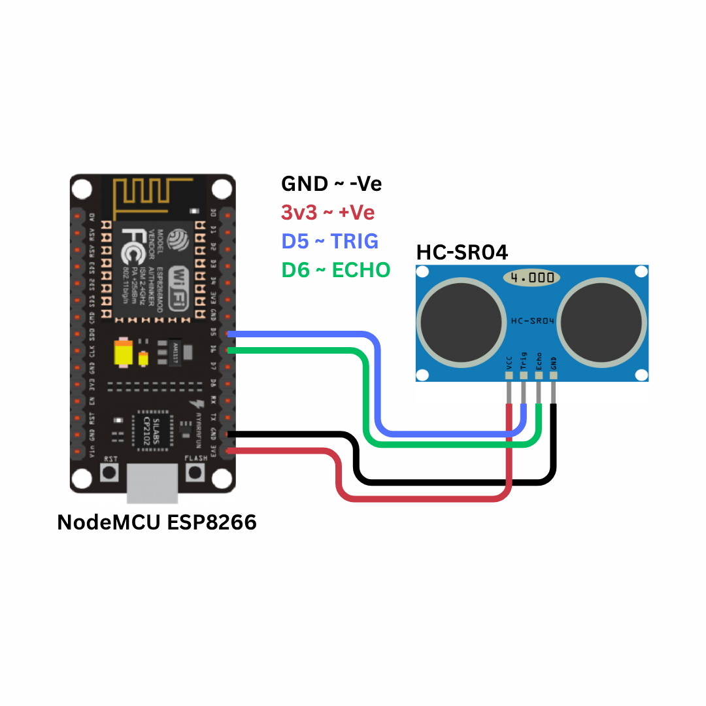
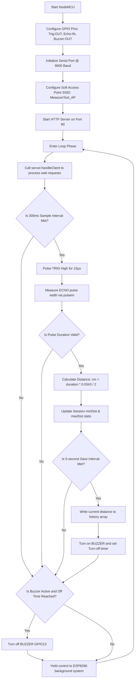

# Smart Distance Monitoring System using Ultrasonic Sensor and NodeMCU ESP8266

---

## 1. Problem Statement

Distance measurement is a fundamental task across multiple domains, including civil engineering, construction, architecture, interior design, warehousing, and robotics. Traditional tools, such as manual tape measures, present several operational challenges:

1. **Physical Access Requirements**: Standard tape measures require the user to physically access both the start and end points. Measuring hard-to-reach areas (e.g., high ceilings, open shafts, or hazardous environments) poses severe safety risks.
2. **Measurement Jitter & Parallax Errors**: Bending of the tape over long distances introduces sagging, while off-axis viewing of the scale leads to parallax errors, reducing measurement accuracy.
3. **Requirement of Double Operators**: Measuring long distances typically requires two people—one to anchor the tape and another to stretch it and read the scale.
4. **Data Isolation**: Manual measurements must be written down, introducing transcription errors and slowing down the integration of spatial data into computer systems or design drafts.

### Proposed Solution
To overcome these limitations, we require a contactless, digital measurement system capable of calculating distances instantly without physical intervention. The solution must support multi-unit readouts (metric and imperial), display spatial statistics (minimum and maximum bounds), log data records over time, and stream this information wirelessly to any mobile or desktop web interface without requiring internet or specialized application downloads.

---

## 2. Our Solution

The **Smart Distance Monitoring System** is a standalone, contactless digital measurement instrument built on the ESP8266 NodeMCU microcontroller and the HC-SR04 ultrasonic transducer. The system integrates hardware-level sensor interfacing, embedded signal processing, local data logging, and an offline web server.

### Key Features
- **Contactless Acoustic Ranging**: Utilizes high-frequency sound waves to measure distances from 2 cm to 400 cm with a resolution of ~3 mm.
- **Simultaneous Dual-Unit Readout**: Converts and presents readings in centimeters (metric) and inches (imperial) in real-time.
- **Non-Blocking Control Loop**: Samples the sensor at high frequency (every 300 ms) to provide instant feedback while maintaining a web server.
- **Statistical Session Tracking**: Computes and maintains the minimum and maximum distances measured during the session.
- **Acoustic Data Capture Confirmation**: Sounds a brief 50 ms beep using a piezo buzzer whenever a reading is committed to the local history log.
- **Standalone Access Point Mode**: Generates an independent WiFi network, allowing any device with a browser to connect and view data at `http://192.168.4.1` without external internet.
- **Animated SVG Web Dashboard**: Renders a real-time visualization of the ultrasonic beam cone (scaling dynamically with distance), a responsive ruler bar, and a historical data table showing the last 50 measurements.

---

## 3. Brief of Solution

The system operates as an edge computing node that handles raw signal acquisition, processes physical calculations, logs states, and serves graphical interfaces.

### System Data Flow Architecture
```
+------------------+       Trigger Pulse      +-------------------+
|  NodeMCU GPIO14  | -----------------------> |    HC-SR04 Trig   |
|   (Output D5)    |                          +-------------------+
+------------------+                                    |
                                                [Acoustic Burst]
                                                        |
+------------------+        Echo Pulse          +-------------------+
|  NodeMCU GPIO12  | <----------------------- |    HC-SR04 Echo   |
|    (Input D6)    | (Through Voltage Divider)+-------------------+
+------------------+
         |
  [Compute Duration]
         |
  [Calculate Distance]
         |
  +------+------+
  |             |
  v             v
[Min/Max]   [RAM Buffer] ➔ (Every 5s + Buzzer Beep)
  |             |
  +------+------+
         |
         v
+------------------+       Web Requests       +-------------------+
| ESP8266 Server   | <----------------------- |   User Web App    |
| (JSON Endpoints) | -----------------------> | (JS AJAX Polling) |
+------------------+       JSON Payload       +-------------------+
```

1. **Acoustic Ranging Trigger**: The microcontroller sends a 10 µs High signal to the `TRIG` pin of the HC-SR04.
2. **Pulse Generation and Echo Timing**: The HC-SR04 emits an 8-cycle sonic burst. The sensor pulls the `ECHO` pin High, keeping it High until the reflected wave is received back.
3. **Data Processing**: The microcontroller measures the duration of this echo pulse. Using the speed of sound, it calculates the distance, scales it to cm and inches, and updates the session statistics.
4. **Local Buffering**: Every 5 seconds, a distance reading is saved to a circular buffer in memory. A pulse is sent to GPIO13 (D7) to briefly ring a piezo buzzer.
5. **Dashboard Serving**: The ESP8266 serves an HTTP page (`/`) and two JSON endpoints (`/live` and `/history`). An AJAX script on the webpage queries the endpoints every 500 ms to update the animated visual gauges.

---

## 4. What We Are Going to Use

### Hardware Requirements
1. **NodeMCU ESP8266 (ESP-12E Module)**
   - Core: Xtensa 32-bit LX106 RISC processor.
   - Operating Voltage: 3.3V (VCC), 5V via Micro-USB (converted via onboard LDO).
   - Clock Speed: 80 MHz.
   - Connectivity: Onboard 802.11 b/g/n WiFi.
2. **HC-SR04 Ultrasonic Transducer**
   - Operating Voltage: 5.0V.
   - Quiescent Current: < 2 mA.
   - Operating Frequency: 40 kHz.
   - Ranging Angle: < 15°.
   - Measurement Range: 2 cm to 400 cm.
3. **Active Piezo Buzzer**
   - Operating Voltage: 3V to 5V.
   - Sound Output: ~85 dB at 10 cm.
   - Frequency: ~2300 Hz.
4. **Resistor Network (Voltage Divider)**
   - Resistor 1: $1\text{ k}\Omega$ (1/4 W).
   - Resistor 2: $2\text{ k}\Omega$ (1/4 W).
   - Purpose: Attenuate the HC-SR04 Echo pin's 5.0V output to a safe 3.3V level for the ESP8266 GPIO.
5. **Breadboard and Jumper Wires**: For connection and layout.
6. **Micro-USB Cable**: For power supply and programming.

### Software Requirements
1. **Arduino IDE 2.x**: Writing, compiling, and flashing the firmware.
2. **ESP8266 Board Core (v3.0.0 or later)**: Compiler toolchain and board files.
3. **Web Browser (Chrome, Firefox, Safari)**: Viewing the responsive dashboard.

---

## 5. In-Depth of IoT (Internet of Things)

The Internet of Things (IoT) describes a network of physical objects ("things") embedded with sensors, actuators, software, and communication technologies to connect and exchange data with other devices over networks.

### Architecture Layers of IoT
A typical IoT system is structured into a multi-tier architecture to handle data collection, transmission, processing, and visualization:

```
+-------------------------------------------------------------+
| 1. Application Layer (Web Dashboard, UI Elements, Charts)   |
+-------------------------------------------------------------+
                              ▲
                              │ HTTP Protocol (AP-Mode / TCP)
                              ▼
+-------------------------------------------------------------+
| 2. Network Layer (IP Routing, 802.11 WiFi, TCP/IP Stack)    |
+-------------------------------------------------------------+
                              ▲
                              │ Local Bus (GPIO / ADC)
                              ▼
+-------------------------------------------------------------+
| 3. Perception Layer (HC-SR04 Transducer, Analog Pins, Raw)  |
+-------------------------------------------------------------+
```

1. **Perception (Sensing) Layer**: The physical foundation of the IoT ecosystem. It consists of sensors (like the HC-SR04) and actuators (like the buzzer). This layer converts environmental parameters (such as sound waves and air pressure) into digital electrical signals.
2. **Network (Transmission) Layer**: Responsible for routing data from the perception layer to the processing systems. In this project, the network layer is established locally by the ESP8266's built-in WiFi radio using the IEEE 802.11 b/g/n standard.
3. **Application Layer**: Renders the processed data to the end-user. In this system, the application layer is a web app written in HTML5, CSS3, and JavaScript, hosted directly in the ESP8266's flash memory.

### Wireless Modes: Access Point (AP) vs. Station (STA)
The ESP8266's WiFi module can operate in three distinct configurations:
- **Station (STA) Mode**: The ESP8266 acts as a client that connects to an existing WiFi router. It obtains an IP address via DHCP and can access the wider internet or local network devices.
- **Access Point (AP) Mode**: The ESP8266 acts as a router/host. It creates its own SSID (WiFi Network Name) and broadcasts WPA2 security beacons. Clients (smartphones/laptops) connect directly to it. This project runs in **AP Mode**, enabling standalone offline operation without external routers or internet access.
- **Dual (AP + STA) Mode**: The ESP8266 concurrently acts as a client connected to a router and a host network, allowing local control while bridging data to cloud gateways.

### Communication Protocol: TCP/IP & HTTP REST
Communication between the client browser and the ESP8266 relies on the TCP/IP suite. The browser initiates an HTTP request-response cycle:
- **TCP Connection**: The client initiates a three-way handshake on TCP port 80 (HTTP) to establish a stable, error-corrected stream.
- **HTTP Request**: The browser requests a resource (e.g., `GET /live HTTP/1.1`).
- **HTTP Response**: The ESP8266 reads the request, queries its sensor variables, compiles them into a JSON payload, and responds with a standard header (e.g., `200 OK`, `Content-Type: application/json`), followed by the data packet.

---

## 6. In-Depth about Microcontrollers, Sensors, Actuators

Embedded systems rely on three core pillars: microcontrollers, sensors, and actuators.

```
       +------------+
       |   SENSOR   | (Interprets physical state into electrical input)
       +------------+
             |
             v [Digital Pulse Width / Analog Voltage]
       +------------+
       | MICROCON-  |
       |  TROLLER   | (Executes firmware, processes algorithms)
       +------------+
             |
             v [GPIO Pin State / PWM Signal]
       +------------+
       |  ACTUATOR  | (Converts electrical command back to physical action)
       +------------+
```

### Microcontrollers
A microcontroller is a compact integrated circuit designed to govern a specific operation in an embedded system. Unlike general-purpose microprocessors (found in PCs), a microcontroller integrates:
- **Central Processing Unit (CPU)**: Executes instructions fetched from program memory.
- **Volatile Memory (SRAM)**: Stores runtime variables, stacks, and heaps.
- **Non-Volatile Flash Memory**: Holds the compiled machine code (firmware) and static assets.
- **Peripherals (GPIO, Timers, UART, ADC)**: Directly interfaces with physical hardware pins.

### Sensors (Transducers)
Sensors are input transducers that detect environmental changes (light, temperature, pressure, distance) and convert them into electrical signals. These signals can be:
- **Analog**: Continuous voltage outputs proportional to the physical parameter (e.g., analog pulse sensors, soil moisture probes).
- **Digital**: Pulse-width signals, serial communication protocols (I2C, SPI), or high/low logic levels. The HC-SR04 is a digital sensor because it outputs a variable-duration logic pulse representing the echo travel time.

### Actuators
Actuators are output transducers that convert electrical control signals from the microcontroller back into physical action. Examples include:
- **Acoustic Actuators**: Buzzers that turn electrical pulses into pressure waves (sound).
- **Mechanical Actuators**: Servomotors that convert pulse-width modulated (PWM) signals into precise angular shaft movements.
- **Visual Actuators**: Light Emitting Diodes (LEDs) that convert current flow into visible light.

---

## 7. In-Depth about ESP8266 NodeMCU

The NodeMCU is an open-source firmware and development kit that uses the ESP8266 WiFi chip.


### Micro-Architecture and Chip Details
At the core of the NodeMCU is the ESP-12E module, which houses the ESP8266EX silicon chip:
- **Processor**: Xtensa single-core 32-bit L106 RISC processor running at a standard clock speed of 80 MHz (can be overclocked to 160 MHz). It features a 5-stage pipeline and does not have a native floating-point unit (FPU), so floating-point math is handled via software emulation.
- **Memory Map**:
  - **Instruction RAM (IRAM)**: 32 KB, used for critical code paths, ISRs (Interrupt Service Routines), and high-frequency loops.
  - **Data RAM (DRAM)**: 80 KB, allocated for system heap, stack, and user variables.
  - **Flash Memory**: External SPI flash (typically 4 MB on standard NodeMCU boards) accessed via a high-speed QSPI bus. The flash holds the bootloader, program binary, and file systems (SPIFFS/LittleFS).
- **WiFi Radio**: Integrated 2.4 GHz RF transceiver supporting 802.11 b/g/n, with built-in low-noise amplifiers (LNA), power amplifiers (PA), baluns, and antenna switches. It features an onboard PCB trace antenna.
- **Power Subsystem**: A 3.3V Low-Dropout (LDO) linear regulator (AMS1117-3.3) regulates input voltages up to 15V (usually 5V via USB) down to a stable 3.3V for the module.

### NodeMCU Pinout Mapping
The NodeMCU break out the ESP8266EX pins to a user-friendly dual-inline package (DIP) layout:

| NodeMCU Silk Pin | ESP8266 GPIO Pin | Primary Function in this Project |
|------------------|------------------|----------------------------------|
| **D5**           | GPIO14           | HC-SR04 TRIGGER Output (10 µs pulse) |
| **D6**           | GPIO12           | HC-SR04 ECHO Input (Pulse duration reading) |
| **D7**           | GPIO13           | Piezo Buzzer Control Output (Beep on record save) |
| **3V3**          | 3.3V VCC         | Microcontroller power rail |
| **GND**          | Ground           | Common system ground |
| **Vin**          | USB 5V Rail      | High-current 5V supply for HC-SR04 sensor |

### Technical Capabilities of ESP8266
* **Processor Core**: Tensilica Xtensa 32-bit LX106 RISC CPU, operating at 80 MHz (can be overclocked to 160 MHz). It delivers up to 645 DMIPS of processing power.
* **Memory Subsystem**: 80 KB of Instruction/Data SRAM, plus support for up to 16 MB of external SPI flash memory (typically 4 MB on NodeMCU boards) to store firmware, assets, and file systems.
* **Integrated Wi-Fi Stack**: Built-in 802.11 b/g/n Wi-Fi transceiver running at 2.4 GHz. It supports WEP, WPA/WPA2 Personal/Enterprise security protocols. It includes an integrated TR switch, balun, LNA, power amplifier, and matching network.
* **Low-Power Modes**: Supports three sleep configurations to conserve power in battery-operated nodes:
  - **Modem Sleep** (~15 mA): CPU remains active, Wi-Fi radio is powered down between beacon intervals.
  - **Light Sleep** (~0.9 mA): CPU clock is gated, Wi-Fi radio is off. The chip wakes up on external interrupts.
  - **Deep Sleep** (~20 µA): Only the internal Real-Time Clock (RTC) remains active. The chip resets on wake-up (GPIO16/D0 connected to RST).
* **Hardware Peripherals**: Features 17 GPIO pins, hardware PWM (Pulse-Width Modulation), SPI, I2C, I2S, UART interfaces, and a 10-bit analog-to-digital converter (ADC).

### Real-World Applications
1. **Smart Home Automation**: Wireless control of smart plugs, lighting fixtures, appliances, and automated blinds.
2. **Environmental Tracking**: Standalone weather stations, air quality monitors, and greenhouse climate controls.
3. **Wearable Health Monitors**: Portable pulse, step, and temperature trackers that transmit telemetry to local displays or remote apps.
4. **Precision Agriculture**: Remote soil moisture, ambient light, and irrigation control systems for farm management.

### Industrial Usecases
1. **Predictive Maintenance**: Monitoring vibration and temperature of machinery, logging telemetry, and reporting anomalies before failure occurs.
2. **Industrial IoT Gateways**: Bridging legacy serial protocol devices (RS-232/RS-485) to local Wi-Fi networks or MQTT brokers.
3. **Asset Tracking & Logistics**: Monitoring temperature, humidity, and location of sensitive shipments inside warehouses and transport containers.
4. **Remote Telemetry & SCADA**: Wireless transmission of tank levels, pressure values, and power consumption statistics to industrial SCADA systems.

---

## 8. In-Depth about the Project-Specific Sensor: HC-SR04

The HC-SR04 is an ultrasonic ranging sensor that uses acoustic pulse reflection to calculate the distance between the sensor face and a target obstacle.

```
       +-----------------------+              +-------------------+
       |                       |   Trigger    |                   |
       |    ESP8266 (GPIO14)   | ------------>|    HC-SR04 TRIG   |
       |                       | (10µs Pulse) |                   |
       +-----------------------+              +-------------------+
                   ▲                                    │
                   │                                    ▼ (Piezoelectric Tx)
                   │                              (((( 40kHz Ultrasonic Burst ))))
                   │                                    │
                   │ Echo Pulse                         v
                   │ (Width = Travel Time)          [Obstacle]
                   │                                    │
       +-----------------------+                        ▼ (Piezoelectric Rx)
       |                       |                  (((( Reflected Echo ))))
       |    ESP8266 (GPIO12)   |<-----------------------│
       |                       |                        │
       +-----------------------+                        +-------------------+
                                                        |    HC-SR04 ECHO   |
                                                        +-------------------+
```

### Physical Principles of Operation
The sensor contains two main components:
1. **Ultrasonic Transmitter**: A piezoelectric transducer that contracts and expands rapidly when an alternating electrical signal is applied, converting electrical energy into acoustic energy (40 kHz sound waves).
2. **Ultrasonic Receiver**: A matched piezoelectric receiver transducer that operates in reverse. When the incoming reflected sound wave hits the receiver membrane, it vibrates, generating a tiny alternating voltage that is amplified and parsed by the onboard processing circuitry.

### Speed of Sound Calculation
The speed of sound in air ($v$) is not constant. It depends on air density, which is primarily influenced by temperature ($T$ in °C) and, to a lesser extent, humidity. The speed of sound is calculated using the following formula:

$$v = 331.3 + (0.606 \times T) \text{ m/s}$$

At a standard room temperature of $20^\circ\text{C}$:

$$v = 331.3 + (0.606 \times 20) = 343.42 \text{ m/s} = 0.034342 \text{ cm/}\mu\text{s}$$

### Ranging Derivation
To measure distance, the microcontroller issues a 10 µs High pulse on the Trigger line. The HC-SR04 internal chip immediately drives a 40 kHz pulse train to the transmitter.
Simultaneously, the sensor drives the Echo line High.
When the reflected sound hits the receiver, the Echo line is pulled Low. The time the Echo pin remains High ($\Delta t$) represents the round-trip travel time of the sound wave.

The total distance traveled by the sound wave is:

$$\text{Total Distance} = v \times \Delta t$$

Because the sound wave must travel to the object and bounce back to the sensor, the physical distance to the object ($d$) is half the total distance:

$$d = \frac{v \times \Delta t}{2}$$

At standard temperature ($20^\circ\text{C}$):

$$d = \frac{0.0343 \text{ cm/}\mu\text{s} \times \Delta t \text{ (}\mu\text{s)}}{2}$$

$$d = \frac{\Delta t}{58.3} \text{ cm}$$

For imperial units (inches), since $1 \text{ inch} = 2.54 \text{ cm}$:

$$d_{\text{inches}} = \frac{d_{\text{cm}}}{2.54} = \frac{\Delta t}{148} \text{ inches}$$

---

## 9. In-Depth about Arduino IDE, Compilation, and Flashing

The Arduino development environment abstracts a sophisticated toolchain designed to build and flash code onto microcontrollers.

### Compilation Toolchain Lifecycle
When you click "Upload" in the Arduino IDE, the system executes the following steps:
1. **Sketch Preprocessing**: The Arduino builder joins all sketch files (`.ino`) and generates forward declarations for functions. It creates standard C++ headers and inserts `#include <Arduino.h>`.
2. **Compilation**:
   - The preprocessed source is passed to the cross-compiler: `xtensa-lx106-elf-g++` (for C++ files) and `xtensa-lx106-elf-gcc` (for C files).
   - The compiler translates C++ instructions into assembly language, then into binary object files (`.o`).
3. **Linking**: The linker (`xtensa-lx106-elf-ld`) aggregates the project object files, pre-compiled system libraries, core runtime libraries, and WiFi frameworks into a unified ELF (Executable and Linkable Format) file.
4. **Binary Generation**: The utility tool `elf2bin` extracts the machine code sections from the ELF file to build a single raw `.bin` file containing the bootable image.

### Memory Layout of the Flash Binary
The generated binary contains several segments that are mapped to memory upon boot:
- **`.text` (Code Segment)**: Read-only instructions loaded directly from Flash.
- **`.rodata` (Read-only Data)**: Constants, string literals, and PROGMEM structures.
- **`.data` (Initialized Data)**: Global and static variables with initial values. These are copied from Flash to RAM during boot.
- **`.bss` (Uninitialized Data)**: Variables initialized to zero. Space is allocated in RAM, but they do not take up space in the compiled binary.

### Flashing and the Bootloader
Flashing writes the binary image onto the ESP8266's external SPI Flash memory:
- **Serial Protocol**: The IDE invokes the Python-based utility `esptool.py` to communicate over USB-UART.
- **Hardware Reset**: The USB interface (via CP2102 chip) controls the NodeMCU's `RST` and `GPIO0` pins:
  - Pulls `GPIO0` Low.
  - Pulses `RST` Low to reboot the processor.
  - The Xtensa CPU checks boot configuration pins on startup. Since `GPIO0` is Low, the CPU bypasses the user flash code and executes the ROM-based bootloader.
- **Flashing**: The bootloader receives the binary data over UART at a high baud rate (typically 115200 or 921600 bps), verifies the CRC, and writes it block-by-block to the SPI Flash.
- **Execution**: The CP2102 pulls `GPIO0` High and pulses `RST` to reboot the CPU into normal execution mode, launching the newly flashed firmware.

---

## 10. Implementation with Circuit Diagram

### Wiring Connections Table
To interface the HC-SR04 and Piezo Buzzer to the NodeMCU, establish the following electrical connections:

| Component | Pin Label | NodeMCU Connection Pin | Wire Function | Notes |
|-----------|-----------|------------------------|---------------|-------|
| **HC-SR04** | VCC | Vin | 5V Power Supply | Requires 5V; NodeMCU Vin provides this from USB. |
| **HC-SR04** | GND | GND | System Ground Reference | Common ground. |
| **HC-SR04** | TRIG | D5 (GPIO14) | Trigger Output | 3.3V logic level from NodeMCU is sufficient. |
| **HC-SR04** | ECHO | D6 (GPIO12) via Divider| Echo Input | Must use a voltage divider to drop 5V output to 3.3V. |
| **Buzzer** | Positive (+) | D7 (GPIO13) | Buzzer Logic Control | active High output triggers tone. |
| **Buzzer** | Negative (-) | GND | Ground Reference | Connection to ground. |

### The Voltage Divider Network
The HC-SR04 operates at 5V, meaning its Echo pin outputs a 5V signal. The ESP8266 GPIO pins are rated for a maximum of 3.3V. Directly connecting the Echo pin can damage the microcontroller over time. A voltage divider network attenuates the signal:

```
        HC-SR04 ECHO (5V Out) 
                 │
                 ├──[ 1kΩ Resistor ]──┬── NodeMCU D6 (GPIO12) (3.3V In)
                 │                    │
                 │                [ 2kΩ Resistor ]
                 │                    │
                GND                  GND
```

The output voltage ($V_{\text{out}}$) is calculated using Ohm's Law:

$$V_{\text{out}} = V_{\text{in}} \times \left( \frac{R_2}{R_1 + R_2} \right) = 5.0\text{V} \times \left( \frac{2\text{ k}\Omega}{1\text{ k}\Omega + 2\text{ k}\Omega} \right) = 3.33\text{V}$$

This safely matches the ESP8266's 3.3V logic limit.

### Circuit Diagram
The structural layout of this configuration is illustrated below:



---

## 11. Code Explanation

Below is a detailed analysis of the firmware implementation in `Smart_Distance_Monitoring_System.ino`.

### Pin and Library Definitions
We configure the hardware control registers. Pin D5 is mapped as output (`TRIG_PIN`) and D6 as input (`ECHO_PIN`). GPIO13 (D7) controls the `BUZZER_PIN`.

```cpp
#define TRIG_PIN      14         // D5 on NodeMCU
#define ECHO_PIN      12         // D6 on NodeMCU
#define BUZZER_PIN    13         // D7 on NodeMCU
```

### System Configuration Variables
AP networking options are loaded into flash memory. The web server is instantiated on port 80:

```cpp
const char* AP_SSID     = "MeasureTool_AP";
const char* AP_PASSWORD = "12345678";
const IPAddress AP_IP(192, 168, 4, 1);
const IPAddress AP_SUBNET(255, 255, 255, 0);

ESP8266WebServer server(80);
```

### The Non-Blocking Main Loop
Standard sketches rely on the blocking `delay()` function. In our firmware, we implement time slice scheduling using `millis()`. This approach allows the web server to remain highly responsive:

```cpp
void loop() {
  server.handleClient(); // Process incoming web requests immediately

  uint32_t now = millis();
  
  // Sample distance every 300ms
  if (now - lastSample >= SAMPLE_INTERVAL) {
    lastSample = now;
    float dist = getDistance(); // Trigger and measure pulse width

    if (dist >= 2.0 && dist <= 400.0) {
      currentDist = dist;
      
      // Update session statistics
      if (currentDist < minDist) minDist = currentDist;
      if (currentDist > maxDist) maxDist = currentDist;

      // Save to memory log every 5s
      if (now - lastSave >= 5000) {
        lastSave = now;
        addRecord(currentDist); // Commit to circular RAM buffer
        
        // Sound the piezo buzzer for 50ms
        digitalWrite(BUZZER_PIN, HIGH);
        buzzerOffTime = now + 50; // Schedule buzzer shutdown
      }
    }
  }

  // Turn off the buzzer without blocking
  if (buzzerOffTime > 0 && now >= buzzerOffTime) {
    digitalWrite(BUZZER_PIN, LOW);
    buzzerOffTime = 0;
  }
  
  yield(); // Prevent hardware watchdog timeouts
}
```

### Data Acquisition Routine
This function triggers the ultrasonic burst and calculates the target distance:

```cpp
float getDistance() {
  digitalWrite(TRIG_PIN, LOW);
  delayMicroseconds(2);
  digitalWrite(TRIG_PIN, HIGH);
  delayMicroseconds(10); // Emit trigger pulse
  digitalWrite(TRIG_PIN, LOW);

  // Measure Echo pulse width with a 30,000 µs timeout (~5 meters)
  long duration = pulseIn(ECHO_PIN, HIGH, 30000); 
  if (duration == 0) return -1.0; // Out of range or timeout

  // Calculate distance in cm based on speed of sound (0.0343 cm/µs)
  return (duration * 0.0343) / 2.0; 
}
```

### Web API Serialization
To stream data to the dashboard, we serialize system states into JSON packets:

```cpp
void handleLive() {
  String json = "{";
  json += "\"cm\":" + String(currentDist, 1) + ",";
  json += "\"inch\":" + String(currentDist / 2.54, 1) + ",";
  json += "\"min\":" + String(minDist == 9999.0 ? 0.0 : minDist, 1) + ",";
  json += "\"max\":" + String(maxDist == -1.0 ? 0.0 : maxDist, 1) + ",";
  json += "\"uptime\":" + String(millis() / 1000);
  json += "}";
  server.sendHeader("Access-Control-Allow-Origin", "*");
  server.send(200, "application/json", json);
}
```

### Program Flow Diagram
The logical flowchart below maps the runtime behavior of the system's firmware:



---

## 12. Working

When the Smart Distance Monitoring System is powered on, it executes the following operational steps:

```
[ Power On ]
     │
     ▼
[ Bootloader Init ] ➔ Copies initialized variable arrays to DRAM
     │
     ▼
[ Setup() Routine ]
     ├── Configure GPIO Directions (Trig: OUT, Echo: IN, Buzzer: OUT)
     ├── Initialize Serial Port (9600 Baud)
     ├── Set Up Soft AP (SSID: MeasureTool_AP)
     └── Start HTTP Server (Port 80 Router Hooks)
     │
     ▼
[ Main Loop Execution ]
     ├── Check HTTP clients (handleClient)
     ├── Sample HC-SR04 (Every 300ms) ➔ Convert Pulse Time to cm/inches
     ├── Compare against min/max limits
     └── Check 5s Interval ➔ If met: Save to Log + Sound Buzzer (50ms)
     │
     ▼
[ User Interface Loop ]
     ├── Device connects to WiFi "MeasureTool_AP" (PW: 12345678)
     ├── Browser loads http://192.168.4.1 ➔ Fetches HTML page from Flash
     └── Javascript initiates AJAX polling every 500ms (requests `/live` and `/history`)
```

1. **Initial Boot Phase**: The AMS1117 regulator regulates input power to 3.3V. The CPU boots, executes setup configurations, maps GPIO pins, configures the Soft Access Point, starts the HTTP server, and mounts route handlers.
2. **Measurement Cycle**: Every 300 ms, the Trigger pin is pulsed. The CPU monitors D6 for the Echo response, calculates the distance, and updates the global variables `currentDist`, `minDist`, and `maxDist`.
3. **Data Recording and Acoustic Beep**: Every 5 seconds, the loop updates the circular index, saves the current measurement, pulls GPIO13 High, and schedules it to shut off 50 ms later.
4. **Client Connection**: When a user connects to `MeasureTool_AP` and loads `http://192.168.4.1`, the browser displays the dashboard. An AJAX engine polls the JSON endpoints to update the SVG beam animation, the dynamic ruler bar, and the logging table.

---

## 13. Conclusion

### Project Evaluation
We successfully built an offline, low-cost digital measurement instrument. By using non-blocking programming, the system processes sensor readings and handles client requests smoothly. The physical voltage divider keeps the ESP8266 safe from 5V signals, ensuring reliable hardware operation.

### Future Improvements
1. **Speed of Sound Correction**: Add a DHT11 sensor to calculate the exact speed of sound based on real-time temperature, improving ranging accuracy.
2. **Precision ADC Integration**: Replace the ultrasonic sensor with a time-of-flight (ToF) laser sensor (such as the VL53L0X) for millimeter-level accuracy and a narrower beam width.
3. **Power Optimization**: Implement sleep modes to conserve battery life in portable setups.
