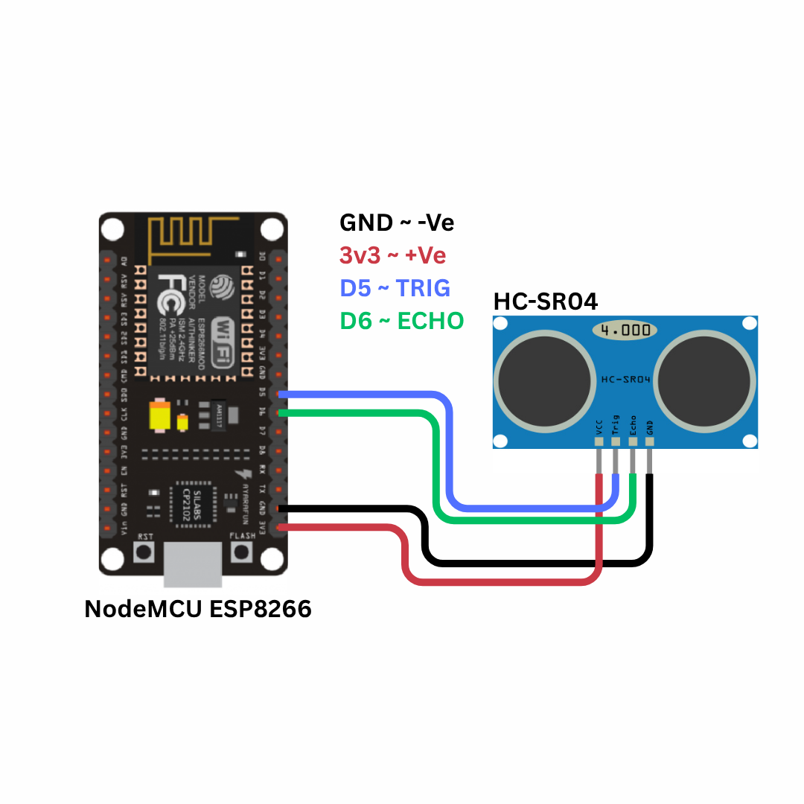
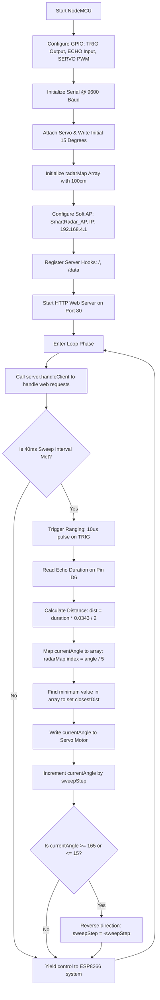

# Smart Motion Radar with Servo Rotation using Ultrasonic Sensor and NodeMCU

---

## 1. Problem Statement

Spatial mapping, obstacle detection, and active surveillance are fundamental requirements in modern robotics, autonomous driving, and security systems. Traditional stationary sensors, such as passive infrared (PIR) detectors or fixed-range proximity sensors, suffer from major design limitations:

1. **Lack of Angular Resolution**: A single stationary sensor can only detect whether an object is present within its field of view, but it cannot determine the object's relative angle, direction of travel, or coordinate position.
2. **Blind Spots**: Fixed sensors leave large areas unmonitored. Covering a full $180^\circ$ field of view typically requires multiple sensors, increasing the cost, complexity, physical size, and power consumption of the system.
3. **Absence of Real-Time Visualization**: Simple alarms or indicator lights do not provide descriptive telemetry. Security personnel, robotic navigators, or system operators require spatial maps to locate and track objects.
4. **Integration Barriers in Educational Laboratories**: Academic curricula often teach radar theory (polar coordinates, signal propagation delay, and spatial plotting) using dry, math-heavy textbooks. Students lack low-cost, hands-on platforms to physically experiment with coordinate transformations and mechanical sweep state machines.
5. **Infrastructure Monitoring in Smart Cities**: Modern urban centers require flexible, localized sensing to monitor crosswalks, traffic lanes, or security boundaries without deploying heavy, internet-dependent camera networks that raise privacy concerns.

### Relevant SDGs
* **SDG 9: Industry, Innovation & Infrastructure**: By creating a low-cost, open-source industrial scanning prototype, this project advances local technological capabilities, promotes automated infrastructure, and introduces accessible robotics education.
* **SDG 11: Sustainable Cities & Communities**: This system provides the foundation for localized traffic and pedestrian monitoring, autonomous navigation in public transit, and low-cost security barriers for sustainable urban management.

### Proposed Solution
To resolve these challenges, we need to design a compact, low-cost, and standalone **Smart Motion Radar**. The system must mechanically sweep an ultrasonic distance sensor across a $180^\circ$ arc (from $15^\circ$ to $165^\circ$) using a micro servo motor. The firmware must calculate distance at each angular position using non-blocking state-slicing to ensure that a web dashboard, served locally by the device, remains fully responsive. Connected users will see a retro-themed, tactical radar screen where obstacles are plotted as pulsing blips with phosphor glow trails, translating raw physical sound waves into an interactive graphical map.

---

## 2. Our Solution

The **Smart Motion Radar with Servo Rotation** is an offline-ready, micro-embedded spatial scanning system built on the ESP8266 NodeMCU development board. The device operates as a portable, standalone sonar station that maps surroundings, processes distance calculations, tracks the closest obstacle, and hosts an animated, retro-styled web dashboard.

### Key Features
* **Active Servo Sweep**: Uses an SG90 micro-servo motor to sweep the ultrasonic sensor in a non-blocking arc ($15^\circ - 165^\circ$), protecting cheap servo gears from physical stalling at extreme ends.
* **Concentric Sonar Mapping**: Integrates the HC-SR04 ultrasonic ranging module to map obstacles within a 1-meter tracking window.
* **Local Web Access Point**: Runs entirely offline by generating its own wireless hotspot (`SSID: SmartRadar_AP`), serving the live dashboard on `http://192.168.4.1`.
* **Phosphor Glow Radar Visualizer**: Serves a tactical green CRT-style dashboard featuring a semi-circular radar grid, coordinate lines, and a sweeping beam that leaves a 2-second phosphor decay trail.
* **Proximity Alert System**: Blips are dynamically colored green for safe zones ($\ge 20\text{ cm}$) and pulse red with shadow glows for critical zones ($< 20\text{ cm}$), updating the panel status to "CLEAR" or "ALERT".
* **Voltage-Protected Design**: Employs a physical resistor divider network to safely step down the HC-SR04's 5V Echo output to the safe 3.3V logic level of the ESP8266.
* **Non-Blocking Sweep Loop**: Uses `millis()` timing instead of software `delay()` commands, allowing the servo to step smoothly every 40 ms while managing incoming HTTP client requests.
* **Memory-Optimized Data Storage**: Packs the $180^\circ$ arc into 37 data buckets (spaced every $5^\circ$), minimizing the size of JSON payloads and conserving the ESP8266's static RAM.

---

## 3. Brief of Solution

The system operates as a self-contained edge computing nodes that coordinates mechanical movement, measures spatial distance, compiles radar maps, and serves real-time web dashboards.

### System Data Flow Architecture
```
                                Mechanical Sweep (PWM 50Hz)
                              ┌─────────────────────────────┐
                              ▼                             │
+-------------------+   Acoustic Pulse    +-------------------+
|  Target Obstacle  | ◄─────────────────► |  HC-SR04 Sensor   |
+-------------------+                     +-------------------+
                                                    │
                                           [Trig & Echo Signals]
                                                    │
                                                    ▼
+---------------------------------------------------------------------+
|                      ESP8266 Microcontroller                        |
|                                                                     |
|  1. Tick Sweep Timer: Move servo angle by 3° every 40ms             |
|  2. Trigger ultrasonic pulse & measure flight duration              |
|  3. Calculate distance: dist = duration * 0.0343 / 2                |
|  4. Map angle to bucket array index: index = angle / 5              |
|  5. Update closest object tracking & format JSON payload            |
+---------------------------------------------------------------------+
          │                                              │
  [Serve Web Dashboard]                          [Update Servo Angle]
  (HTML, CSS, JS in Flash)                       (D2 / GPIO4 PWM Pin)
          │                                              │
          ▼                                              ▼
+---------------------+       Web Request        +--------------------+
| ESP8266 Web Server  | <----------------------- |    User Web App    |
| (JSON API: /data)   | ----------------───────► |  (Canvas Drawing)  |
+---------------------+      JSON Response       +--------------------+
```

### Operational Sequence:
1. **Mechanical Scan Step**: The ESP8266 check its internal timer. Every 40 ms, it calculates the next angle ($15^\circ$ to $165^\circ$, moving in $3^\circ$ steps) and updates the servo.
2. **Pulse Ranging**: The controller pulses the sensor's Trigger pin for $10\ \mu\text{s}$, producing an ultrasonic burst. It measures the duration of the returning Echo pin signal.
3. **Coordinate Log**: The microsecond flight duration is converted to centimeters. The reading is saved in the corresponding bucket of the `radarMap` array (0 to 36, mapping the $180^\circ$ span).
4. **Data Delivery**: When a connected device requests `/data`, the ESP8266 compiles a JSON string containing the current angle, the closest object distance, and the entire `radarMap` array.
5. **Dashboard Render**: The client-side JavaScript reads the JSON payload every 250 ms. It clears the canvas, redraws the concentric grids, sweeps the radar line using polar-to-cartesian formulas, and draws glowing blips at the obstacle coordinates.

---

## 4. What We Are Going to Use

### Hardware Requirements

1. **NodeMCU ESP8266 Development Board (ESP-12E Module)**
   * **Core**: Tensilica Xtensa 32-bit LX106 CPU running at 80 MHz.
   * **Peripherals**: Onboard WiFi transceiver, hardware PWM timers, SPI flash, and digital GPIO pins.
2. **HC-SR04 Ultrasonic Ranging Module**
   * **Transducers**: Twin piezoelectric elements (one transmitter, one receiver).
   * **Ranging Range**: $2\text{ cm}$ to $400\text{ cm}$ with a resolution of $3\text{ mm}$.
   * **Operating Voltage**: $5\text{V}$ (Vin pin).
   * **Logic Level**: $5\text{V}$ logic high outputs, requiring signal attenuation.
3. **SG90 Micro Servo Motor**
   * **Type**: Geared positional actuator.
   * **Rotation Range**: $180^\circ$.
   * **Operating Voltage**: $4.8\text{V} - 6\text{V}$.
   * **Control Interface**: Pulse-Width Modulation (PWM) at $50\text{ Hz}$.
4. **Signal Attenuation Resistors (Voltage Divider)**
   * **Resistors**: $1\text{ k}\Omega$ and $2\text{ k}\Omega$ resistors ($1/4\text{W}$).
   * **Purpose**: Scales the 5V Echo output to 3.3V to prevent overvoltage damage to the ESP8266.
5. **Solderless Breadboard & Dupont Jumper Wires**
6. **Micro-USB Cable**: For power supply and flashing code.

### Software Requirements

1. **Arduino IDE 2.x**: The desktop environment for coding and compiling.
2. **ESP8266 Arduino Core Platform**: Provides the compiler toolchain and native WiFi/WebServer libraries.
3. **Built-in `Servo` Library**: Controls the angle of the SG90 servo motor.
4. **Modern Web Browser**: Supports HTML5 Canvas rendering and AJAX JSON parsing (Chrome, Firefox, Safari, Edge).

---

## 5. In-Depth of IoT (Internet of Things)

The Internet of Things (IoT) describes the integration of sensors, mechanical actuators, and network connectivity into everyday objects, allowing them to exchange telemetry and run operations without human intervention.

### Architecture Layers of IoT
This project is structured into three standard IoT layers:

```
+-----------------------------------------------------------------+
| 1. Application Layer (Web UI, Canvas Scope, Pulse Blips, Stats) |
+-----------------------------------------------------------------+
                               ▲
                               │ HTTP Protocol (AJAX JSON Fetch)
                               ▼
+-----------------------------------------------------------------+
| 2. Network Layer (ESP8266 WiFi Access Point, TCP/IP Server)     |
+-----------------------------------------------------------------+
                               ▲
                               │ Hardware Bus (GPIO Control / PWM)
                               ▼
+-----------------------------------------------------------------+
| 3. Perception/Actuator Layer (Ultrasonic Ranging, SG90 Servo)    |
+-----------------------------------------------------------------+
```

1. **Perception/Actuator Layer**: Consists of the physical sensors and actuators. The HC-SR04 sensor measures sound reflections, and the SG90 servo rotates the sensor assembly.
2. **Network Layer**: Manages data routing. The ESP8266 sets up a localized WiFi hotspot (Access Point) running a TCP/IP stack. An HTTP server on port 80 processes client dashboard requests.
3. **Application Layer**: Renders the telemetry. The web browser downloads the HTML, CSS, and JS files from the flash memory of the ESP8266, running calculations to plot targets on a graphical grid.

### Wireless Access Point Configuration
The device uses **Access Point (AP) Mode** to enable deployment in remote, outdoor, or emergency environments:
* **SSID**: `SmartRadar_AP`
* **Password**: `12345678`
* **Local Subnet**: The ESP8266 runs an onboard DHCP server. It sets its own IP to `192.168.4.1` and assigns temporary IP addresses to connected clients within the range `192.168.4.2` to `192.168.4.20`.

### Data API and JSON Interchange
To achieve real-time screen updates without reloading the entire page, the application uses **asynchronous AJAX polling**:
* **Endpoint (`/data`)**: The client requests updates from this endpoint every 250 ms.
* **JSON Response Structure**:
  ```json
  {
    "angle": 90,
    "closest": 42,
    "map": [100, 100, 85, 83, 79, 42, 42, 80, 100, 100, 100, 100, 100, 100, 100, 100, 100, 100, 100, 100, 100, 100, 100, 100, 100, 100, 100, 100, 100, 100, 100, 100, 100, 100, 100, 100, 100]
  }
  ```
  The array index represents angular buckets of $5^\circ$ ($i \times 5^\circ$). This approach reduces the payload size from over 1.5 KB to under 200 bytes, minimizing network traffic.

---

## 6. In-Depth about Microcontrollers, Sensors, Actuators

Embedded electronics rely on microcontrollers to read inputs from sensors, process calculations, and drive physical actuators.

```
       +------------+
       |   SENSOR   | (HC-SR04: Measures sound reflection time)
       +------------+
             │
             ▼ [Echo Pin: 5V Pulse output -> divider to 3.3V]
       +------------+
       | MICROCON-  |
       |  TROLLER   | (ESP8266: Processes timing, controls sweep, hosts web server)
       +------------+
             │
             ├──────────────────────────────┐
             ▼ [PWM Signal: 50Hz]           ▼ [Virtual Actuator]
       +------------+                +---------------------+
       |  ACTUATOR  | (SG90 Servo)   | HTML5 Canvas Dashboard |
       +------------+                +---------------------+
```

### Microcontrollers
A microcontroller is an integrated chip that houses a processor core, random-access memory (RAM), read-only storage (Flash), and input/output peripherals. In this project, the **ESP8266 NodeMCU** runs the mechanical sweep loop, records distances in memory, formats the JSON string, and serves the dashboard files.

### Sensors
Sensors convert physical phenomena into electrical signals. The **HC-SR04** uses ultrasonic sound waves (acoustics) to measure distance. By calculating the time delay between sending a sound pulse and receiving its echo, it determines how far away an object is.

### Actuators
Actuators convert electrical commands back into physical action.
* **SG90 Servo (Physical Actuator)**: Converts PWM pulse widths into specific output shaft angles.
* **HTML5 Canvas (Virtual Actuator)**: The client browser converts JSON coordinate arrays into visual indicator blips and sweep paths.

---

## 7. In-Depth about ESP8266 NodeMCU

The NodeMCU is an open-source development board that breaks out the pins of the ESP8266EX system-on-chip (SoC), facilitating the rapid prototyping of smart devices.


### Processor Architecture
* **Core CPU**: Xtensa 32-bit LX106 RISC processor.
* **Clock Frequency**: Running at 80 MHz, enabling rapid execution of sensor sweeps and high web server throughput.
* **Memory Architecture**:
  * **SRAM**: 80 KB DRAM (dynamic memory) shared between web servers, connection state tables, and variables.
  * **SPI Flash**: 4 MB external flash memory to store the compiled firmware binary and static HTML content.

### Peripheral Subsystems
* **WiFi Subsystem**: Onboard 2.4 GHz radio supporting 802.11 b/g/n standards, an integrated antenna, and the WPA2 security engine.
* **PWM Controllers**: Silicon-level timers generate the high-precision Pulse-Width Modulated (PWM) signals needed to position the servo motor.

### Pinout Mapping
The table below lists the physical board pins, their internal ESP8266 GPIO mappings, and their functions in this project:

| Board Pin | GPIO Pin | Function in This Project | Electrical Characteristics |
|-----------|----------|--------------------------|----------------------------|
| **D2**    | GPIO4    | Servo PWM Output | 3.3V digital output. Outputs a 50Hz PWM wave to control the servo angle. |
| **D5**    | GPIO14   | Trigger Output (TRIG) | 3.3V digital output. Sends a 10$\mu$s start pulse to the HC-SR04. |
| **D6**    | GPIO12   | Echo Input (ECHO) | 3.3V digital input. Receives the returning pulse (via a voltage divider). |
| **VIN**   | Vin      | 5V Power Supply | Supplies 5V power directly from the USB connector to drive the servo and sensor. |
| **GND**   | Ground   | Ground Reference | Common system ground. |

---

## 8. In-Depth about the Project-Specific Sensor and Actuators

### HC-SR04 Ultrasonic Sensor

The HC-SR04 sensor measures distance using the same principle of echolocation employed by bats and marine sonar:

```
                            HC-SR04 Sensor Module
                      ┌────────────────────────────────┐
                      │    Trigger Pulse Input (10µs)  │
                      │               │                │
                      │   ┌───────┐   ▼   ┌───────┐    │
                      │   │  Tx   │       │  Rx   │    │
                      └───┼───────┴───────┴───────┼────┘
                          │ (Sonic Burst 40kHz)   ▲ (Echo Wave)
                          │                       │
                          ▼                       │
                       )  )  )                 (  (  (
                      )  )  )                   (  (  (
                     )  )  )                     (  (  (
                                  ┌─────┐
                                  │     │ (Obstacle Target)
                                  └─────┘
```

1. **Piezoelectric Transduction**: The transmitter (Tx) contains a piezoelectric transducer. When pulsed with a high frequency, it vibrates to produce a 40 kHz ultrasonic burst (well above the human hearing limit of 20 kHz).
2. **Ranging Trigger**: The microcontroller sends a high logic signal to the Trigger pin for at least $10\ \mu\text{s}$. The HC-SR04 internal circuit responds by sending 8 consecutive cycles of the 40 kHz ultrasonic burst.
3. **Echo Timing**: As the acoustic waves leave the sensor, the Echo pin is pulled High. The wave travels through the air, hits an obstacle, and bounces back. When the receiver (Rx) detects the reflected wave, the Echo pin is pulled Low. The time the Echo pin remains High represents the round-trip travel time ($t$) of the sound wave.

#### Sound Speed Physics & Distance Equation
The speed of sound in dry air ($v$) varies with temperature ($T$ in $^\circ\text{C}$):
$$v = 331.3 + 0.606 \times T \text{ m/s}$$

At a room temperature of $20^\circ\text{C}$, the speed of sound is:
$$v = 331.3 + (0.606 \times 20) = 343.42 \text{ m/s} = 0.034342 \text{ cm/\mu s}$$

Since the sound wave has to travel to the obstacle and back to the sensor, the total distance ($d$) is half the total flight time:
$$d = \frac{v \times t}{2}$$

Substituting the speed of sound:
$$d = \frac{0.03434 \text{ cm/\mu s} \times t\ \mu\text{s}}{2} = \frac{t}{58.24} \text{ cm}$$

#### Example Calculation:
If the Echo pulse duration ($t$) is **$2915\ \mu\text{s}$**:
$$d = \frac{2915}{58.24} \approx 50.05 \text{ cm}$$

---

### SG90 Micro Servo Motor

The SG90 is a positional actuator that rotates its output shaft to a specific angle based on incoming control signals:

```
    50Hz Period (20ms)
    ┌─┐                                    ┌─┐
    │ │                                    │ │
────┘ └────────────────────────────────────┘ └───────────  (0.5ms Pulse = 0 Degrees)
    
    ┌────┐                                 ┌────┐
    │    │                                 │    │
────┘    └─────────────────────────────────┘    └────────  (1.5ms Pulse = 90 Degrees)
    
    ┌──────┐                               ┌──────┐
    │      │                               │      │
────┘      └───────────────────────────────┘      └──────  (2.5ms Pulse = 180 Degrees)
```

1. **Internal Feedback Control Loop**: The servo contains a small DC motor, a reduction gear train to increase torque, a potentiometer connected to the output shaft, and a control circuit. The potentiometer measures the current angle of the shaft.
2. **PWM Position Signaling**: The control circuit expects a high pulse every 20 ms ($50\text{ Hz}$ frequency). The width of this pulse determines the target position:
   * **$0.5\text{ ms}$ pulse**: Command to rotate to $0^\circ$ (represented by $2.5\%$ duty cycle).
   * **$1.5\text{ ms}$ pulse**: Command to rotate to $90^\circ$ (represented by $7.5\%$ duty cycle).
   * **$2.5\text{ ms}$ pulse**: Command to rotate to $180^\circ$ (represented by $12.5\%$ duty cycle).
3. **Control Interpolation Formula**: The pulse width ($t_{\text{on}}$) for a desired angle ($\theta$) is calculated as:
   $$t_{\text{on}}(\theta) = 0.5\text{ ms} + \left( \frac{\theta}{180^\circ} \right) \times 2.0\text{ ms}$$
   The duty cycle ($D$) for the $20\text{ ms}$ control window is:
   $$D(\theta) = \frac{t_{\text{on}}(\theta)}{20\text{ ms}} \times 100\%$$

---

### Polar to Cartesian Trigonometric Conversion

The sensor records coordinates in polar form: a distance ($r$) at a specific sweep angle ($\theta$). Since HTML5 Canvas draws elements using Cartesian coordinates $(X, Y)$, the client browser must run trigonometric conversions:

```
             CSS Canvas Cartesian Geometry (Origin top-left)
             (0,0) ┌──────────────────────────────────────────────┐
                   │                     cx,cy                      │
                   │                       o ───────────────────────►
                   │                      / \                       X-Axis
                   │                     /   \ θ (Sweep Angle)
                   │                    /     \
                   │                r  /       \
                   │                  /         \
                   │                 ▼           \
                   │             (x, y)          \
                   │                             ▼
                   ▼
                   Y-Axis
```

In the standard screen coordinate space, $X$ increases to the right, and $Y$ increases downwards. The radar semicircle is drawn with its center point at the bottom center of the canvas:
$$x_c = \text{cx} = \frac{\text{canvas.width}}{2}$$
$$y_c = \text{cy} = \text{canvas.height}$$

The sweep angle $\theta$ starts at $0^\circ$ on the right side and increases counter-clockwise towards $180^\circ$ on the left side. The Cartesian coordinates are calculated as:
$$x = x_c - r \times \cos\left( \theta \times \frac{\pi}{180} \right)$$
$$y = y_c - r \times \sin\left( \theta \times \frac{\pi}{180} \right)$$

Subtracting the cosine term mirrors the sweep direction to match the physical orientation of the motor on the workbench.

---

## 9. In-Depth about Arduino IDE, Compilation, and Flashing

The Arduino IDE manages the build and upload process for the microcontroller sketch.

### Compilation Process
1. **Preprocessing**: The IDE joins the `.ino` files, adds standard headers, and generates function prototypes.
2. **Compilation**: The cross-compiler (`xtensa-lx106-elf-g++`) compiles the code into binary object files (`.o`).
3. **Linking**: The linker (`xtensa-lx106-elf-ld`) combines the object files with system and WiFi libraries to create a single `.elf` file.
4. **Binary Generation**: The `elf2bin` utility extracts the executable code from the `.elf` file to create the final `.bin` binary file.

### Memory Segments
* **`.text`**: The program instructions stored in flash memory.
* **`.rodata`**: Read-only constants, string literals, and the static HTML page stored in flash using `PROGMEM`.
* **`.data`**: Initialized variables, which are copied to RAM when the board boots.
* **`.bss`**: Uninitialized variables, which are allocated and set to zero in RAM during boot.

### Flashing and Reset
The IDE uploads the binary file using `esptool.py` over serial:
* **Serial Interface**: The onboard CP2102 USB-to-UART chip bridges the computer's USB port to the ESP8266's serial pins.
* **Reset Sequence**: The tool uses the DTR and RTS lines to control the `RST` and `GPIO0` pins:
  1. Pulls `GPIO0` Low and pulses `RST` Low to restart the chip into bootloader mode.
  2. The bootloader writes the binary file to the external SPI flash.
  3. The tool pulls `GPIO0` High and pulses `RST` to reboot the chip and run the program.

---

## 10. Implementation with Circuit Diagram

### Wiring Connections Table
The table below lists the wiring connections between the servo motor, the ultrasonic sensor, the voltage divider, and the NodeMCU:

| Component | Pin Label | NodeMCU Connection Pin | Wire Function | Notes |
|-----------|-----------|------------------------|---------------|-------|
| **SG90 Servo** | VCC (Red) | VIN (5V) | Motor Power Supply | Drives the servo from the 5V USB power rail. |
| **SG90 Servo** | GND (Brown) | GND | Common Ground | System ground connection. |
| **SG90 Servo** | Signal (Orange) | D2 (GPIO4) | PWM Control | Receives the 50Hz position control signal. |
| **HC-SR04** | VCC | VIN (5V) | Sensor Power Supply | Requires 5V power to generate the ultrasonic pulse. |
| **HC-SR04** | TRIG | D5 (GPIO14) | Pulse Trigger | Receives the 10$\mu$s trigger signal from the micro. |
| **HC-SR04** | ECHO | Connected to D6 (GPIO12) **via voltage divider** | Echo Duration | Outputs a 5V signal; must be scaled down to 3.3V. |
| **HC-SR04** | GND | GND | Common Ground | Common ground reference. |

---

### Signal Attenuation (Voltage Divider Circuit)

The ESP8266 logic pins are designed to run at 3.3V. Applying 5V directly to the digital pins can degrade the silicon over time or burn out the pin. Because the HC-SR04 Echo pin outputs a 5V signal, we must use a voltage divider to attenuate the output:

```
            HC-SR04 ECHO Pin (5V Pulse Output)
                           │
                           ▼
                       ┌───────┐
                       │  R1   │  (1 kΩ Resistor)
                       │       │
                       └───┬───┘
                           │
                           ├───► NodeMCU Pin D6 (GPIO12 Input - 3.33V Level)
                           │
                       ┌───────┐
                       │  R2   │  (2 kΩ Resistor)
                       │       │
                       └───┬───┘
                           │
                           ▼
                      Common GND
```

The voltage output ($V_{\text{out}}$) sent to pin D6 is calculated as:
$$V_{\text{out}} = V_{\text{in}} \times \left( \frac{R_2}{R_1 + R_2} \right)$$
$$V_{\text{out}} = 5\text{V} \times \left( \frac{2\text{ k}\Omega}{1\text{ k}\Omega + 2\text{ k}\Omega} \right) = 5\text{V} \times \frac{2}{3} \approx 3.33\text{V}$$

This safe, attenuated voltage of 3.33V matches the high logic levels of the ESP8266.

---

### Circuit Diagram

The physical connections and resistor layouts are shown below:



---

## 11. Code Explanation

This section describes the structure and logic of the firmware inside `Smart_Motion_Radar.ino`.

### Pin Configuration & Globals
The code defines control pins, configures the local WiFi Access Point settings, and allocates space for the sweep values:

```cpp
#define SERVO_PIN     4          // Pin D2 for Servo PWM
#define TRIG_PIN      14         // Pin D5 for Ultrasonic Trigger
#define ECHO_PIN      12         // Pin D6 for Ultrasonic Echo

const char* AP_SSID     = "SmartRadar_AP";
const char* AP_PASSWORD = "12345678";
const IPAddress AP_IP(192, 168, 4, 1);
const IPAddress AP_SUBNET(255, 255, 255, 0);

const int MAX_DISTANCE_CM = 100; // Cap values above 100cm

ESP8266WebServer server(80);
Servo myServo;

int currentAngle = 15;
int sweepStep = 3;             // Move 3 degrees per tick
uint32_t lastMoveTime = 0;
const int MOVE_INTERVAL = 40;  // 40ms between servo updates

int radarMap[37];              // Array storing 180 degrees mapped to 37 buckets (5° steps)
int closestDist = 999;
```

---

### The Ultrasonic Ranging Function
The `getDistance()` function generates the start pulse, measures the return wave duration, and handles sensor timeouts:

```cpp
float getDistance() {
  // Clear the Trigger pin
  digitalWrite(TRIG_PIN, LOW);
  delayMicroseconds(2);
  
  // Send a 10 microsecond High pulse
  digitalWrite(TRIG_PIN, HIGH);
  delayMicroseconds(10);
  digitalWrite(TRIG_PIN, LOW);
  
  // Read flight time in microseconds (20ms timeout = ~3.4 meters max range)
  long duration = pulseIn(ECHO_PIN, HIGH, 20000); 
  
  // If no echo is detected, return maximum range
  if (duration == 0) return MAX_DISTANCE_CM; 
  
  // Calculate distance based on sound speed
  return (duration * 0.0343) / 2.0; 
}
```

---

### Non-Blocking Sweep Logic
The main execution loop uses time checks instead of delay commands, allowing the web server to run alongside the mechanical sweep:

```cpp
void loop() {
  // Serve incoming HTTP client requests immediately
  server.handleClient();

  uint32_t now = millis();
  
  // Run sweep step every 40 ms
  if (now - lastMoveTime >= MOVE_INTERVAL) {
    lastMoveTime = now;

    // 1. Measure obstacle distance
    int dist = (int)getDistance();
    if(dist > MAX_DISTANCE_CM) dist = MAX_DISTANCE_CM;

    // 2. Map current angle to the data array (0-180° mapped to 0-36 buckets)
    int index = currentAngle / 5;
    if (index >= 0 && index <= 36) {
      radarMap[index] = dist;
    }

    // Identify the closest object dynamically across the map
    closestDist = MAX_DISTANCE_CM;
    for(int i = 0; i < 37; i++) {
      if(radarMap[i] < closestDist) {
        closestDist = radarMap[i];
      }
    }

    // 3. Increment angle for the next step
    currentAngle += sweepStep;
    
    // Reverse sweep direction at boundaries to prevent gear stalls
    if (currentAngle >= 165) {
      currentAngle = 165;
      sweepStep = -abs(sweepStep); // Reverse sweep direction
    } 
    else if (currentAngle <= 15) {
      currentAngle = 15;
      sweepStep = abs(sweepStep);  // Forward sweep direction
    }
    
    // Position the servo motor shaft
    myServo.write(currentAngle);
  }
}
```

---

## 12. Working

When the Smart Motion Radar is powered on, the system executes the following operational steps:

```
[ Power On ]
     │
     ▼
[ Setup() Initialization ]
     ├── Initialize Serial @ 9600 Baud for hardware logging
     ├── Configure PinModes: TRIG (Output), ECHO (Input)
     ├── Initialize Servo object & center to 15°
     ├── Populate radarMap array with default 100cm values
     ├── Configure WiFi Access Point "SmartRadar_AP" (IP 192.168.4.1)
     └── Start HTTP Web Server on port 80 (endpoints: / and /data)
     │
     ▼
[ Loop() Execution Phase ]
     ├── Handle incoming client connections (server.handleClient())
     └── If 40 ms sweep timer expires:
             ├── Send 10µs trigger pulse to sensor
             ├── Read flight time on Echo pin & calculate distance in cm
             ├── Map reading to the 37-element JSON array
             └── Sweep servo by 3° & reverse direction at limits (15°/165°)
     │
     ▼
[ Web Interface Rendering ]
     ├── User connects to Wi-Fi & enters http://192.168.4.1 in browser
     ├── Web page downloads HTML, CSS styling, and Javascript code
     └── Javascript polls '/data' endpoint every 250 ms:
             ├── Parses JSON payload for current angle, map array, and warnings
             ├── Clears Canvas and paints concentric range grids (25-100cm)
             ├── Draws green sweep line & fades past sweeps for phosphor glow
             ├── Renders obstacle blips (green if far, red if close)
             └── Updates stats boxes (Scan Angle, Alert, Object count)
```

1. **System Startup**: The controller runs the `setup()` block to initialize serial communications, configure IO pins, mount the servo, reset data arrays, and activate the WiFi Access Point.
2. **Scanning Process**: Every 40 ms, the system updates the servo position, fires an acoustic pulse, measures the reflected wave timing, and stores the calculated distance in the corresponding sector of the array.
3. **Web Server Host**: The ESP8266 serves the local dashboard files stored in flash memory.
4. **Dashboard Render**: The client-side JavaScript polls `/data` every 250 ms, plotting obstacles as glowing blips on the canvas radar screen.

---

## 13. Conclusion

### Project Evaluation
The Smart Motion Radar system provides a low-cost, effective solution for local spatial monitoring and obstacle detection. By mounting an ultrasonic sensor on a servo motor, the system covers a $180^\circ$ area, reducing hardware costs and power consumption. The web dashboard provides a clear, real-time visualization of surrounding obstacles without requiring external routers or internet connectivity.

### Future Improvements
1. **Full $360^\circ$ Scanning**: Upgrade from a standard servo to a continuous rotation servo or stepper motor to enable full $360^\circ$ surveillance.
2. **LiDAR Integration**: Replace the ultrasonic sensor with a time-of-flight LiDAR sensor to improve angular resolution and detection range.
3. **Pan-Tilt Tracking**: Integrate a camera mounted on a pan-tilt bracket. If an obstacle is detected in the hazard zone, the camera can automatically orient towards the target coordinates.
4. **Cloud Integration**: Add Station Mode capability to allow the device to connect to local networks and upload data maps to central servers.

---

## 14. Flow Diagram

The flowchart below shows the logic of the firmware program:



---

### College Team Information
* **College**: Karnatak Arts, Science and Commerce College, Bidar
* **Department**: Department of Computer Science (B.Sc. 6th Semester)
* **Team Members**:
  * **pooja** (Roll No. U27RE23S0325)
  * **Sakshita** (Roll No. U27RE23S0331)
  * **venkatesh** (Roll No. U27RE23S0291)
