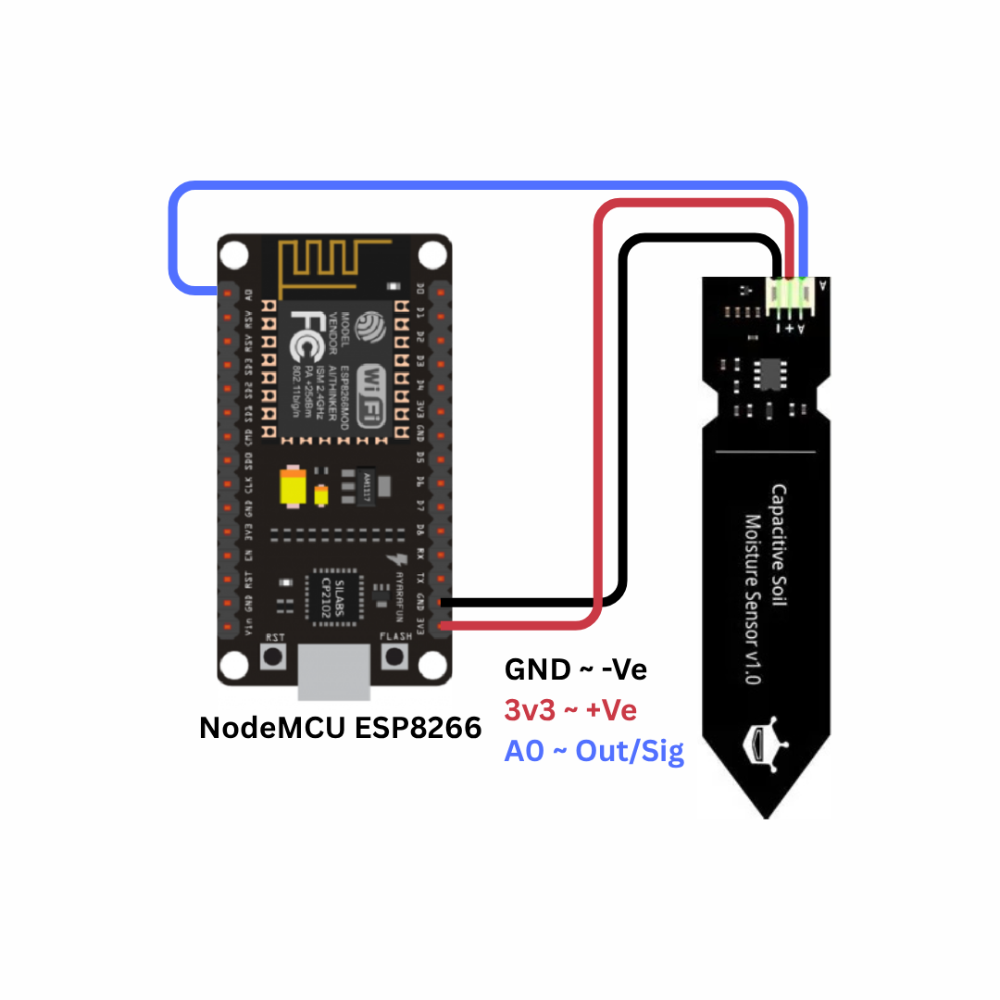
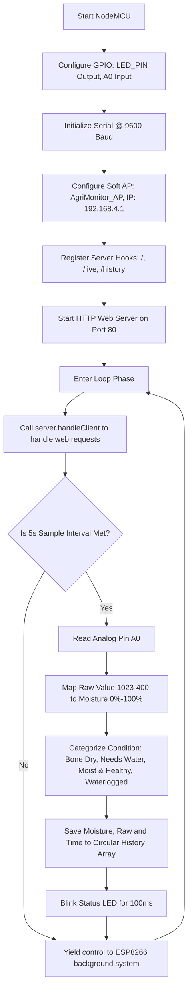

# Smart Soil Moisture Monitoring System for Precision Irrigation

---

## 1. Problem Statement

Water resource management is one of the most critical challenges facing global society in the 21st century. According to the United Nations, agriculture accounts for approximately 70% of all global freshwater withdrawals. However, traditional farming and gardening methods suffer from several severe inefficiencies:

1. **Rule-of-Thumb and Manual Guesswork**: Many small-scale farmers and home gardeners decide when to irrigate based on visual observation of surface soil or fixed daily schedules. Surface soil dries out much faster than the root zone, leading to premature and excessive watering.
2. **Over-Irrigation and Resource Waste**: Watering crops beyond their field capacity leads to water run-off, soil erosion, and leaching of essential nutrients (such as nitrogen and phosphorus) down past the root zone into groundwater tables.
3. **Crop Pathology (Root Rot and Fungal Infections)**: Soil that remains continuously waterlogged deprives plant roots of oxygen, leading to anaerobic conditions, root decay, and fungal infestations (e.g., *Pythium* and *Phytophthora*).
4. **Under-Irrigation and Crop Stress**: Delayed watering causes the soil moisture to fall below the wilting point. Under this water stress, plants close their stomata, reducing photosynthesis and leading to stunted growth, leaf shedding, and significantly lower crop yields.
5. **Lack of Accessible Digital Logging**: High-end commercial precision agriculture setups require proprietary telemetry hubs, cellular subscriptions, and complex server integration. This makes them unaffordable and impractical for small farms, urban gardens, and educational institutions.

### Proposed Solution
To address these issues, we need an affordable, autonomous IoT sensor node that measures real-time soil moisture levels at the root zone, translates the physical electrical resistance of the soil into a moisture percentage ($0\% - 100\%$), classifies the soil condition (e.g., Bone Dry, Needs Water, Healthy, Waterlogged), and hosts a localized wireless dashboard. This system must broadcast its own WiFi network, allowing any nearby smartphone or computer to connect and view live data and historical logs without requiring external internet or app store downloads.

---

## 2. Our Solution

The **Smart Soil Moisture Monitoring System** is a standalone, micro-embedded IoT device built on the ESP8266 NodeMCU microcontroller and a resistive soil moisture sensor probe. The system integrates real-time analog signal acquisition, threshold-based mathematical calibration, historical data logging, and an offline web server.

### Key Features
- **Precision Calibration Mapping**: Translates raw analog electrical resistance into a human-readable moisture percentage ($0\% - 100\%$) using calibrated reference limits.
- **Offline Wireless Access Point**: Operates without external routers or internet by generating its own WiFi network (`SSID: AgriMonitor_AP`), serving the live dashboard on `http://192.168.4.1`.
- **Reactive SVG Plant Animation**: The web dashboard features an animated SVG plant character that reacts to moisture levels. The plant smiles and sways when healthy, sweats and droops when thirsty, wilts brown in cracked soil when dry, and shows a ripple-water puddle when waterlogged.
- **Dynamic Hysteresis Classification**: Categorizes soil moisture into four states: *Bone Dry*, *Needs Water*, *Moist & Healthy*, and *Waterlogged*.
- **Visual Status Indicator**: Flashes the NodeMCU GPIO4 (D2) LED for 100 ms on every measurement cycle to indicate active operation.
- **Rolling RAM Historian**: Retains the last 100 measurements in a circular FIFO queue in DRAM, displaying historical trends directly on the dashboard.
- **Cooperative Multitasking**: Employs non-blocking programming structures using `millis()`, ensuring the web server responds instantly even during high-frequency sensor readings.

---

## 3. Brief of Solution

The system operates as an edge computing node that monitors soil moisture, logs history, and serves graphical interfaces.

### System Data Flow Architecture
```
+------------------+       Analog Voltage      +-------------------+
|  Moisture Probe  | ------------------------> |    NodeMCU A0     |
|   (Resistive)    |                           |    (10-bit ADC)   |
+------------------+                           +-------------------+
                                                         │
                                             [ADC Sampling (0-1023)]
                                                         │
                                                         ▼
+------------------------------------------------------------------+
|                     ESP8266 Microcontroller                      |
|                                                                  |
|   1. Map Raw (1023 to 400) to Moisture (0% to 100%)              |
|   2. Constrain Moisture to [0, 100]                              |
|   3. Classify (Bone Dry, Needs Water, Moist, Waterlogged)        |
+------------------------------------------------------------------+
          │                                              │
  [Save to RAM Buffer]                           [Blink Status LED]
  (Circular Array, size 100)                     (D2 / GPIO4 - 100ms)
          │                                              │
          ▼                                              ▼
+---------------------+       Web Request        +------------------+
| ESP8266 Web Server  | <----------------------- |   User Web App   |
| (JSON REST APIs)    | -----------------------> |  (JS AJAX Fetch) |
+---------------------+      JSON Response       +------------------+
```

1. **Resistance Sensing**: The two exposed metallic prongs of the probe act as a variable resistor. The soil's electrical resistance depends on its water content.
2. **Voltage Partitioning**: An onboard circuit converts the soil's resistance variations into an analog voltage output ($0\text{V} - 3.3\text{V}$).
3. **ADC Acquisition**: The ESP8266 samples the voltage on analog pin A0, outputting a 10-bit integer ($0 - 1023$).
4. **Calibration Mapping**: The firmware maps this raw reading to a moisture percentage based on pre-calibrated limits (where air-dry is 1023 and water-submerged is 400).
5. **Logging & Control**: The calculated moisture and status are logged to RAM, and the ESP8266 flashes the status LED.
6. **Dashboard Updates**: The ESP8266 web server handles browser requests, returning the HTML page and JSON payloads. The client-side JavaScript parses these payloads to update the responsive gauges and animate the SVG plant character.

---

## 4. What We Are Going to Use

### Hardware Requirements
1. **NodeMCU ESP8266 Development Board (ESP-12E Module)**
   - Core: Xtensa 32-bit LX106 RISC CPU running at 80 MHz.
   - Onboard Peripherals: 10-bit ADC, SPI Flash, GPIO pins.
   - WiFi Module: Integrated 2.4 GHz 802.11 b/g/n transceiver.
2. **Soil Moisture Sensor Probe & Comparator Breakout**
   - Transducer Type: Two-prong resistive probe.
   - Output Signal: Analog voltage ($0\text{V} - 3.3\text{V}$).
   - Comparator Chip: Onboard LM393 comparator (provides a digital threshold output, though this project uses the analog output for continuous mapping).
3. **LED (Light Emitting Diode)**
   - Color: Green or Red.
   - Forward Voltage: ~2.0V.
4. **Current-Limiting Resistor**
   - Value: 220 $\Omega$ (1/4 W).
   - Purpose: Limits the output current from the GPIO pin to protect the LED.
5. **Breadboard & Jumper Wires**
6. **Micro-USB Cable**: For power and code flashing.

### Software Requirements
1. **Arduino IDE 2.x**: IDE used to write, compile, and flash the code.
2. **ESP8266 Arduino Board Core**: Compiler toolchain and peripheral driver libraries.
3. **Modern Web Browser**: Renders the HTML5, CSS3, and JavaScript dashboard.

---

## 5. In-Depth of IoT (Internet of Things)

The Internet of Things (IoT) refers to a network of physical objects embedded with sensors, software, and communication electronics, enabling them to collect, log, and exchange data over networks.

### Architecture Layers of IoT
This project is structured into three standard IoT layers:

```
+-----------------------------------------------------------------+
| 1. Application Layer (Web Dashboard, Plant SVG, Gauge Bars)     |
+-----------------------------------------------------------------+
                               ▲
                               │ HTTP Protocol (AJAX Fetch API)
                               ▼
+-----------------------------------------------------------------+
| 2. Network Layer (ESP8266 Access Point, TCP/IP, Web Server)     |
+-----------------------------------------------------------------+
                               ▲
                               │ Hardware Bus (Analog Read / ADC)
                               ▼
+-----------------------------------------------------------------+
| 3. Perception Layer (Resistive Probe, LM393 Board, GPIO Pins)   |
+-----------------------------------------------------------------+
```

1. **Perception Layer**: Consists of the physical probe inserted into the soil and the analog-to-digital converter (ADC) on the ESP8266, which measures the voltage across the soil.
2. **Network Layer**: Manages data routing. The ESP8266 generates a localized wireless network under the IEEE 802.11 b/g/n standard. The built-in TCP/IP stack runs a lightweight HTTP server on port 80 to manage incoming client requests.
3. **Application Layer**: Renders the data. The web interface served by the ESP8266 displays raw values, computed moisture percentages, and the reactive SVG plant character.

### Standalone Access Point (AP) Mode
For remote agricultural or backyard use, the ESP8266 is configured in **Access Point (AP) Mode**:
- **Independent Operation**: Unlike Station (STA) mode, which requires connecting to an existing router and internet network, AP mode creates an isolated local network.
- **SSID & Password**: The device broadcasts `AgriMonitor_AP` with the password `12345678`.
- **IP Addressing**: The ESP8266 acts as the DHCP server, assigning IP addresses in the `192.168.4.x` range and hosting the dashboard at `192.168.4.1`.

### Data Exchange: REST API and JSON
The dashboard updates in real-time by polling the web server:
- **Asynchronous AJAX**: The client browser uses the JavaScript Fetch API to request data in the background, preventing page reloads.
- **API Endpoints**:
  - `/live`: Returns the current moisture percentage, raw ADC value, status text, and system uptime.
  - `/history`: Returns the array of the last 100 logged measurements.
- **JSON Serialization**: Data is formatted as lightweight key-value pairs:
  ```json
  {"percent": 58, "raw": 662, "cond": "Moist & Healthy", "uptime": 128}
  ```

---

## 6. In-Depth about Microcontrollers, Sensors, Actuators

Embedded systems rely on microcontrollers, sensors, and actuators to interact with the physical world.

```
       +------------+
       |   SENSOR   | (Moisture Probe: Soil moisture to electrical resistance)
       +------------+
             │
             ▼ [A0 Analog Pin: 3.3V Max]
       +------------+
       | MICROCON-  |
       |  TROLLER   | (ESP8266 NodeMCU: Maps analog value, runs HTTP server)
       +------------+
             │
             ▼ [GPIO Pin: Logic High/Low]
       +------------+
       |  ACTUATOR  | (Status LED / Reactive Plant SVG Dashboard)
       +------------+
```

### Microcontrollers
A microcontroller is a single chip that contains a CPU, memory, and input/output peripherals.
- **Processor**: Executes firmware code instructions.
- **RAM**: Stores dynamic variables and the data logs.
- **Flash Memory**: Stores the compiled program and the HTML dashboard page.
- **Peripherals**: Interfaces with sensors using the built-in ADC and controls actuators via GPIO pins.

### Sensors
Sensors are input transducers that convert physical parameters into electrical signals.
- **Resistive Sensors**: Measure changes in electrical resistance. Soil moisture sensors use two metal probes to measure the resistance of the soil between them.
- **Analog Output**: Outputs a continuous voltage level. The ESP8266's ADC measures this voltage and converts it into a digital value.

### Actuators
Actuators convert electrical signals back into physical action.
- **Indicator LED**: Connected to D2 (GPIO4) to provide visual feedback.
- **Web Dashboard (Virtual Actuator)**: JavaScript updates the HTML and CSS styles of the SVG plant character in response to the sensor data.

---

## 7. In-Depth about ESP8266 NodeMCU

The NodeMCU board breaks out the ESP8266EX chip, making it easy to build connected projects.


### Processor Architecture
- **CPU**: Tensilica Xtensa 32-bit LX106 core.
- **Clock Frequency**: 80 MHz, enabling fast calculations and responsive web hosting.
- **Memory Structure**:
  - **SRAM**: 80 KB DRAM for dynamic data, variables, and networking stacks.
  - **SPI Flash**: 4 MB external flash memory to store the program and web dashboard assets.

### Hardware Interfaces
- **Analog Input (A0)**: The ESP8266 has a single analog input pin with a 10-bit ADC. On the NodeMCU board, a resistor divider scales the input voltage range from $0 - 3.3\text{V}$ to the safe $0 - 1\text{V}$ range of the chip.
- **WiFi Radio**: Integrated 2.4 GHz radio supporting WPA/WPA2 security and the TCP/IP stack.

### Pinout Mapping
The table below maps the NodeMCU board pins to the ESP8266's internal GPIO pin designations:

| Board Pin | GPIO Pin | Function in This Project | Electrical Characteristics |
|-----------|----------|--------------------------|----------------------------|
| **A0**    | ADC0     | Analog Sensor Input (Moisture Probe) | 10-bit resolution ($0 - 1023$). Input voltage range: $0 - 3.3\text{V}$. |
| **D2**    | GPIO4    | Status LED Output | 3.3V digital output. Used to flash the status indicator. |
| **3V3**   | 3.3V VCC | Sensor Power Supply | Stable 3.3V output from the onboard regulator. |
| **GND**   | Ground   | Common System Ground | Common ground reference. |

### Technical Capabilities of ESP8266
* **Processor Core**: Tensilica Xtensa 32-bit LX106 RISC CPU, operating at 80 MHz (can be overclocked to 160 MHz). It delivers up to 645 DMIPS of processing power.
* **Memory Subsystem**: 80 KB of Instruction/Data SRAM, plus support for up to 16 MB of external SPI flash memory (typically 4 MB on NodeMCU boards) to store firmware, assets, and file systems.
* **Integrated Wi-Fi Stack**: Built-in 802.11 b/g/n Wi-Fi transceiver running at 2.4 GHz. It supports WEP, WPA/WPA2 Personal/Enterprise security protocols. It includes an integrated TR switch, balun, LNA, power amplifier, and matching network.
* **Low-Power Modes**: Supports three sleep configurations to conserve power in battery-operated nodes:
  - **Modem Sleep** (~15 mA): CPU remains active, Wi-Fi radio is powered down between beacon intervals.
  - **Light Sleep** (~0.9 mA): CPU clock is gated, Wi-Fi radio is off. The chip wakes up on external interrupts.
  - **Deep Sleep** (~20 µA): Only the internal Real-Time Clock (RTC) remains active. The chip resets on wake-up (GPIO16/D0 connected to RST).
* **Hardware Peripherals**: Features 17 GPIO pins, hardware PWM (Pulse-Width Modulation), SPI, I2C, I2S, UART interfaces, and a 10-bit analog-to-digital converter (ADC).

### Real-World Applications
1. **Smart Home Automation**: Wireless control of smart plugs, lighting fixtures, appliances, and automated blinds.
2. **Environmental Tracking**: Standalone weather stations, air quality monitors, and greenhouse climate controls.
3. **Wearable Health Monitors**: Portable pulse, step, and temperature trackers that transmit telemetry to local displays or remote apps.
4. **Precision Agriculture**: Remote soil moisture, ambient light, and irrigation control systems for farm management.

### Industrial Usecases
1. **Predictive Maintenance**: Monitoring vibration and temperature of machinery, logging telemetry, and reporting anomalies before failure occurs.
2. **Industrial IoT Gateways**: Bridging legacy serial protocol devices (RS-232/RS-485) to local Wi-Fi networks or MQTT brokers.
3. **Asset Tracking & Logistics**: Monitoring temperature, humidity, and location of sensitive shipments inside warehouses and transport containers.
4. **Remote Telemetry & SCADA**: Wireless transmission of tank levels, pressure values, and power consumption statistics to industrial SCADA systems.

---

## 8. In-Depth about the Project-Specific Sensor: Resistive Soil Probe

The system uses a two-prong resistive soil moisture sensor to measure water levels in the soil.

```
                  Exposed Copper Electrodes
                       /│          │\
                      / │          │ \
                     /  │  Current │  \
                    │   │   Flow   │   │
                    │   ├───►►►►───┤   │
                    │   │  (Water) │   │
                    └───┘          └───┘
                      Soil Matrix (Variable Resistance)
```

### Physical Principles of Operation
Resistive soil moisture sensing is based on the relationship between water content and electrical resistance:
1. **Soil Resistance**: Dry soil is a poor conductor of electricity, meaning the resistance ($R_{\text{soil}}$) between the two metal prongs is very high (often in the range of Megaohms). Water is a much better conductor. When the soil contains more water, the electrical resistance between the prongs drops significantly (down to a few Kiloohms).
2. **Voltage Divider Circuit**: The sensor probe is connected to a breakout board containing an LM393 comparator and a resistor divider circuit:
   - A fixed resistor ($R_f \approx 10\text{ k}\Omega$) and the soil resistance ($R_{\text{soil}}$) form a voltage divider.
   - The output voltage ($V_{\text{out}}$) sent to pin A0 is:
     $$V_{\text{out}} = V_{\text{CC}} \times \left( \frac{R_{\text{soil}}}{R_f + R_{\text{soil}}} \right)$$
   - In dry soil, because $R_{\text{soil}}$ is very large:
     $$V_{\text{out}} \approx V_{\text{CC}} \times 1 \approx 3.3\text{V}$$
   - In wet soil, because $R_{\text{soil}}$ drops:
     $$V_{\text{out}} \text{ drops towards } 0\text{V}$$

### Mathematical Calibration
The raw ADC output varies from 0 to 1023. Since dry soil results in a high voltage and wet soil in a low voltage, we must invert and calibrate the readings:
- **Dry Calibration Point (`DRY_SOIL_VAL = 1023`)**: The value measured when the probe is held in open air.
- **Wet Calibration Point (`WET_SOIL_VAL = 400`)**: The value measured when the probe is placed in a glass of water.

Using these points, the firmware maps and constrains the raw readings to a percentage:
$$\text{Moisture \%} = \text{constrain}\left( \text{map}(\text{Raw}, \text{DRY\_SOIL\_VAL}, \text{WET\_SOIL\_VAL}, 0, 100), 0, 100 \right)$$

#### Map Function Math:
$$\text{Moisture \%} = \frac{(\text{Raw} - \text{DRY\_SOIL\_VAL}) \times (100 - 0)}{\text{WET\_SOIL\_VAL} - \text{DRY\_SOIL\_VAL}}$$
$$\text{Moisture \%} = \frac{(\text{Raw} - 1023) \times 100}{400 - 1023} = \frac{(\text{Raw} - 1023) \times 100}{-623}$$

#### Example Calculation:
If the raw ADC reading is **650**:
$$\text{Moisture \%} = \frac{(650 - 1023) \times 100}{-623} = \frac{-373 \times 100}{-623} \approx 59.8\% \approx 60\%$$

---

## 9. In-Depth about Arduino IDE, Compilation, and Flashing

The Arduino IDE handles the compile and upload process for the ESP8266.

### Compilation Process
1. **Preprocessing**: The compiler joins the sketch files, inserts standard libraries, and generates function prototypes.
2. **Compilation**: The cross-compiler (`xtensa-lx106-elf-g++`) compiles the code into binary object files (`.o`).
3. **Linking**: The linker (`xtensa-lx106-elf-ld`) combines the object files with system and WiFi libraries to create a single `.elf` file.
4. **Binary Generation**: The `elf2bin` utility extracts the executable code from the `.elf` file to create the final `.bin` binary file.

### Memory Segments
- **`.text`**: The program instructions stored in flash memory.
- **`.rodata`**: Read-only constants, string literals, and the static HTML page stored in flash using `PROGMEM`.
- **`.data`**: Initialized variables, which are copied to RAM when the board boots.
- **`.bss`**: Uninitialized variables, which are allocated and set to zero in RAM during boot.

### Flashing and Reset
The IDE uploads the binary file using `esptool.py` over serial:
- **Serial Interface**: The onboard CP2102 USB-to-UART chip bridges the computer's USB port to the ESP8266's serial pins.
- **Reset Sequence**: The tool uses the DTR and RTS lines to control the `RST` and `GPIO0` pins:
  1. Pulls `GPIO0` Low and pulses `RST` Low to restart the chip into bootloader mode.
  2. The bootloader writes the binary file to the external SPI flash.
  3. The tool pulls `GPIO0` High and pulses `RST` to reboot the chip and run the program.

---

## 10. Implementation with Circuit Diagram

### Wiring Connections Table
The table below lists the connections between the soil moisture sensor, LED, and the NodeMCU board:

| Component | Pin Label | NodeMCU Connection Pin | Wire Function | Notes |
|-----------|-----------|------------------------|---------------|-------|
| **Soil Sensor** | VCC | 3V3 (3.3V) | Sensor Power Supply | Power supply from the board. |
| **Soil Sensor** | GND | GND | System Ground | Common ground reference. |
| **Soil Sensor** | A0 | A0 | Analog Signal Output | Outputs voltage from $0\text{ to }3.3\text{V}$. |
| **LED** | Anode (+) | D2 (GPIO4) via 220$\Omega$ resistor | Digital Control Output | High turns the LED on; Low turns it off. |
| **LED** | Cathode (-) | GND | Ground Reference | Connection to ground. |

### Circuit Design Notes
- **LM393 Comparator Board**: The soil probe connects to this breakout board, which provides the output voltage to pin A0.
- **Current-Limiting Resistor**: A 220 $\Omega$ resistor is connected in series with the LED to limit the current drawn from the GPIO pin to a safe level of about $6\text{ mA}$:
  $$I = \frac{V_{\text{pin}} - V_{\text{LED}}}{R} = \frac{3.3\text{ V} - 2.0\text{ V}}{220\ \Omega} \approx 5.9\text{ mA}$$

### Circuit Diagram
The wiring and component layout are shown below:



---

## 11. Code Explanation

This section explains the structure and logic of the firmware in `Smart_Soil_Moisture_Monitoring_System.ino`.

### Pin and Variable Definitions
The firmware defines the sensor and LED pins, sets the WiFi Access Point parameters, and creates a web server instance on port 80:

```cpp
#define SENSOR_PIN    A0         // Analog input for Soil Sensor
#define LED_PIN       4          // GPIO4 (maps to board D2 pin)

const char* AP_SSID     = "AgriMonitor_AP";
const char* AP_PASSWORD = "12345678";
const IPAddress AP_IP(192, 168, 4, 1);
const IPAddress AP_SUBNET(255, 255, 255, 0);

ESP8266WebServer server(80);
```

### Calibration and Status Settings
The firmware maps the raw readings to percentages and evaluates the soil condition using thresholds:

```cpp
const int DRY_SOIL_VAL  = 1023; // Value when dry in air
const int WET_SOIL_VAL  = 400;  // Value when submerged in water

void loop() {
  server.handleClient(); // Process incoming HTTP requests immediately

  uint32_t now = millis();
  if (now - lastSample >= SAMPLE_INTERVAL) {
    lastSample = now;

    // 1. Read the analog pin
    currentRaw = analogRead(SENSOR_PIN);
    
    // 2. Map and constrain the value to a percentage
    currentPercent = map(currentRaw, DRY_SOIL_VAL, WET_SOIL_VAL, 0, 100);
    currentPercent = constrain(currentPercent, 0, 100);

    // 3. Categorize the soil condition
    if (currentPercent < 15)      currentStatus = "Bone Dry";
    else if (currentPercent < 40) currentStatus = "Needs Water";
    else if (currentPercent < 75) currentStatus = "Moist & Healthy";
    else                          currentStatus = "Waterlogged";

    // 4. Save the measurement and flash the indicator LED
    addRecord(currentPercent, currentRaw);
    
    digitalWrite(LED_PIN, HIGH); // Turn LED on
    delay(100);                  // Short blink
    digitalWrite(LED_PIN, LOW);  // Turn LED off
  }
  yield(); // Allow background WiFi tasks to run
}
```

### Program Flow Diagram
The flowchart below shows the logic of the firmware program:



---

## 12. Working

When the Soil Moisture Monitor is powered on, it runs through the following operational steps:

1. **Boot Sequence**: When powered on, the ESP8266 sets D2 as an output, initializes the serial port, sets up the WiFi Access Point with the SSID `AgriMonitor_AP`, and starts the HTTP server on port 80.
2. **Measurement**: Every 5 seconds, the system reads the voltage on pin A0, maps it to a percentage, categorizes the soil condition, adds the record to history, and blinks the LED.
3. **Web Server**: The web server waits for incoming connections. When a client requests the root URL (`/`), the server sends the HTML page stored in flash memory.
4. **Dashboard Updates**: The JavaScript in the webpage polls the `/live` and `/history` JSON endpoints every 5 seconds. It updates the values on the page and adjusts the appearance of the SVG plant character based on the soil condition:
   - **Bone Dry (< 15% Moisture)**: The plant stems and leaves droop, turning brown. The soil shows cracks, the plant face shows distress, and water drops disappear.
   - **Needs Water (15 - 40% Moisture)**: Stems droop slightly, turning a lighter green-brown color. Water droplets animate falling down to indicate it needs water.
   - **Moist & Healthy (40 - 75% Moisture)**: The plant stands upright, sways gently, and displays a smiling expression.
   - **Waterlogged (>= 75% Moisture)**: Stems sway rapidly, and a water puddle with ripples appears at the base of the pot to show overflow.

---

## 13. Conclusion

### Project Evaluation
The Smart Soil Moisture Monitoring System provides an affordable, standalone solution for precision irrigation. The real-time web dashboard uses a clear, animated plant character to communicate soil conditions, making it easy for users to decide when to water crops without needing to interpret technical numbers.

### Future Improvements
1. **Capacitive Sensor**: Upgrade to a capacitive soil moisture sensor probe. Capacitive probes do not expose metal electrodes directly to the soil, preventing corrosion and extending the sensor's lifespan.
2. **Automated Irrigation**: Connect a relay module to control a 5V solenoid water valve or mini water pump, turning the system into an automated irrigation controller that waters plants only when the moisture drops below a set threshold.
3. **Low-Power Modes**: Implement low-power deep sleep modes to run the device off batteries for long-term measurements in agricultural fields.
